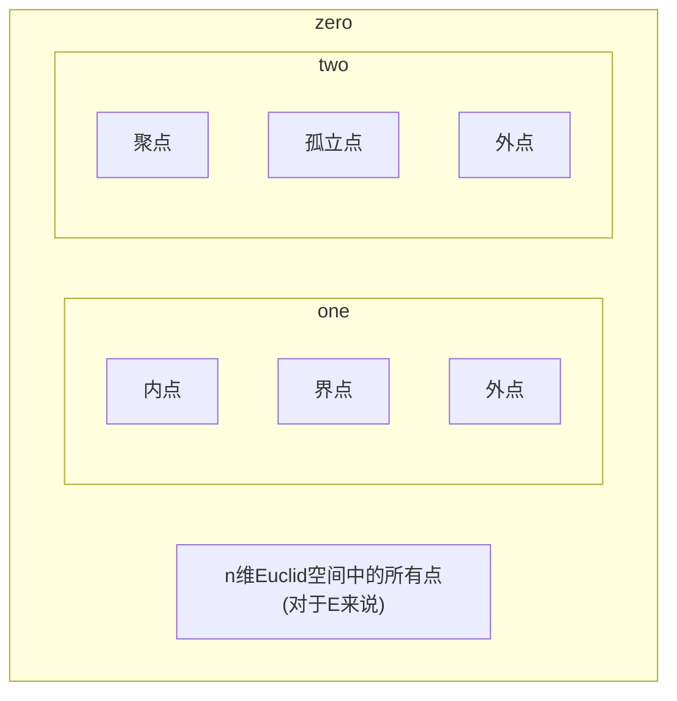

# 集合
## 1 朴素集合论
> 「Definition:集合」
> 集合往往被认为是一个不言自明的概念,集合也称集、族或类,元素也称元、点或成员
> 没有元素的集合称为空集,记作$\emptyset$;由一个元素组成的集合称为单点集
> 通常用如下方式定义集合:$\{ x|\text{a Proposition related to x}  \}$,$|$也可以用$:$或$;$代替,只要不产生歧义即可

>[!example] 
>通常用以下记号:
>$\mathbb{Z}$:整数集
>$\mathbb{N}$:自然数集
>$\mathbb{N}^*,\mathbb{N}_{+}$:正整数集
>$\mathbb{Q}$:有理数集
>$\mathbb{J}$:无理数集
>$\mathbb{R}$:实数集

## 2 ZF公理集合论
>Axiom:Axioms of Zermole-Fraenkel
>(1)Axiom of Extensionality(**外延公理**):If X and Y have the same elements,then X=Y
>(2)Axiom of Pairing(**配对公理**):For any a and b there exists a set $\{ a,b \}$ that contains exactly a and b
>(3)Axiom Schema of Serperation(**分离公理模式**):If P is a property (with parameter p),then for any X and p there exists a set $Y=\{ u\in X:P(u,p) \}$ that contains all those $u\in X$ that have property P(It menas that we can SERPERATE a set B which satisfy peoperty P from the set A)
>(4)Axiom of Union(**并集公理**):For any X there exists a set $Y=\bigcup X$,the union of all elements of X
>(5)Axioms of Power Set(**幂集公理**):For any X there exists a set $Y=P(X)$,the set of all subsets of X
>(6)Axiom of Infinity(**无穷性公理**):There exists an infinite set 
>(7)Axiom Schema of Replacement(**替换公理模式**):If a class F is a function,then for any X there exists a set $Y=F(X)=\{ F(x):x\in X \}$
>(8)Axiom of Regularity(**正则公理**):Every nonempty set has an $\in-minimal\,element$ 
>(9)Axiom of Choice(**选择公理**):Every family of nonempty sets has a choice function

>[!note] 
>Intuitively,a set is a collection of all elements that satisfy a certain given property.In other words,we might be tempted to postulate the following rule of formation for sets:
>**Axiom Schema of Comprehension**(FALSE):If P is a property,then there exists a set $Y=\{ x:P(x) \}$ 
>This principle, however, is false:
>**Russell's Paradox:** Consider the set S whose elements are all those (and only those) sets that are not members of themselves:$S=\{ X:X\not\in X \}$. Question: Does S belongs to S? We have a contradiction. 
>Thus we must conclude that $\{ X:X\not\in X \}$ is not a set.

## 3 集合的运算

## 4 序数与基数

## 5 实数

## 6 选择公理
## 7 关系
> 「Definition:Cartesian Product」
> 设$X,Y$是两个集合,则集合$\{ (x,y) |x\in X,y\in Y\}$称为集合$X$与集合$Y$的笛卡尔积(也叫直积),记作$X\times Y$
> 其中$(x,y)$是一个有序偶,$x$称为有序偶$(x,y)$的第一个坐标,$y$是第二个坐标
> $X$称为笛卡尔积$X\times Y$的第一个坐标集,$Y$是第二个坐标集
> 集合$X$与自身的笛卡尔积$X\times X$称为二重积,记作$X^2$
> 
> 笛卡尔积可推广到有限个集合的情况

>  「Definition:关系」
>  设$X,Y$是两个集合,若$R\subset X\times Y$,则称$R$是从$X$到$Y$的一个关系
>  
>  关系可推广到有限多个的情况

> 「Definition:R-相关」
> 设$R\subset X\times Y$.若$(x,y)\in R$,则称$x,y$是R-相关的,记作$xRy$
> 若$A\subset X$,则$Y$的子集$\{ y\in Y|\exists x\in A,s.t.xRy \}$称为集合$A$对关系$R$而言的像集,或简称为$A$的像集(或R-像),记作$R(A)$.
> $R(X)$称为关系$R$的值域

>[!tip] 
>事实上,映射、等价、序、运算等等概念都是关系的特例

> 「Definition:逆」
> 设$R\subset X\times Y$.此时笛卡尔积$Y\times X$的子集$\{ (y,x)\in Y\times X|xRy \}$是从集合$Y$到$X$的一个关系,称它为关系$R$的逆,记作$R^{-1}$
> 若$B\subset Y$,那么$X$的子集$R^{-1}(B)$是集合$B$的$R^{-1}$-像,也称集合$B$对关系$R$而言的原像(或R-原像)
> 关系$R^{-1}$的值域$R^{-1}(Y)$也称为关系$R$的定义域

> 「Definition:复合」
> 设$R\subset X\times Y,S\subset Y\times Z$.集合$\{ (x,z)\in X\times Z|\exists y\in Y,s.t.xRy,ySz \}$是笛卡尔积$X\times Z$的一个子集,即从$X$到$Z$的一个关系,此关系称为关系$R$和关系$S$的复合(或积),记作$S\circ R$
> 
> ==🖇️Properties：==
> 设$R\subset X\times Y,S\subset Y\times Z,T\subset Z\times U,A,B\subset X$,则
> 1)$(R^{-1})^{-1}=R$
> 2)(**逆运算**)$(S\circ R)^{-1}=R^{-1}\circ S^{-1}$
> 3)(**乘法交换律**)$T\circ(S\circ R)=(T\circ S)\circ R$
> 4)$R(A\cup B)=R(A)\cup R(B)$
> 5)$R(A\cap B)\subset R(A)\cap R(B)$
> 6)(**乘积的定义**)$(S\circ R)(A)=S(R(A))$

## 8 映射
> 「Definition:映射」
> 设$F\subset X\times Y$.如果对于每一个$x\in X$,存在唯一的$y\in Y$使得$xFy$,则称关系$F$是从$X$到$Y$的一个映射,记作$F:X\to Y$
> 通常用小写字母$f,g,h\dots$表示映射
>
> ==🖇️Properties：==
> 设$f:X\to Y$.若$A,B\subset Y$,则
> 1)$f^{-1}(A\cup B)=f^{-1}(A)\cup f^{-1}(B)$
> 2)$f^{-1}(A\cap B)=f^{-1}(A)\cap f^{-1}(B)$
> 3)$f^{-1}(A- B)=f^{-1}(A)- f^{-1}(B)$
> 即映射的原像保持集合的并、交、差运算
> 
> 集合到自身的映射,有时称为变换(如线性变换)
> 若$\sigma:X\to X,\sigma(x)=x,x\in X$,则称$\sigma$为恒同映射,记为$i_{X}(1_{X})$

>[!note] 
>映射的相等定义为:
>设$\sigma:X\to Y,\tau:X\to Y$,$\sigma=\tau\Longleftrightarrow \forall x\in X:\sigma(x)=\tau(x)$

> 「Definition:单射与满射」
> 设$\sigma:X\to Y$,若
> 1)$\sigma(X)=Y$,则$\sigma$称为满射
> 2)$\forall a_{1},a_{2}\in X,a_{1}\neq a_{2}\Longrightarrow\sigma(a_{1})\neq\sigma(a_{2})$,则$\sigma$称为单射
> 3)若$\sigma$即是单射又是满射则称它为双射或一一映射

>Theorem:逆映射存在定理
>设$f:X\to Y$.若$f$是一个双射,则$f^{-1}$是一个从$Y$到$X$的双射,且有$f^{-1}\circ f=i_{X};f\circ f^{-1}=i_{Y}$

## 9 点集
>[!note] 
>以下讨论均在n维Euclid空间$\mathbb{R}^n$中进行,事实上,在一般度量空间中也可作类似定义

### 9.1 邻域
>  「Definition:邻域」
>  设$x_{0}\in\mathbb{R}^n,\delta>0$,称点集$\{ x\in \mathbb{R}^n|d(x,x_{0})<\delta \}$为$\mathbb{R}^n$中以$x_{0}$为中心,以$\delta$为半径的开球,也称$x_{0}$的$\delta$(球)邻域,记为$U(x_{0},\delta)$(或$B,O$)
>   
> 「Definition:两个非空点集的距离」
> 定义两个非空点集$A,B$的距离为$d(A,B)=\inf\{ d(x,y)|x\in A,y\in B \}$  
> 
>  「Definition:直径」
>  设$E$是$\mathbb{R}^n$中的点集,令$\mathrm{diam}(E)=\sup\{ d(x,y)|x,y\in E \}$,称为点集$E$的直径.(或用$\delta(E)$表示)
>  
> 「Definition:有界集」
> 设$E$是$\mathbb{R}^n$中的点集,若$\mathrm{diam}(E)<+\infty$,则称$E$为有界集
> 
> 显然,$E$是有界集的充要条件是:$\exists M>0,|x|<M(\forall x)$

### 9.2 聚点,内点,界点
>设$E$是$\mathbb{R}^n$中的一个点集(记$E^c=\mathbb{R}^n\setminus E$),$x_{0}$是$\mathbb{R}^n$中的一个定点,考察$x_{0}$与$E$的关系:
> 「Definition:内点,外点,界点」
> 若$\exists U(x_{0}),s.t.U(x_{0})\subset E$,则称$x_{0}$为$E$的内点
> 若$x_{0}$是$E^c$的内点,则称$x_{0}$是$E$的外点
> 若$x_{0}$既不是$E$的内点也不是$E^c$的内点,即$\forall U(x_{0}),\exists x_{1},x_{2}\in U(x_{0}),s.t.x_{1}\in E,x_{2}\not\in E$,则称$x_{0}$为$E$的(边)界点
> 
>  「Definition:聚点」
>  **第一定义** 设$x_{0}$的任一邻域都含有$E$中的无穷多个点,则称$x_{0}$是$E$的聚点
>  **第二定义** 设$x_{0}$的任一邻域都含有$E$中的一个异于$x_{0}$的点,则称$x_{0}$是$E$的聚点
>  >[!note] 
>  >显然,无限集才存在聚点
>  
>  ==度量空间中某点是聚点的充要条件== $x_{0}$是$E$的极限点当且仅当$x_{0}$是某个点列的极限
>  
>  「Definition:孤立点」
>  若$x_{0}\in E$但不是$E$的聚点,则称$x_{0}$是$E$的孤立点
>  显然,$x_{0}$是$E$的孤立点的充要条件是:$\exists U(x_{0}),s.t.E\cap U(x_{0})=\{ x_{0} \}$
>  因此,$E$的界点不是聚点就是孤立点

> 「Definition:常见点集」
> 1)$E$中所有内点所成的集合,称为$E$的开核,记为$\mathring{E}$,即$\mathring{E}=\{ x|\exists U(x)\subset E \}$
> 2)$E$中所有聚点所成的集合,称为$E$的导集,记为$E'$,即$E'=\{ x|\forall U(x):\mathring{U}(x)\cap E\neq \emptyset \}$
> 3)$E$中所有界点所成的集合,称为$E$的边界,记为$\partial E$,即$\partial E=\{ x|\forall U(x),U(x)\cap E\neq \emptyset,U(x)\cap E^c\neq \emptyset \}$
> 4)$\{ \text{isolated points of E} \}=\{ x|\exists U(x),U(x)\cap E=\{ x \} \}$
> 5)$E\cup E'$称为$E$的闭包,记为$\bar{E}$,即$\bar{E}=\{ x|\forall U(x),U(x)\cap E\neq \emptyset \}$
> 
> ==🖇️Properties：==
> 1)(对偶关系)$(\mathring{E})^c=\overline{E^c},(\bar{E})^c=\mathring{E^c}$
> 2)设$A\subset B$,则$A'\subset B',\mathring{A}\subset \mathring{B},\bar{A}\subset \bar{B}$
> 3)$(A\cup B)'=A'\cup B'$

### 9.3 开集与闭集
> 「Definition:开集与闭集」 
> 设$E\subset \mathbb{R}^n$,
> 如果$E$的每一点都是$E$的内点,则称$E$为开集
> $E$为开集的充要条件是$E\subset \mathring{E}$,亦即$E=\mathring{E}$
>  
> 如果$E$的每一个聚点都属于$E$,则称$E$为闭集
> $E$是闭集的充要条件是$E'\subset E$,或$\partial E\subset E$
> 
> ==🖇️Properties：==
> 1)$\mathring{E}$是开集,$E',\bar{E}$是闭集
> 2)(**对偶性**)若$E$是开集,则$E^c$是闭集;设$E$是闭集,则$E^c$是开集
> 3)任意多个开集的并仍为开集,有限多个开集的交仍为开集
> 4)任意多个闭集的交仍为闭集,有限多个闭集的并仍为闭集

Proof :

**2)对偶性**
$1^\circ$ 若$E$为开集,则$\forall x\in E,\exists U(x)\subset E$,即$x$不是$E^c$的聚点,即如果$E^c$有聚点,则它一定属于$E^c$.因此$E^c$为闭集
$2^\circ$ 若$E$为闭集,则$E$的一切聚点属于$E$,即$\forall x\in E^c$,$x$不是$E$的聚点,即$\exists U(x):U(x)\cap E=\emptyset$,即$U(x)\subset E^c$,故$E^c$为开集

> 「Definition:自密集」
> 若$E\subset E'$,则称$E$是自密集,亦即集合中每个点都是聚点,亦即没有孤立点
> 
>  「Definition:完备集」
>  若$E=E'$,则称$E$为完备集或完全集
>  
>  完备集就是自密闭集,也就是没有孤立点的闭集

