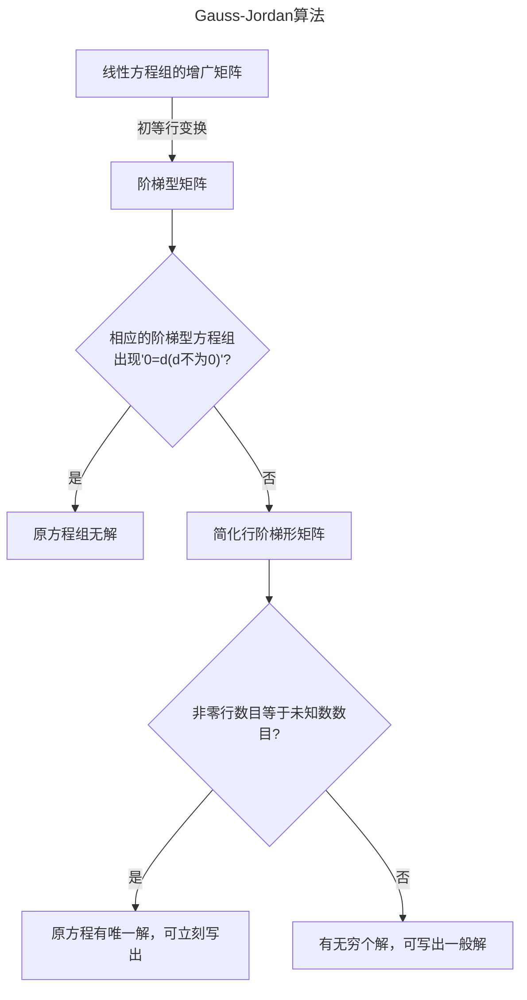
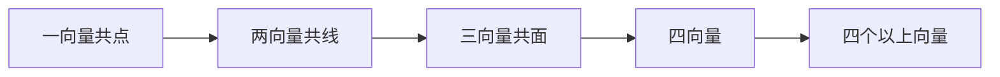

# 行列式
## 1 排列
> 「Definition：排列」
> n个不同的正整数组成的一个有序数组称为一个n阶排列。
> 在n阶排列$a_{1}a_{2}a_{3}\dots a_{n}$中**从左到右**任取一对数$a_{i}a_{j}(i<j)$，如果$a_{i}<a_{j}$，那么称这一对数为一个顺序；如果$a_{i}>a_{j}$，那么称这一对数为一个逆序。
> 一个n阶排列中逆序的总数称为逆序数，记作$\tau(a_{1},a_{2}\dots a_{n})$.
> 逆序数为奇数的排列称为奇排列，偶数的为偶排列。
> ==🖇️Properties：==
> 1. 对换改变排列的奇偶性。
> 2. 任意一个n阶排列都可以与排列12...n经过一系列对换互变，并且所作对换的个数与这个排列有相同的奇偶性。

Proof ：
1.相邻对换：$\dots jk\dots \Rightarrow\dots kj\dots$
显然jk对换不影响jk以外的数的逆序数；
假设$j>k$，对换后逆序数减一；$j<k$，对换后逆序数加一。
故对换后奇偶性改变
不相邻对换：$\dots ji_{1}i_{2}\dots i_{s}k\dots \Rightarrow\dots ki_{1}i_{2}\dots i_{s}j\dots$
把j向右移动s+1位，k向左移动s位即可。故一共进行了2s+1次相邻对换，改变奇偶性。
2.对排列的阶数n使用弱归纳法
一阶排列只有一个，显然成立；
假设结论对于n-1阶排列已经成立；
对于n阶排列$j_{1}j_{2}\dots j_{n}$，
若$j_{n}=n$，由归纳法假设，经过一系列对换可以$j_{1}j_{2}\dots j_{n-1}\Rightarrow12\dots(n-1)$
若$j_{n}\ne n$，将n对换到最后一位，就变成上面的情形。
故结论普遍成立
相仿的，$12\dots n$也可以经过一系列对换变为$j_{1}j_{2}\dots j_{n}$，由于$12\dots n$是偶排列，故所作对换的个数与$j_{1}j_{2}\dots j_{n}$有相同的奇偶性
证毕

## 2 行列式及其性质
> 「Definition：n阶行列式」
> n阶矩阵的行列式
> $$\begin{vmatrix}
a_{11}\quad a_{12}\dots a_{1n}  \\
a_{21}\quad a_{22}\dots a_{2n}  \\
\dots  \\
a_{n1}\quad a_{n2}\dots a_{nn}
\end{vmatrix}$$
>等于所有取自**不同行不同列的n个元素的乘积的代数和**。每一项都是位于不同行不同列的n个元素的乘积，把这n个元素的行指标按自然顺序排好位置，列指标构成的排列的奇偶性决定该项的正负，即
>$\sum\limits_{j_{1}j_{2}\dots j_{n}}(-1)^{\tau(j_{1}j_{2}\dots j_{n})}a_{1j_{1}}a_{2j_{2}}\dots a_{nj_{n}}=\sum\limits(-1)^{\tau(i_{1}i_{2}\dots i_{n})+\tau(j_{1}j_{2}\dots j_{n})}a_{i_{1}j_{1}}a_{i_{2}j_{2}}\dots a_{i_{n}j_{n}}$
>它的主对角线是从左上方到右下方的对角线。

>[!example] 
>主对角线下方全为0的行列式称为上三角行列式，它的值等于主对角线上n个元素的乘积。
>
>$$\begin{vmatrix}
>a_{11}& a_{12}&\dots &a_{1n}  \\
>0&a_{22}&\dots& a_{2n}  \\
>&&\dots& \\
>0&0&\dots& a_{nn}
>\end{vmatrix}$$

>[!example] 
>主对角线以外元素全为0的行列式称为对角型行列式，它是特殊的上三角行列式。

>==🖇️Properties：==
>1.行列式中行与列的地位是对称的。
>>[!note] 
>>行列互换后变为原来的转置行列式，不影响值。且凡是有关行的性质，对列也成立。
>>以下只探讨行的性质，事实上对列也成立。
>
>2.初等变换类：
>	2.1.行列式一行的公因子可以提取出来，即：
>$$\begin{vmatrix}
>a_{11}&a_{12}&\dots&a_{1n}  \\
>\vdots&\vdots&\vdots&\vdots \\
>ka_{i1}&ka_{i2}&\dots&ka_{in} \\
>\vdots&\vdots&\vdots&\vdots  \\
>a_{n1}&a_{n2}&\dots&a_{nn}
>\end{vmatrix}=k\begin{vmatrix}
>a_{11}&a_{12}&\dots&a_{1n}  \\
>\vdots&\vdots&\vdots&\vdots \\
>a_{i1}&a_{i2}&\dots&a_{in} \\
>\vdots&\vdots&\vdots&\vdots  \\
>a_{n1}&a_{n2}&\dots&a_{nn}
>\end{vmatrix}$$
>>[!tip] 
>>显然，如果行列式一行为0，行列式为0。
>
>
>	2.2.两行互换，行列式反号：
>$$\begin{vmatrix}
>a_{11}&a_{12}&\dots&a_{1n}  \\
>\vdots&\vdots&\vdots&\vdots \\
>a_{i1}&a_{i2}&\dots&a_{in} \\ 
>\vdots&\vdots&\vdots&\vdots \\
>a_{j1}&a_{j2}&\dots&a_{jn} \\
>\vdots&\vdots&\vdots&\vdots  \\
>a_{n1}&a_{n2}&\dots&a_{nn}
>\end{vmatrix}=-\begin{vmatrix}
>a_{11}&a_{12}&\dots&a_{1n}  \\
>\vdots&\vdots&\vdots&\vdots \\
>a_{j1}&a_{j2}&\dots&a_{jn} \\ 
>\vdots&\vdots&\vdots&\vdots \\
>a_{i1}&a_{i2}&\dots&a_{in} \\
>\vdots&\vdots&\vdots&\vdots  \\
>a_{n1}&a_{n2}&\dots&a_{nn}
>\end{vmatrix}$$
>
>	2.3.把一行的倍数加到另一行上，行列式值不变：
>$$\begin{vmatrix}
a_{11}&a_{12}&\dots&a_{1n}  \\
\vdots&\vdots&\vdots&\vdots \\
a_{i1}&a_{i2}&\dots&a_{in} \\ 
\vdots&\vdots&\vdots&\vdots \\
a_{j1}&a_{j2}&\dots&a_{jn} \\
\vdots&\vdots&\vdots&\vdots  \\
a_{n1}&a_{n2}&\dots&a_{nn}
\end{vmatrix}=\begin{vmatrix}
a_{11}&a_{12}&\dots&a_{1n}  \\
\vdots&\vdots&\vdots&\vdots \\
a_{i1}&a_{i2}&\dots&a_{in} \\ 
\vdots&\vdots&\vdots&\vdots \\
a_{j1}+ka_{i1}&a_{j2}+ka_{i2}&\dots&a_{jn}+ka_{in} \\
\vdots&\vdots&\vdots&\vdots  \\
a_{n1}&a_{n2}&\dots&a_{nn}
\end{vmatrix}$$
>3.行列式中若有一行是两组数的和，那么行列式等于这两个行列式的和：
>$$\begin{vmatrix}
>a_{11}&a_{12}&\dots&a_{1n}  \\
>\vdots&\vdots&\vdots&\vdots \\
>b_{1}+c_{1}&b_{2}+c_{2}&\dots&b_{n}+c_{n} \\
>\vdots&\vdots&\vdots&\vdots  \\
>a_{n1}&a_{n2}&\dots&a_{nn}
>\end{vmatrix}=\begin{vmatrix}
>a_{11}&a_{12}&\dots&a_{1n}  \\
>\vdots&\vdots&\vdots&\vdots \\
>b_{1}&b_{2}&\dots&b_{n} \\
>\vdots&\vdots&\vdots&\vdots  \\
>a_{n1}&a_{n2}&\dots&a_{nn}
>\end{vmatrix}+\begin{vmatrix}
>a_{11}&a_{12}&\dots&a_{1n}  \\
>\vdots&\vdots&\vdots&\vdots \\
>c_{1}&c_{2}&\dots&c_{n} \\
>\vdots&\vdots&\vdots&\vdots  \\
>a_{n1}&a_{n2}&\dots&a_{nn}
>\end{vmatrix}
>$$
>>[!tip] 
>>可以推广到多组数和的形式。
>
>>[!tip] 
>>由此，行列式两行相同或成比例，行列式为0.

Proof ：
n阶行列式共有$n!$项，可以将它们分为n组，第一组都含有$a_{i1}$，第二组都含有$a_{i2}$，等等，把它们提取出来有：
$\begin{vmatrix}a_{11}&\dots&a_{1n}\\ \vdots&&\vdots\\a_{n1}&\dots&a_{nn}\end{vmatrix}=a_{i1}A_{i1}+a_{i2}A_{i2}+\dots a_{in}A_{in}$(事实上，这就是行列式按照一行展开定理)
以上性质均可以用展开后的行列式来证明
证毕

## 3 行列式按一行(列)展开
> 「Definition：代数余子式」
> 在行列式$\begin{vmatrix}a_{11}&\dots&a_{1j}&\dots&a_{1n}\\\vdots&&\vdots&&\vdots\\a_{i1}&\dots&a_{ij}&\dots&a_{in}\\\vdots&&\vdots&&\vdots\\a_{n1}&\dots&a_{nj}&\dots&a_{nn}\end{vmatrix}$中划去元素$a_{ij}$所在的第i行与第j列，剩下的$(n-1)^2$个元素按照原来的排法构成一个n-1阶的行列式$\begin{vmatrix}a_{11}&\dots&a_{1,j-1}&a_{1,j+1}&\dots&a_{1n}\\\vdots&&\vdots&&\vdots\\a_{i-1,1}&\dots&a_{i-1,j-1}&a_{i-1,j+1}&\dots&a_{i-1,n}\\a_{i+1,1}&\dots&a_{i+1,j-1}&a_{i+1,j+1}&\dots&a_{i+1,n}\\\vdots&&\vdots&&\vdots\\a_{n1}&\dots&a_{n,j-1}&a_{n,j+1}&\dots&a_{nn}\end{vmatrix}$称为元素$a_{ij}$的余子式。
> 而$A_{ij}=(-1)^{i+j}M_{ij}$叫做元素$a_{ij}$的代数余子式。

>Theorem:行列式按一行(列)展开
>设$d=\begin{vmatrix}a_{11}&\dots&a_{1n}\\ \vdots&&\vdots\\a_{n1}&\dots&a_{nn}\end{vmatrix}$
>则成立:
>按k行展开：$\sum\limits^{n}_{s=1}a_{ks}A_{is}=\begin{cases}d,k=i\\0,k\ne i\end{cases}$
>按l列展开：$\sum\limits^{n}_{s=1}a_{sl}A_{sj}=\begin{cases}d,l=j\\0,l\ne j\end{cases}$

Proof ：
$1^\circ$ 先证$d=a_{i1}A_{i1}+a_{i2}A_{i2}+\dots a_{in}A_{in}$
n阶行列式共有$n!$项，可以将它们分为n组，第一组都含有$a_{i1}$，第二组都含有$a_{i2}$，等等，把它们提取出来有：
$\begin{vmatrix}a_{11}&\dots&a_{1n}\\ \vdots&&\vdots\\a_{n1}&\dots&a_{nn}\end{vmatrix}=a_{i1}A_{i1}+a_{i2}A_{i2}+\dots a_{in}A_{in}$ 
$1.1^\circ$ 先证对于这些$A_{ij}$，有$A_{ij}=(-1)^{i+j}M_{ij}$
由定义可知n阶行列式与n-1阶行列式有以下关系：
$\begin{vmatrix}a_{11}&\dots&a_{1,n-1}&a_{1,n}\\ \vdots&&\vdots&\vdots\\a_{n-1,1}&\dots&a_{n-1,n-1}&a_{n-1,n}\\0&\dots&0&1\end{vmatrix}=\begin{vmatrix}a_{11}&\dots&a_{1,n-1}\\ \vdots&&\vdots\\a_{n-1,1}&\dots&a_{n-1,n-1}\end{vmatrix}$
为证明$A_{ij}=(-1)^{i+j}M_{ij}$，令$a_{i1}=\dots a_{i,j-1}=a_{i,j+1}=\dots=a_{in}=0,a_{ij}=1$
即得：
$$\begin{align}
A_{ij}&=\begin{vmatrix}a_{11}&\dots&a_{1,j-1}&a_{1j}&a_{1,j+1}&\dots&a_{1n}\\\vdots&&\vdots&\vdots&\vdots&&\vdots\\a_{i-1,1}&\dots&a_{i-1,j-1}&a_{i-1,j}&a_{i-1,j+1}&\dots&a_{i-1,n}\\0&\dots&0&1&0&\dots&0 \\a_{i+1,1}&\dots&a_{i+1,j-1}&a_{i+1,j}&a_{i+1,j+1}&\dots&a_{i+1,n}\\\vdots&&\vdots&\vdots&\vdots\\a_{n1}&\dots&a_{n,j-1}&a_{nj}&a_{n,j+1}&\dots&a_{nn}\end{vmatrix} \\
&=(-1)^{n-i}\begin{vmatrix}a_{11}&\dots&a_{1,j-1}&a_{1j}&a_{1,j+1}&\dots&a_{1n}\\\vdots&&\vdots&\vdots&\vdots&&\vdots\\a_{i-1,1}&\dots&a_{i-1,j-1}&a_{i-1,j}&a_{i-1,j+1}&\dots&a_{i-1,n}\\a_{n1}&\dots&a_{n,j-1}&a_{nj}&a_{n,j+1}&\dots&a_{nn} \\a_{i+1,1}&\dots&a_{i+1,j-1}&a_{i+1,j}&a_{i+1,j+1}&\dots&a_{i+1,n}\\\vdots&&\vdots&\vdots&\vdots\\0&\dots&0&1&0&\dots&0 \end{vmatrix}  \\
&=(-1)^{(n-i)+(n-j)}\begin{vmatrix}a_{11}&\dots&a_{1,j-1}&a_{1,j+1}&\dots&a_{1n}&a_{1j}\\\vdots&&\vdots&\vdots&\vdots&&\vdots\\a_{i-1,1}&\dots&a_{i-1,j-1}&a_{i-1,j+1}&\dots&a_{i-1,n}&a_{i-1,j}\\a_{n1}&\dots&a_{n,j-1}&a_{n,j+1}&\dots&a_{nn}&a_{nj} \\a_{i+1,1}&\dots&a_{i+1,j-1}&a_{i+1,j+1}&\dots&a_{i+1,n}&a_{i+1,j}\\\vdots&&\vdots&\vdots&\vdots\\0&\dots&0&0&\dots&0&1 \end{vmatrix}
\end{align}$$
第一步是依次把第i行和它的下一行对换，直至换到第n行；第二步是依次把第j列和它的下一列对换，直至换到第n列；
又由于$(-1)^{2n-(i+j)}=(-1)^{i+j}$
即得$A_{ij}=(-1)^{i+j}M_{ij}$
$1.2^\circ$ 因此就有：$d=a_{i1}A_{i1}+a_{i2}A_{i2}+\dots a_{in}A_{in}$

$2^\circ$ 再证$a_{i1}A_{s1}+a_{i2}A_{s2}+\dots a_{in}A_{sn}=0\quad(i\neq s)$
只需要构造一个两行相同的行列式即可。
证毕

>[!note] 
>n=3时，该定理有明显的几何意义：
>$\boldsymbol{\alpha_{1}}=(a_{11},a_{12},a_{13}),\boldsymbol{\alpha_{2}}=(a_{21},a_{22},a_{23}),\boldsymbol{\alpha_{3}}=(a_{31},a_{32},a_{33})$
>那么$\boldsymbol{\alpha_{2}}\times \boldsymbol{\alpha_{3}}=(A_{11},A_{12},A_{13})$
>于是：$a_{11}A_{11}+a_{12}A_{12}+a_{13}A_{13}=\boldsymbol{\alpha_{1}}\cdot(\boldsymbol{\alpha_{2}}\times \boldsymbol{\alpha_{3}})$
>$a_{21}A_{11}+a_{22}A_{12}+a_{23}A_{13}=\boldsymbol{\alpha_{2}}\cdot(\boldsymbol{\alpha_{2}}\times \boldsymbol{\alpha_{3}})=0$
>$a_{31}A_{11}+a_{32}A_{12}+a_{33}A_{13}=\boldsymbol{\alpha_{3}}\cdot(\boldsymbol{\alpha_{2}}\times \boldsymbol{\alpha_{3}})=0$

## 4 Cramer法则
>Theorem:Cramer法则
>如果线性方程组$\begin{cases}a_{11}x_{1}+a_{12}x_{2}+\dots+a_{1n}x_{n}=b_{1}\\a_{21}x_{1}+a_{22}x_{2}+\dots+a_{2n}x_{n}=b_{2}\\\quad\vdots\qquad\quad\vdots \qquad\quad\quad\quad\vdots\\a_{n1}x_{1}+a_{n2}x_{2}+\dots+a_{nn}x_{n}=b_{n}\end{cases}$(方程个数与未知量的个数相等)的系数矩阵$A=\begin{bmatrix}a_{11}\quad a_{12}\dots a_{1n}  \\a_{21}\quad a_{22}\dots a_{2n}  \\\dots  \\a_{n1}\quad a_{n2}\dots a_{nn}\end{bmatrix}$的行列式，即系数行列式$d=|A|\ne0$，那么该线性方程组有唯一解，为
>$x_{1}=\frac{d_{1}}{d},x_{2}=\frac{d_{2}}{d}\dots x_{n}=\frac{d_{n}}{d}$
>其中$d_{j}$是将矩阵A中的第j列换成$b_{1},b_{2}\dots b_{n}$
>
>反之也成立

Proof ：
$\Longrightarrow$ 
$1^\circ$先将$\left( \frac{d_{1}}{d}, \frac{d_{2}}{d}\dots \frac{d_{n}}{d}\right)$代入方程组，验证它是解
$2^\circ$假设$(c_{1},c_{2}\dots c_{n})$是另一个解，证明这两个解相同
或者由$AX=B$，A可逆知X唯一，$X=A^{-1}B$

$\Longleftarrow$
设该方程组有唯一解$(c_{1},c_{2},\dots c_{n})$，对于它的导出组，若有非零解$(d_{1},d_{2},\dots d_{n})$，则$(c_{1}+d_{1},c_{2}+d_{2},\dots c_{n}+d_{n})$也是原方程组的解且异于它的唯一解，矛盾
因此它的导出组只有零解，因此$|A|\neq0$
证毕

## 5 行列式按k行(列)展开
> 「Definition：k阶代数余子式」
> 在n阶行列式D中任意选定k行k列$k\le n$，位于这些行和列的交点上的$k^2$个元素按照原来的次序组成的k阶行列式M，称为行列式D的k阶子式
> 当$k<n$时，在D中划去这k行k列剩下的元素按照原来的次序组成的n-k阶行列式M'称为k阶子式M的余子式 
>$(-1)^{(i_{1}+i_{2}+\dots i_{k})+(j_{1}+j_{2}+\dots j_{k})}M'$称为M的代数余子式，其中$i_{1},\dots i_{k},j_{1}\dots j_{k}$分别是M在D中行、列指标

>Theorem:Laplace定理
>设在行列式D中任意选定了k($1\le k\le n-1$)行，由这k行元素所组成的一切k阶子式与它们的代数余子式的乘积的和等于行列式D

Proof ：
$1^\circ$ 先证明行列式D中任意一个子式M与它的代数余子式A的乘积中的每一项都是行列式D展开式中的一项
$1.1^\circ$ 先讨论M位于行列式D左上角的情形 

$1.2^\circ$ 一般情形可通过上述情形的对换得到

$2^\circ$ 再证明$D=M_{1}A_{1}+\dots M_{t}A_{t}$等式两边项数相等即可

证毕

## 6 特殊行列式
> 「Definition：Vandermonde行列式」
> $d=\begin{vmatrix}1&1&\dots&1\\a_{1}&a_{2}&\dots&a_{n}\\a_{1}^2&a_{2}^2&\dots&a_{n}^2\\ \vdots&\vdots&&\vdots\\a_{1}^{n-1}&a_{2}^{n-1}&\dots&a_{n}^{n-1}\end{vmatrix}$称为n阶的Vandermonde行列式 
>
>$d=\prod\limits_{1\le j\le i\le n}(a_{i}-a_{j})$
>可以使用弱归纳法证明

> 「Definition：箭形行列式」
> 若行列式满足$a_{ij}=0(i\ne j\ne1)$，就称D为箭形行列式，有：
> $\begin{vmatrix}a_{11}&a_{12}&a_{13}&\dots&a_{1n}\\a_{21}&a_{22}&0&\dots&0\\a_{31}&0&a_{33}&\dots&0\\ \vdots&\vdots&\vdots&&\vdots\\a_{n1}&0&0&\dots&a_{nn}\end{vmatrix}=\left( a_{11}-\sum\limits_{k=2}^n \frac{a_{1k}a_{k1}}{a_{kk}} \right)\prod\limits_{k=2}^na_{kk}$
> 解决方法：第一列依次减去第二列的$\frac{a_{21}}{a_{22}}$倍，...，第n列的$\frac{a_{n1}}{a_{nn}}$倍，使第一列变成$\begin{bmatrix}a_{11}-\sum\limits_{k=2}^n \frac{a_{1k}a_{k1}}{a_{kk}}\\0\\0\\ \vdots\\0\end{bmatrix}$，之后按第一列展开即可

> 「Definition：两三角形行列式」
> 若行列式满足$a_{ij}=\begin{cases}a,i<j\\x_{i},i=j\\b,i>j\end{cases}$，就称D为两三角形行列式，有：
> $\begin{vmatrix}x_{1}&a&a&\dots&a\\b&x_{2}&a&\dots&a\\b&b&x_{3}&\dots&a\\ \vdots&\vdots&\vdots&&\vdots\\b&b&b&\dots&x_{n}\end{vmatrix}=\begin{cases}\left[ x_{1}+a \sum\limits^{n}_{k=2} \frac{x_{1}-a}{x_{k}-a} \right]\cdot \prod\limits^{n}_{k=2}(x_{k}-a),a=b\\(x_{n}-b)D_{n-1}+\prod\limits^{n-1}_{k=1}(x_{k}-a),a\ne b\end{cases}$

Solution ：
将最后一列拆分：
$$D_n=\left|\begin{array}{cccccc}
x_1& b&\cdots& b& b+0\\
a& x_2&\cdots& b& b+0\\
\vdots&\vdots&\ddots&\vdots&\vdots\\
a& a&\cdots& x_{n-1}& b+0\\
a& a&\cdots& a& b+(x_n-b)
\end{array}\right|=\left|\begin{array}{cccccc}
x_1& b&\cdots& b& b\\
a& x_2&\cdots& b& b\\
\vdots&\vdots&\ddots&\vdots&\vdots\\
a& a&\cdots& x_{n-1}& b\\
a& a&\cdots& a& b
\end{array}\right|+
\left|\begin{array}{cccccc}
x_1& b&\cdots& b& 0\\
a& x_2&\cdots& b& 0\\
\vdots&\vdots&\ddots&\vdots&\vdots\\
a& a&\cdots& x_{n-1}& 0\\
a& a&\cdots& a& x_{n}-b
\end{array}\right|.$$

后面一个行列式显然等于$(x_n-b) D_{n-1}$
对于前一个式子，用最后一行的-1倍加到各行，得到

$$\begin{vmatrix}
x_1& b&\cdots& b& b\\
a& x_2&\cdots& b& b\\
\vdots&\vdots&\ddots&\vdots&\vdots\\
a& a&\cdots& x_{n-1}& b\\
a& a&\cdots& a& b
\end{vmatrix}=\begin{vmatrix}
x_1-a& b-a&\cdots& b-a& 0\\
0& x_2-a&\cdots& b-a& 0\\
\vdots&\vdots&\ddots&\vdots&\vdots\\
0& 0&\cdots& x_{n-1}-a& 0\\
a& a&\cdots& a& b
\end{vmatrix}$$

再按最后一列展开，行列式等于 $b\prod_{i=1}^{n-1}(x_i-a)$。综合，就有$D_n=(x_n-b) D_{n-1}+b\prod_{i=1}^{n-1}(x_i-a)$.
如果按最后一行拆开，近似地，就有对称式：$D_n=(x_n-a) D_{n-1}+a\prod_{i=1}^{n-1}(x_i-b)$.

如此，就可以将$D_{n}$解出来：$D_n=\frac{b\prod_{i=1}^n(x_i-a)-a\prod_{i=1}^n(x_i-b)}{b-a}$.

 eg. 1 
求行列式：
1)(缺一行的Vandermonde行列式)$\begin{vmatrix}1&1&\dots&1\\a_{1}&a_{2}&\dots&a_{n}\\a_{1}^2&a_{2}^2&\dots&a_{n}^2\\ \vdots&\vdots&&\vdots\\a_{1}^{n-2}&a_{2}^{n-2}&\dots&a_{n}^{n-2}\\a_{1}^{n}&a_{2}^{n}&\dots&a_{n}^{n}\end{vmatrix}$
2)(加两次边)$\begin{vmatrix}0&a_{1}+a_{2}&a_{1}+a_{3}&\dots&a_{1}+a_{n}\\a_{2}+a_{1}&0&a_{2}+a_{3}&\dots&a_{2}+a_{n}\\a_{3}+a_{1}&a_{2}+a_{1}&0&\dots&a_{3}+a_{n}\\ \vdots&\vdots&\vdots&&\vdots\\a_{n}+a_{1}&a_{n}+a_{2}&a_{n}+a_{3}&\dots&a_{n}+a_{n}\end{vmatrix}$

Solution ：
1)加边为$\begin{vmatrix}1&1&\dots&1&1\\a_{1}&a_{2}&\dots&a_{n}&y\\a_{1}^2&a_{2}^2&\dots&a_{n}^2&y^2\\ \vdots&\vdots&&\vdots&\vdots\\a_{1}^{n-2}&a_{2}^{n-2}&\dots&a_{n}^{n-2}&y^{n-2}\\a_{1}^{n-1}&a_{2}^{n-1}&\dots&a_{n}^{n-1}&y^{n-1}\\a_{1}^{n}&a_{2}^{n}&\dots&a_{n}^{n}&y^n\end{vmatrix}$，比较$y^{n-1}$的系数即可
2)(加边法)
$$\begin{align}
\begin{vmatrix}
0&a_1+a_2&a_1+a_3&...&a_1+a_n\\a_2+a_1&0&a_2+a_3&...&a_2+a_n\\a_3+a_1&a_3+a_2&0&...&a_3+a_n\\...&...&...&...&...\\a_n+a_1&a_n+a_2&a_n+a_3&...&0
\end{vmatrix}&\xlongequal{加边} 
\begin{vmatrix}
1&a_1&a_2&...&a_n\\0&0&a_1+a_2&...&a_1+a_n\\0&a_2+a_1&0&...&a_2+a_n\\...&...&...&...&...\\0&a_n+a_1&a_n+a_2&...&0
\end{vmatrix} \\
&\xlongequal{r_1×(-1)+r_i(i\ne1)}\begin{vmatrix}
1&a_1&a_2&...&a_n\\-1&-a_1&a_1&...&a_1\\-1&a_2&-a_2&...&a_2\\...&...&...&...&...\\-1&a_n&a_n&...&-a_n
\end{vmatrix} \\
&\xlongequal{加边}\begin{vmatrix}
1&0&0&0&...&0\\0&1&a_1&a_2&...&a_n\\a_1&-1&-a_1&a_1&...&a_1\\a_2&-1&a_2&-a_2&...&a_2\\...&...&...&...&...\\a_n&-1&a_n&a_n&...&-a_n
\end{vmatrix} \\
&\xlongequal{c_1×(-1)+c_i(i\ne1,2)}\begin{vmatrix}
1&0&-1&-1&...&-1\\0&1&a_1&a_2&...&a_n\\a_1&-1&-2a_1&0&...&0\\a_2&-1&0&-2a_2&...&0\\...&...&...&...&...\\a_n&-1&0&0&...&-2a_n
\end{vmatrix}
\end{align}$$

# 线性方程组
## 1 用消元法研究线性方程组
### 1.1 线性方程组与消元法

>  「Definition：线性方程组」
>含有n个未知量的线性方程组称为n元线性方程组，其一般形式为：
>$$\begin{cases}a_{11}x_{1}+a_{12}x_{2}+\dots+a_{1n}x_{n}=b_{1}\\a_{21}x_{1}+a_{22}x_{2}+\dots+a_{2n}x_{n}=b_{2}\\\quad\vdots\qquad\quad\vdots \qquad\quad\quad\quad\vdots\\a_{s1}x_{1}+a_{s2}x_{2}+\dots+a_{sn}x_{n}=b_{s}\end{cases}$$
> $a_{ij}(i=1,2\dots s,j=1,2\dots n)$称为方程组的系数，$b_{j}(j=1,2\dots s)$称为常数项。
> 方程组的一个解，就是由n个数组成的有序数组，代入后使得每个等式变为恒等式。方程组解的全体称为它的解集合。如果两个方程组具有相同的解集合，称它们同解。
> 
> >[!note] 
> >同解的线性方程组之间是等价关系，即满足**自反性、对称性、传递性**。

>  「Definition：初等变换」
> 线性方程组的初等变换是指以下三种变换：
> 1)把一个方程的倍数加到另一个方程。
> 2)互换两个方程的位置。
> 3)用一个非零常数乘以某一个方程。
>
>显然，经过初等变换后的方程组与原方程组同解。

Proof ：
只需证明原方程组的解是变换后的方程组的解，以及变换后的方程组的解是原方程组的解即可。

> 「Definition：矩阵」
>由sm个数排成s行、m列的一张表称为一个$s\times m$矩阵，第i行第j列的元素称为矩阵的(i,j)元。
>元素全为0的矩阵称为零矩阵。
>如果一个矩阵行数与列数相同，则称它为方阵。
>
>将线性方程组的系数按原先顺序对应排列，就形成了它的系数矩阵；系数和常数项对应排列，就形成了它的增广矩阵。
> 「Definition：阶梯型矩阵」
>所给矩阵为行阶梯型矩阵，则矩阵中每一行的第一个不为零的元素的左边及其所在列以下全为零。
>在阶梯形矩阵中，若非零行的第一个非零元素全是1，且非零行的第一个元素1所在列的其余元素全为零，就称该矩阵为行最简形矩阵(简化行阶梯形矩阵)。
>在最简形矩阵中，非零行有且只有一个非零元素且为1，则称该矩阵为标准形矩阵。
>
>任意一个矩阵都可以通过初等行变换化成阶梯型矩阵。
>进一步，任意一个矩阵都可以通过初等行变换化成简化行阶梯型矩阵，并且是唯一的。

Proof ：
第一列元素只要有一个不为零，通过互换两行总可以使$a_{11}$不为0；第i行加上第一行的$-\frac{a_{i1}}{a_{11}}$倍，使得第一列除了第一个元素外均为0；以此类推。
证毕

>  「Definition：一般解」
> 如果n元线性方程组的一部分未知量可以用其余未知量的至多一次的式子来表示，那么把这个表达式称为这个线性方程组的一般解，这些其余未知量称为自由未知量。

>[!important] 
>通常选取系数阶梯型矩阵中每行第一个不为零的元为固定量，其余为自由未知量

### 1.2 解的情况与判定法则
> Theorem:Gauss-Jordan算法
> 系数和常数项为有理数(或者实数、复数)的n元线性方程组的解的情况有且仅有三种可能：无解、有唯一解、有无穷个解。
> 如果一个线性方程组有解，则称它是相容的，否则是不相容的。

> Corollary
> n元齐次线性方程组有非零解的充分必要条件是：它的系数矩阵化成的阶梯型矩阵中，非零行的数目r<n。
> 显然，对于n元线性齐次方程组，如果方程的数目s小于未知数的数目n，它一定有非零解。

Proof ：
显然，方程组化为阶梯型矩阵后，方程的个数不会超过原方程组方程的个数，即$r\leqslant s<n$
故它的解不是唯一的，必有非零解

>Theorem:齐次方程组解的判定定理
>常数项全为零的线性方程组称为**齐次线性方程组**，齐次方程组总是有解的，即$(0,0,0\dots0)$，我们关注的是它的非零解 
>
>如果齐次线性方程组$\begin{cases}a_{11}x_{1}+a_{12}x_{2}+\dots+a_{1n}x_{n}=0\\a_{21}x_{1}+a_{22}x_{2}+\dots+a_{2n}x_{n}=0\\\dots\\a_{n1}x_{1}+a_{n2}x_{2}+\dots+a_{nn}x_{n}=0\end{cases}$的系数矩阵的行列式$|A|\ne0$，则它只有零解；
>反之，若$|A|=0$，则它有非零解
>
>反过来也成立

Proof ：
$\Longrightarrow$
由Cramer法则，因为行列式$d_{j}$中有一列为0，故$d_{j}=0,j=1,2,\dots n$
故它唯一的解为$\left( \frac{d_{1}}{d}, \frac{d_{2}}{d}\dots \frac{d_{n}}{d}\right)=(0,0,\dots0)$

$\Longleftarrow$
方程组有非零解$\Longleftrightarrow$ 系数矩阵的列向量组线性相关，即$|A|=0$

证毕

## 2 向量代数
### 2.1 n维向量空间
> 「Definition：n维向量空间」
> 取定一个数域P，设n是一个任意的正整数，令$P^n=\{(a_{1},a_{2}\dots a_{n})|a_{i}\in P,i=1,2\dots n\}$
> 
> 1)**相等**：若$a_{1}=b_{1},a_{2}=b_{2}\dots a_{n}=b_{n}$，则称$P^n$中的两个元素$(a_{1},a_{2},\dots a_{n}),(b_{1},b_{2}\dots b_{n})$相等
> 2)**加法**：在$P^n$中定义加法运算如下：$(a_{1},a_{2},\dots a_{n})+(b_{1},b_{2}\dots b_{n})\xlongequal{def}(a_{1}+b_{1},a_{2}+b_{2},\dots a_{n}+b_{n})$
> 3)**数乘**：在P中的元素与$P^n$中元素之间规定数量乘法运算如下：$k(a_{1},a_{2},\dots a_{n})\xlongequal{def}(ka_{1},ka_{2},\dots ka_{n})$
> 4)**8条运算法则**：加法和数乘运算满足下述8条与运算法则，对于$\boldsymbol{\alpha},\boldsymbol{\beta},\boldsymbol{\gamma}\in P^n,k,l\in P:$
> 	$1^\circ$加法交换律：$\boldsymbol{\alpha}+\boldsymbol{\beta}=\boldsymbol{\beta}+\boldsymbol{\alpha}$
> 	$2^\circ$加法结合律：$(\boldsymbol{\alpha}+\boldsymbol{\beta})+\boldsymbol{\gamma}=\boldsymbol{\alpha}+(\boldsymbol{\beta}+\boldsymbol{\gamma})$
> 	$3^\circ$零元：将元素$(0,0\dots0)$记作$\boldsymbol{0}$，有$\boldsymbol{0}+\boldsymbol{\alpha}=\boldsymbol{\alpha}+\boldsymbol{0}=\boldsymbol{\alpha}$
> 	$4^\circ$负元：对于$\boldsymbol{\alpha}=(a_{1},a_{2}\dots a_{n})\in P^n$，令$-\boldsymbol{\alpha}\xlongequal{def}(-a_{1},-a_{2}\dots-a_{n})\in P^n$，有$\boldsymbol{\alpha}+(-\boldsymbol{\alpha})=(-\boldsymbol{\alpha})+\boldsymbol{\alpha}=\boldsymbol{0}$ 
> 	$5^\circ$单位元：$1\boldsymbol{\alpha}=\boldsymbol{\alpha}$
> 	$6^\circ$乘法结合律：$(kl)\boldsymbol{\alpha}=k(l\boldsymbol{\alpha})$
> 	$7^\circ$乘法分配律：$(k+l)\boldsymbol{\alpha}=k\boldsymbol{\alpha}+l\boldsymbol{\alpha}$
> 	$8^\circ$第二分配律：$k(\boldsymbol{\alpha}+\boldsymbol{\beta})=k\boldsymbol{\alpha}+k\boldsymbol{\beta}$
> 
> 数域P上一个n维向量就是指P中的一个n元有序数组$(a_{1},a_{2}\dots a_{n})$，$a_{i}$称为该向量的第i个分量。
> 通常用小写希腊字母表示向量。
> 
> 数域P上所有n维向量的集合，连同定义在它们上面的加法和数乘运算(加上八条运算律)称为数域P上的一个**n维向量空间**。
> 
> 向量通常写作一行$\boldsymbol{\alpha}=(a_{1},a_{2}\dots a_{n})$，有时也写作一列$\boldsymbol{\alpha}=\begin{pmatrix}a_{1}\\a_{2}\\ \vdots\\a_{n}\end{pmatrix}$，分别称为行向量和列向量，它们之间只是写法的区别。
> 

> 「Definition：子空间」
> $P^n$的一个非空子集$U$如果满足加法和数乘运算封闭，那么称$U$是$P^n$的一个线性子空间，简称子空间。
> 
> 向量组$\boldsymbol{\alpha_{1}},\boldsymbol{\alpha_{2}}\dots \boldsymbol{\alpha_{s}}$的所有线性组合组成的集合W是$P^n$的一个子空间，称它为$\boldsymbol{\alpha_{1}},\boldsymbol{\alpha_{2}}\dots \boldsymbol{\alpha_{s}}$生成(或张成)的子空间，记作$<\boldsymbol{\alpha_{1}},\boldsymbol{\alpha_{2}}\dots \boldsymbol{\alpha_{s}}>$

### 2.2 向量
> 「Definition：标架」
> 空间中的一个定点O，连同三个不共面的有序向量$\boldsymbol{e_{1}},\boldsymbol{e_{2}},\boldsymbol{e_{3}}$的全体，叫做空间中的一个标架，记作$\{O;\boldsymbol{e_{1}}，\boldsymbol{e_2},\boldsymbol{e_{3}}\}$.
> 如果$\boldsymbol{e_{1}},\boldsymbol{e_{2}},\boldsymbol{e_{3}}$都是单位向量，那么$\{O;\boldsymbol{e_{1}}，\boldsymbol{e_2},\boldsymbol{e_{3}}\}$叫做Cartesian标架；
> $\boldsymbol{e_{1}},\boldsymbol{e_{2}},\boldsymbol{e_{3}}$两两垂直的Cartesian标架叫做Cartesian直角标架，简称直角标架。
> 一般情况下，$\{O;\boldsymbol{e_{1}}，\boldsymbol{e_2},\boldsymbol{e_{3}}\}$叫做仿射标架。
>

> 「Definition：射影」
> 设向量$\vec{AB}$的始点A和终点B在轴l上的投影分别为$A',B'$,那么$\vec{A'B'}$叫做向量$\vec{AB}$在轴l上的射影向量，记作射影向量$_{l}\vec{AB}$
> 
> 射影关系：$\Pr_{l}\vec{AB}=|\vec{AB}|\cos<l,\vec{AB}>$

>Theorem:定比分点
>对于线段$AB(A\neq B)$，如果点$C$满足$\vec{AC}=\lambda\vec{CB}$，则称点$C$分线段$AB$成定比$\lambda$ 
>$1^\circ\lambda>0:$ $\vec{AC},\vec{CB}$同向，$C$是线段$AB$内部的点，称其为内分点；
>$2^\circ\lambda<0:$ $\vec{AC},\vec{CB}$反向，$C$是线段$AB$外部的点，称其为外分点；
>$3^\circ\lambda=0:$ $C$与$A$重合；
>$4^\circ\lambda\neq-1:$ 否则矛盾
>设$A(x_{1},y_{1},z_{1}),B(x_{2},y_{2},z_{2})$，则分线段$AB$成定比$\lambda(\lambda\neq-1)$的分点坐标为：$x=\frac{x_{1}+\lambda x_{2}}{1+\lambda},y=\frac{y_{1}+\lambda y_{2}}{1+\lambda},z=\frac{z_{1}+\lambda z_{2}}{1+\lambda}$ 
>

>Theorem:Menelaus定理
>如图，设$P,Q,R$分别分$\triangle ABC$的边$AB,BC,CA$成定比$\lambda,\mu,\nu$，则$P,Q,R\Longleftrightarrow\lambda \mu \nu=-1$
>

Proof ：
取平面仿射标架$\{A;\vec{AB},\vec{AC}\}$，则点$A:(0,0),B:(1,0),C:(0,1)$
由定比分点定理，$P:\left( \frac{\lambda}{1-\lambda},0 \right),Q:\left( \frac{1}{1+\mu},\frac{\mu}{1+\mu} \right),R:(0,\frac{1}{1+\nu})$
而三点共线的充要条件是：$\begin{vmatrix}\frac{\lambda}{1-\lambda}&\frac{1}{1+\mu}&0\\0&\frac{\mu}{1+\mu}&\frac{1}{1+\nu}\\1&1&1\end{vmatrix}=0$
得：$\lambda \mu \nu=-1$
证毕

>Theorem:Ceva定理
>如图，设$P,Q,R$分别**内分**$\triangle ABC$的边$AB,BC,CA$成定比$\lambda,\mu,\nu$，则$三线AQ,BR,CP共点\Longleftrightarrow\lambda \mu \nu=1$
>

Proof ：
三线共点的问题可以转换为三点共线的问题
取平面仿射标架$\{ A;\vec{AB},\vec{AC} \}$，则$A:(0,0),B:(1,0),C:(0,1)$
由定比分点定理，$P:\left( \frac{\lambda}{1-\lambda},0 \right),Q:\left( \frac{1}{1+\mu},\frac{\mu}{1+\mu} \right),R:(0,\frac{1}{1+\nu})$
设$AQ,BR$交于$M(x,y)$，且$M$分别分$AQ,BR$成定比$k,l$，则$x=\frac{k \frac{1}{1+\mu}}{1+k}=\frac{1}{1+l},y=\frac{k \frac{\mu}{1+\mu}}{1+k}=\frac{l \frac{1}{1+\nu}}{1+l}$
考虑$\frac{x}{y}$，得$\frac{1}{\mu}=\frac{1+\nu}{l}$，即$l=\mu(1+\nu)$
因此$x=\frac{1}{1+\mu(1+\nu)},y=\frac{\mu}{1+\mu(1+\nu)}$
由于$\mu>0,\nu>0$，因此$1+\mu(1+\nu)\neq0$，从而，$三线AQ,BR,CP共点\Longleftrightarrow三点C,M,P共线\Longleftrightarrow\lambda \mu \nu=1$
证毕

 eg. 1 
已知$\triangle OAB,\vec{OA}=\boldsymbol{a},\vec{OB}=\boldsymbol{b}$，将向量$\vec{OP}=\boldsymbol{p}$分解成$\boldsymbol{a},\boldsymbol{b}$的线性组合。

Solution ：
设$\vec{MP}=m\vec{MB},\vec{NP}=n\vec{NA}$
有$\boldsymbol{p}=\vec{OM}+\vec{MP}=\vec{ON}+\vec{NP}$
证毕

>[!note] 
>重要结论$\boldsymbol{p}=\frac{\lambda(1-\mu)}{1-\lambda \mu}\boldsymbol{a}+\frac{\mu(1-\lambda)}{1-\lambda \mu}\boldsymbol{b}$

### 2.3 向量的积
#### 2.3.1 内积
> 「Definition：内积」
> 两个向量$\boldsymbol{a},\boldsymbol{b}$的模和它们夹角的余弦的乘积叫做它们的数量积（内积），记作$\boldsymbol{a}\cdot \boldsymbol{b}$或$\boldsymbol{a}\boldsymbol{b}$，即
> $\boldsymbol{a}\cdot \boldsymbol{b}=|\boldsymbol{a}||\boldsymbol{b}|\cos\angle(\boldsymbol{a},\boldsymbol{b})$
> 
>显然，两个向量的内积是一个常量。
>
>两个向量$\boldsymbol{a},\boldsymbol{b}$相互垂直的充要条件是$\boldsymbol{a}\cdot \boldsymbol{b}=0$

>内积运算律
>1. 交换律：$\boldsymbol{a}\cdot \boldsymbol{b}=\boldsymbol{b}\cdot \boldsymbol{a}$ 
>2. 数因子结合律：$(\lambda \boldsymbol{a})\cdot \boldsymbol{b}=\lambda(\boldsymbol{a}\cdot \boldsymbol{b})=\boldsymbol{a}\cdot(\lambda \boldsymbol{b})$
>3. 分配律：$(\boldsymbol{a}+\boldsymbol{b})\cdot \boldsymbol{c}=\boldsymbol{a}\cdot \boldsymbol{c}+\boldsymbol{b}\cdot \boldsymbol{c}$
>4. $\boldsymbol{a}\cdot \boldsymbol{a}=\boldsymbol{a}^2>0(\boldsymbol{a}\ne \boldsymbol{0})$

>标架下的内积
>在直角坐标系$\{O;\boldsymbol{i},\boldsymbol{j},\boldsymbol{k}\}$下：
>1)**用坐标表示内积**：
>设$\boldsymbol{a}=X_{1}\boldsymbol{i}+Y_{1}\boldsymbol{j}+Z_{1}\boldsymbol{k},\boldsymbol{b}=X_{2}\boldsymbol{i}+Y_{2}\boldsymbol{j}+Z_{2}\boldsymbol{k},$则$\boldsymbol{a}\cdot \boldsymbol{b}=X_{1}X_{2}+Y_{1}Y_{2}+Z_{1}Z_{2}$
>
>2)**两点距离**：
>设$\boldsymbol{a}=X\boldsymbol{i}+Y\boldsymbol{j}+Z\boldsymbol{k},$则$|\boldsymbol{a}|=\sqrt{ \boldsymbol{a}^2 }=\sqrt{ X^2+Y^2+Z^2 }$
>空间中两点$P_{1}(x_{1},y_{1},z_{1}),P_{2}(x_{2},y_{2},z_{2})$之间的距离是：$d=\sqrt{ (x_{2}-x_{2})^2+(y_{2}-y_{1})^2+(z_{2}-z_{1})^2 }$
>
>3)**向量的方向余弦**：
>非零向量$\boldsymbol{a}=X\boldsymbol{i}+Y\boldsymbol{j}+Z\boldsymbol{k}$的方向余弦是： 
>$\begin{cases}\cos\alpha=\frac{X}{|\boldsymbol{a}|}=\frac{X}{\sqrt{ X^2+Y^2+Z^2 }} \\cos\beta=\frac{Y}{|\boldsymbol{a}|}=\frac{Y}{\sqrt{ X^2+Y^2+Z^2 }}\\\cos\gamma=\frac{Z}{|\boldsymbol{a}|}=\frac{Z}{\sqrt{ X^2+Y^2+Z^2 }}\end{cases}$
>其中$\alpha,\beta,\gamma$分别是向量$\boldsymbol{a}$与x,y,z轴的交角，即它的三个方向角。
>
>4)**两向量的交角**：
>设空间中两个非零向量$\boldsymbol{a}\{X_{1},Y_{1},Z_{1}\},\boldsymbol{b}\{X_{2},Y_{2},Z_{2}\}$,那么它们夹角的余弦是$\cos \angle(\boldsymbol{a},\boldsymbol{b})= \frac{\boldsymbol{a}\cdot \boldsymbol{b}}{|\boldsymbol{a}||\boldsymbol{b}|}= \frac{X_{1}X_{2}+Y_{1}Y_{2}+Z_{1}Z_{2}}{\sqrt{ X_{1}^2+Y_{1}^2+Z_{1}^2 }\cdot\sqrt{ X_{2}^2+Y_{2}^2+Z_{2}^2 }}$

#### 2.3.2 外积
> 「Definition：外积」
> 两个向量$\boldsymbol{a},\boldsymbol{b}$的外积是一个向量，记作$\boldsymbol{a}\times \boldsymbol{b}$或$[\boldsymbol{a}\boldsymbol{b}]$,它的模是$|\boldsymbol{a}\times \boldsymbol{b}|=|\boldsymbol{a}||\boldsymbol{b}|\sin \angle(\boldsymbol{a},\boldsymbol{b})$,它的方向和$\boldsymbol{a},\boldsymbol{b}$都垂直，并且按照$\boldsymbol{a},\boldsymbol{b},\boldsymbol{a}\times \boldsymbol{b}$的顺序形成右手标架$\{O;\boldsymbol{a},\boldsymbol{b},\boldsymbol{a}\times \boldsymbol{b}\}$
> 
> (几何意义)两个不共线向量$\boldsymbol{a},\boldsymbol{b}$的外积的模，等于以向量$\boldsymbol{a},\boldsymbol{b}$为边构成的平行四边形的面积。
> 两个向量$\boldsymbol{a},\boldsymbol{b}$共线的充要条件是$\boldsymbol{a}\times \boldsymbol{b}=\boldsymbol{0}$
>

>外积运算律
>1. 反交换律：$\boldsymbol{a}\times \boldsymbol{b}=-(\boldsymbol{b}\times \boldsymbol{a})$ 
>2. 数因子结合律：$(\lambda \boldsymbol{a})\times \boldsymbol{b}=\lambda(\boldsymbol{a}\times \boldsymbol{b})=\boldsymbol{a}\times(\lambda \boldsymbol{b})$
>3. 分配律：$(\boldsymbol{a}+\boldsymbol{b})\times \boldsymbol{c}=\boldsymbol{a}\times \boldsymbol{c}+\boldsymbol{b}\times \boldsymbol{c}$

>标架下的外积
>在直角坐标系$\{O;\boldsymbol{i},\boldsymbol{j},\boldsymbol{k}\}$下：
>1)**用坐标表示外积**：
>设$\boldsymbol{a}=X_{1}\boldsymbol{i}+Y_{1}\boldsymbol{j}+Z_{1}\boldsymbol{k},\boldsymbol{b}=X_{2}\boldsymbol{i}+Y_{2}\boldsymbol{j}+Z_{2}\boldsymbol{k},$则$\boldsymbol{a}\times \boldsymbol{b}=\begin{vmatrix}Y_{1}&Z_{1}\\Y_{2}&Z_{2}\end{vmatrix}\boldsymbol{i}+\begin{vmatrix}Z_{1}&X_{1}\\Z_{2}&X_{2}\end{vmatrix}\boldsymbol{j}+\begin{vmatrix}X_{1}&Y_{1}\\X_{2}&Y_{2}\end{vmatrix}\boldsymbol{k}=\begin{vmatrix}\boldsymbol{i}&\boldsymbol{j}&\boldsymbol{k}\\X_{1}&Y_{1}&Z_{1}\\X_{2}&Y_{2}&Z_{2}\end{vmatrix}$
>

#### 2.3.3 混合积
> 「Definition：混合积」
> 对于向量$\boldsymbol{a},\boldsymbol{b},\boldsymbol{c}$先做外积再做内积最后得到它们的混合积，记作$(\boldsymbol{a}\times \boldsymbol{b})\cdot \boldsymbol{c}$或$(\boldsymbol{a},\boldsymbol{b},\boldsymbol{c})$或$(\boldsymbol{a}\boldsymbol{b}\boldsymbol{c})$
> 
> (几何意义)$(\boldsymbol{a}\boldsymbol{b}\boldsymbol{c})=\varepsilon V(当\boldsymbol{a},\boldsymbol{b},\boldsymbol{c}是右手系时，\varepsilon=1;当\boldsymbol{a},\boldsymbol{b},\boldsymbol{c}是左手系时，\varepsilon=-1)$其中V是以$\boldsymbol{a},\boldsymbol{b},\boldsymbol{c}$为棱的平行六面体的体积。
> 显然，当$(\boldsymbol{a}\boldsymbol{b}\boldsymbol{c})=0$时，它们三个向量共面。

>混合积运算律
>轮换混合积的三个因子，不改变值；对调任何两个因子需要改变符号：$(\boldsymbol{a}\boldsymbol{b}\boldsymbol{c})=(\boldsymbol{b}\boldsymbol{c}\boldsymbol{a})=(\boldsymbol{c}\boldsymbol{a}\boldsymbol{b})=-(\boldsymbol{b}\boldsymbol{a}\boldsymbol{c})=-(\boldsymbol{c}\boldsymbol{b}\boldsymbol{a})=-(\boldsymbol{a}\boldsymbol{c}\boldsymbol{b})$
>显然，$(\boldsymbol{a}\times \boldsymbol{b})\cdot \boldsymbol{c}=\boldsymbol{a}\cdot(\boldsymbol{b}\times \boldsymbol{c})$

>标架下的混合积
>在直角坐标系$\{O;\boldsymbol{i},\boldsymbol{j},\boldsymbol{k}\}$下：
>1)**用坐标表示混合积**：
>设$\boldsymbol{a}=X_{1}\boldsymbol{i}+Y_{1}\boldsymbol{j}+Z_{1}\boldsymbol{k},\boldsymbol{b}=X_{2}\boldsymbol{i}+Y_{2}\boldsymbol{j}+Z_{2}\boldsymbol{k},\boldsymbol{c}=X_{3}\boldsymbol{i}+Y_{3}\boldsymbol{j}+Z_{3}\boldsymbol{k},$则$(\boldsymbol{a}\boldsymbol{b}\boldsymbol{c})=\begin{vmatrix}X_{1}&Y_{1}&Z_{1}\\X_{2}&Y_{2}&Z_{2}\\X_{3}&Y_{3}&Z_{3}\end{vmatrix}$
>

#### 2.3.4 双重外积
> 「Definition：双重外积」
> 对于向量$\boldsymbol{a},\boldsymbol{b},\boldsymbol{c}$做两次外积再最后得到它们的双重外积，记作$(\boldsymbol{a}\times \boldsymbol{b})\times \boldsymbol{c}$

>双重外积运算律
>$(\boldsymbol{a}\times \boldsymbol{b})\times \boldsymbol{c}=(\boldsymbol{a}\cdot \boldsymbol{c})\boldsymbol{b}-(\boldsymbol{b}\cdot \boldsymbol{c})\boldsymbol{a}$

Proof ：
取一个右手坐标系，根据坐标计算即可
证毕

>Theorem:Lagrange恒等式
>$(\boldsymbol{a}\times \boldsymbol{b})\cdot(\boldsymbol{a'}\times \boldsymbol{b'})=\begin{vmatrix}\boldsymbol{a}\cdot \boldsymbol{a'}&\boldsymbol{a}\cdot \boldsymbol{b'}\\\boldsymbol{b}\cdot \boldsymbol{a'}&\boldsymbol{b}\cdot \boldsymbol{b'}\end{vmatrix}$
>特殊情况：$(\boldsymbol{a}\times \boldsymbol{b})^2=\boldsymbol{a}^2\boldsymbol{b}^2-(\boldsymbol{a}\cdot \boldsymbol{b})^2$
>Lagrange恒等式被称为三维的勾股定理根据它可以证明：直角三棱锥斜面面积的平方等于其他三个直角面面积的平方和
>

Proof ：
如图，有$\angle AOB=\angle AOC=\angle BOC=90^\circ$，于是：
$\begin{align}|\vec{AB}\times \vec{AC}|^2&=(\vec{AB}\times\vec{AC})\cdot(\vec{AB}\times\vec{AC})\\&=\begin{vmatrix}\vec{AB}\cdot \vec{AC}&\vec{AB}\cdot \vec{AC}\\\vec{AB}\cdot \vec{AC}&\vec{AB}\cdot \vec{AC}\end{vmatrix}\\&=|\vec{AB}|^2|\vec{AC}|^2-(\vec{AB}\cdot \vec{AC})^2\\&=(|\vec{OB}||\vec{OA}|)^2+(|\vec{OA}||\vec{OC}|)^2+(|\vec{OB}||\vec{OC}|)^2\end{align}$
证毕

>Theorem:Jacobi恒等式
>$(\boldsymbol{a}\times \boldsymbol{b})\times \boldsymbol{c}+(\boldsymbol{b}\times \boldsymbol{c})\times \boldsymbol{a}+(\boldsymbol{c}\times \boldsymbol{a})\times \boldsymbol{b}=\boldsymbol{0}$

### 2.4 线性相关
> 「Definition：线性组合」
> 向量$\boldsymbol{\alpha}$称为向量组$\boldsymbol{\beta_{1}},\boldsymbol{\beta_{2}}\dots \boldsymbol{\beta_{s}}$的一个线性组合(也称$\boldsymbol{\alpha}$可以被向量组$\boldsymbol{\beta_{1}},\boldsymbol{\beta_{2}}\dots \boldsymbol{\beta_{s}}$线性表出)，如果有数域P中的数$k_{1},k_{2}\dots k_{s}$使得：
> $\boldsymbol{\alpha}=k_{1}\boldsymbol{\beta_{1}}+k_{2}\boldsymbol{\beta_{2}}+\dots k_{s}\boldsymbol{\beta_{s}}$
> 显然，任意一个n维向量$\boldsymbol{\alpha}=(a_{1},a_{2}\dots a_{n})$都是向量组(也称n维单位向量)：$\begin{cases}\epsilon_{1}=(1,0\dots0)\\\epsilon_{2}=(0,1,\dots0)\\\dots\\\epsilon_{n}=(0,0,\dots n)\end{cases}$
> 零向量是任一向量组的线性组合

> 「Definition：等价向量组」
> 如果向量组$\boldsymbol{\alpha_{1},\boldsymbol{\alpha_{2}}}\dots \boldsymbol{\alpha_{t}}$中的每一个向量$\boldsymbol{\alpha_{i}}(i=1,2\dots t)$都可以经向量组$\boldsymbol{\beta_{1}},\boldsymbol{\beta_{2}}\dots \boldsymbol{\beta_{s}}$线性表出，那么就称向量组$\boldsymbol{\alpha_{1},\boldsymbol{\alpha_{2}}}\dots \boldsymbol{\alpha_{t}}$可以被向量组$\boldsymbol{\beta_{1}},\boldsymbol{\beta_{2}}\dots \boldsymbol{\beta_{s}}$线性表出。
> 如果两个向量组可以相互线性表出，就称它们等价(这是一种等价关系)。

>[!note] 
>线性表出可以找出线性方程组中多余的方程。在线性方程组中，如果一个方程可以由其它方程线性表出，显然经过初等变换对应矩阵中的行可以变成一行零。
>两个向量组等价，那么它们对应的线性方程组等价。

> 「Definition：线性相关」
> 如果向量组$\boldsymbol{\alpha_{1},\boldsymbol{\alpha_{2}}}\dots \boldsymbol{\alpha_{t}}(t\ge2)$中有一个向量可以被其它的向量线性表出，那么就称向量组$\boldsymbol{\alpha_{1},\boldsymbol{\alpha_{2}}}\dots \boldsymbol{\alpha_{t}}$线性相关。$\Longleftrightarrow$
> 向量组$\boldsymbol{\alpha_{1},\boldsymbol{\alpha_{2}}}\dots \boldsymbol{\alpha_{t}}(t\ge1)$称为线性相关，如果在数域P中有**不全为0**的数$k_{1},k_{2}\dots k_{t}$使得$k_{1}\boldsymbol{\alpha_{1}}+k_{2}\boldsymbol{\alpha_{2}}+\dots+k_{t}\boldsymbol{\alpha_{t}}=\boldsymbol{0}$
> 
> 反之，一向量组$\boldsymbol{\alpha_{1},\boldsymbol{\alpha_{2}}}\dots \boldsymbol{\alpha_{t}}(t\ge1)$线性无关，即由$k_{1}\boldsymbol{\alpha_{1}}+k_{2}\boldsymbol{\alpha_{2}}+\dots+k_{t}\boldsymbol{\alpha_{t}}=\boldsymbol{0}$可以推出$k_{1}=k_{2}=\dots k_{t}=0$

>[!note] 
>如果一向量组的一部分线性相关，那么这个向量组就线性相关。
>如果一个向量组线性无关，那么它的任何一个非空的部分组也线性无关。
>**部分相关，整体相关；整体无关，部分无关。**
>特别的，由于两个成比例的向量线性相关，所以线性无关的向量组中一定不能包含两个成比例的向量。

 eg. 1 
试证：设向量组$\boldsymbol{\alpha_{1}},\boldsymbol{\alpha_{2}}\dots \boldsymbol{\alpha_{s}}$线性无关，$\boldsymbol{\beta}=b_{1}\boldsymbol{\alpha_{1}}+\dots b_{s}\boldsymbol{\alpha_{s}}$。如果$b_{i}\neq0$，那么用$\boldsymbol{\beta}$替换$\boldsymbol{\alpha_{i}}$后得到的向量组$\boldsymbol{\alpha_{1}},\boldsymbol{\alpha_{2}}\dots \boldsymbol{\alpha_{i-1}},\boldsymbol{\beta},\boldsymbol{\alpha_{i+1}}\dots \boldsymbol{\alpha_{s}}$也线性无关。

Proof ：

>Theorem:线性相关性判别定理
>$0^\circ$ 一般地，对于一个向量组$\boldsymbol{\alpha_{i}}=(a_{i1},a_{i2}\dots a_{in}),i=1,2\dots s$，线性相关的充要条件是方程$x_{1}\boldsymbol{\alpha_{1}}+x_{2}\boldsymbol{\alpha_{2}}+\dots+x_{s}\boldsymbol{\alpha_{s}}=\boldsymbol{0}$即齐次线性方程组$\begin{cases}a_{11}x_{1}+a_{21}x_{2}+\dots a_{s1}x_{s}=0\\a_{12}x_{1}+a_{22}x_{2}+\dots a_{s2}x_{s}=0\\\dots\\a_{1n}x_{1}+a_{2n}x_{2}+\dots a_{sn}x_{s}=0\end{cases}$有非零解
>
>$1^\circ$ 如果向量组$\boldsymbol{\alpha_{i}}=(a_{i1},a_{i2}\dots a_{in}),i=1,2\dots$线性无关，那么在每一个向量上添加一个分量所得到的n+1维的向量组$\boldsymbol{\beta_{i}}=(a_{i1},a_{i2},\dots a_{in},a_{i,n+1}),i=1,2\dots s$也线性无关
>
>$2^\circ$ 两个向量组$\boldsymbol{\alpha_{1},\boldsymbol{\alpha_{2}}}\dots \boldsymbol{\alpha_{r}}$和$\boldsymbol{\beta_{1}},\boldsymbol{\beta_{2}}\dots \boldsymbol{\beta_{s}}$，若前者可由后者线性表出，且$r>s$，则向量组$\boldsymbol{\alpha_{1},\boldsymbol{\alpha_{2}}}\dots \boldsymbol{\alpha_{r}}$必然线性相关 
>	$2.1^\circ$ 两个向量组$\boldsymbol{\alpha_{1},\boldsymbol{\alpha_{2}}}\dots \boldsymbol{\alpha_{r}}$和$\boldsymbol{\beta_{1}},\boldsymbol{\beta_{2}}\dots \boldsymbol{\beta_{s}}$，若前者可由后者线性表出，且$\boldsymbol{\alpha_{1},\boldsymbol{\alpha_{2}}}\dots \boldsymbol{\alpha_{r}}$线性无关，那么$r\leqslant s$
>	$2.2^\circ$ 任意n+1个n维向量必然线性相关 
>	$2.3^\circ$ 两个线性无关的等价向量组，必然含有相同个数的向量 

Proof ：
$1^\circ$ 事实上，方程组$\begin{cases}a_{11}x_{1}+a_{21}x_{2}+\dots a_{s1}x_{s}=0\\a_{12}x_{1}+a_{22}x_{2}+\dots a_{s2}x_{s}=0\\\dots\\a_{1n}x_{1}+a_{2n}x_{2}+\dots a_{sn}x_{s}=0\\a_{1,n+1}x_{1}+a_{2,n+1}x_{2}+\dots a_{s,n+1}x_{s}=0\end{cases}$的解都是$\begin{cases}a_{11}x_{1}+a_{21}x_{2}+\dots a_{s1}x_{s}=0\\a_{12}x_{1}+a_{22}x_{2}+\dots a_{s2}x_{s}=0\\\dots\\a_{1n}x_{1}+a_{2n}x_{2}+\dots a_{sn}x_{s}=0\end{cases}$的解 
如果后者只有零解，那么前者也只有零解

$2^\circ$ 由题意得$\boldsymbol{\alpha_{i}}=\sum\limits_{j=1}^{s}t_{ji}\boldsymbol{\beta_{j}}(i=1,2\dots r)$
只需证明存在不全为零的数$k_{1},k_{2}\dots k_{r}$使得$k_{1}\boldsymbol{\alpha_{1}}+\dots k_{r}\boldsymbol{\alpha_{r}}=\boldsymbol{0}$
为此，作线性组合$x_{1}\boldsymbol{\alpha_{1}}+\dots x_{r}\boldsymbol{\alpha_{r}}=\sum\limits_{i=1}^{r}x_{i}\sum\limits_{j=1}^{s}t_{ji}\boldsymbol{\beta_{j}}=\sum\limits_{i=1}^{r}\sum\limits_{j=1}^{s}t_{ji}x_{i}\boldsymbol{\beta_{j}}=\sum\limits_{i=1}^{s}\sum\limits_{j=1}^{r}(t_{ji}x_{i})\boldsymbol{\beta_{j}}$
由于齐次方程组$\begin{cases}t_{11}x_{1}+t_{12}x_{2}+\dots+t_{1r}x_{r}=0\\\dots\\t_{s1}x_{1}+t_{s2}x_{2}+\dots+t_{sr}x_{r}=0\end{cases}$中的未知量个数大于方程个数，因此它有非零解。
证毕

---

>Theorem:三维向量与线性相关
>**一向量$\boldsymbol{a}$共点的充要条件：**
>$\boldsymbol{a}=\boldsymbol{0}$
>**两向量$\boldsymbol{a},\boldsymbol{b}$共线的充要条件**：
>$\boldsymbol{a}$是$\boldsymbol{b}$的线性组合，即$\boldsymbol{a}=k\boldsymbol{b}(\boldsymbol{b}\ne\boldsymbol{0})\Longleftrightarrow$$\boldsymbol{a},\boldsymbol{b}$线性相关($\boldsymbol{b}=\boldsymbol{0}$时，显然共线)
>**三向量$\boldsymbol{a},\boldsymbol{b},\boldsymbol{c}$共面的充要条件**：
>$\boldsymbol{a}$是$\boldsymbol{b},\boldsymbol{c}$的线性组合，即$\boldsymbol{a}=k_{1}\boldsymbol{b}+k_{2}\boldsymbol{c}(\boldsymbol{b},\boldsymbol{c}不共线)\Longleftrightarrow$$\boldsymbol{a},\boldsymbol{b}，\boldsymbol{c}$线性相关($\boldsymbol{b},\boldsymbol{c}$共线时，显然共面)
>**四向量$\boldsymbol{a},\boldsymbol{b},\boldsymbol{c},\boldsymbol{d}$**：
>$\boldsymbol{a}$总是可以由$\boldsymbol{b},\boldsymbol{c},\boldsymbol{d}$线性表出，即$\boldsymbol{a}=k_{1}\boldsymbol{b}+k_{2}\boldsymbol{c}+k_{3}\boldsymbol{d}(\boldsymbol{b},\boldsymbol{c}，\boldsymbol{d}不共线)\Longleftrightarrow$空间中任何四个向量总是线性相关的
>**四个以上**：
>空间中四个及以上的向量总是线性相关的。

---

## 3 用矩阵研究线性方程组
### 3.1 极大线性无关组与向量组的秩
> 「Definition：极大线性无关组」
> 一向量组的部分组称为极大线性无关组，如果：
> 1)这个部分组本身是线性无关的 
> 2)从向量组中任意添一个向量(如果还有的话)到该部分组，所得的新的部分组线性相关
> 
> ==🖇️Properties：==
> (i)极大线性无关组不是唯一的，任意一个极大线性无关组都与向量组本身等价
> (ii)一向量组的极大线性无关组都含有相同个数的向量

Proof ：
对于向量组$\boldsymbol{\alpha_{1}},\boldsymbol{\alpha_{2}},\dots \boldsymbol{\alpha_{n}}$，设它的一个极大线性无关组是$\boldsymbol{\alpha_{1}},\boldsymbol{\alpha_{2}},\dots \boldsymbol{\alpha_{r}}$
证明等价，只需证它们可以互相线性表出即可
由于极大线性无关组是部分组，自然可以由整体组线性表出
反过来，只需要看$\boldsymbol{\alpha_{r+1}},\boldsymbol{\alpha_{r+2}},\dots \boldsymbol{\alpha_{n}}$是否可以由极大线性无关组$\boldsymbol{\alpha_{1}},\boldsymbol{\alpha_{2}},\dots \boldsymbol{\alpha_{r}}$线性表出即可
设$\boldsymbol{\alpha_{j}}\in\{\boldsymbol{\alpha_{r+1}},\boldsymbol{\alpha_{r+2}},\dots \boldsymbol{\alpha_{n}}\}$，由极大线性无关组的定义，$\boldsymbol{\alpha_{1}},\boldsymbol{\alpha_{2}},\dots \boldsymbol{\alpha_{r}},\boldsymbol{\alpha_{j}}$线性相关，
即存在不全为零的数$k_{1},\dots k_{r},l$使得$k_{1}\boldsymbol{\alpha_{1}}+\dots k_{r}\boldsymbol{\alpha_{r}}+l\boldsymbol{\alpha_{j}}=\boldsymbol{0}$
假设$l=0$，上式即为$k_{1}\boldsymbol{\alpha_{1}}+\dots k_{r}\boldsymbol{\alpha_{r}}=\boldsymbol{0}$，$k_{1},\dots k_{r}$不全为零，这与$\boldsymbol{\alpha_{1}},\boldsymbol{\alpha_{2}},\dots \boldsymbol{\alpha_{r}}$线性无关矛盾，故$l\neq0$
因此有$\boldsymbol{\alpha_{j}}=-\frac{k_{1}}{l}\boldsymbol{\alpha_{1}}-\dots-\frac{k_{r}}{l}\boldsymbol{\alpha_{r}}$
证毕

>[!note] 
>由上述证明，可得到推论：
>若$\boldsymbol{\alpha_{1}},\boldsymbol{\alpha_{2}},\dots \boldsymbol{\alpha_{r}}$线性无关，$\boldsymbol{\alpha_{1}},\boldsymbol{\alpha_{2}},\dots \boldsymbol{\alpha_{r}},\boldsymbol{\beta}$线性相关，则$\boldsymbol{\beta}$可由$\boldsymbol{\alpha_{1}},\boldsymbol{\alpha_{2}},\dots \boldsymbol{\alpha_{r}}$线性表出

> 「Definition：向量组的秩」
> 向量组的极大线性无关组所含向量个数称为这个向量组的秩，全部由零向量组成的向量组没有极大线性无关组，规定它的秩为零
> 
> ==🖇️Properties：==
> (i)一向量组线性无关的充要条件是它的秩与它所含向量个数相同
> (ii)等价的向量组有相同的秩，秩相等的向量组不一定等价
> (iii)含有非零向量的向量组一定有极大线性无关组，且任一个线性无关的部分向量组都能扩充成一个极大线性无关组
> (iv)如果向量组(I)可以由向量组(II)线性表出，则(I)的秩不超过(II)的秩

Proof ：
(iii)
(pf 1)设向量组$(1)\boldsymbol{\alpha_{1}},\boldsymbol{\alpha_{2}},\dots \boldsymbol{\alpha_{n}}$，它的一个线性无关组是$(2)\boldsymbol{\beta_{1}},\dots \boldsymbol{\beta_{s}}$，一个极大线性无关组是$(3)\boldsymbol{\gamma_{1}},\dots \boldsymbol{\gamma_{r}}$
由于任意一个极大线性无关组都与向量组本身等价，因此$(2)$可由$(3)$线性表出
不妨将$(3)$中的前s个向量替换为$(2)$，得到$(4)\boldsymbol{\beta_{1}},\dots \boldsymbol{\beta_{s}},\boldsymbol{\gamma_{s+1}},\dots \boldsymbol{\gamma_{r}}$与$(3)$等价，因此$(4)$也是一个极大线性无关组
即$(2)$可以扩充成$(4)$
(pf 2)设(1)是(2)的一个线性无关组，
若(2)的每一个向量均能由(1)表出，则(1)是(2)的一个极大线性无关组
若(2)中向量$\boldsymbol{\alpha_{i_{1}}}$不能由(1)线性表出，则向量组$(1)\cup \boldsymbol{\alpha_{i_{1}}}$也是(2)的线性无关组
设$\mathrm{rank}(2)=r,\mathrm{rank}(1)=s$
若r=s+1，$(1)\cup \boldsymbol{\alpha_{i_{1}}}$必为(2)的一个极大线性无关组
若r>s+1，(2)中存在$\boldsymbol{\alpha_{i_{2}}}$不能由$(1)\cup \boldsymbol{\alpha_{i_{1}}}$线性表出，作$(1)\cup \boldsymbol{\alpha_{i_{1}}}\cup \boldsymbol{\alpha_{i_{2}}}$
重复下去最后总能得到一个包含(1)的线性无关组，使(2)中的每个向量都可以由它表出，因此它是极大线性无关组
(iv)
由于(I)可以由(II)线性表出，则(I)的极大线性无关组可以由(II)的极大线性无关组线性表出，因此前者个数小于等于后者个数，即$\mathrm{rank}(I)\leqslant\mathrm{rank}(II)$
证毕

 eg. 1 
假设向量$\beta$可以由向量组$\alpha_{1},\dots\alpha_{r}$线性表出，试证明：表示法唯一的充要条件是$\alpha_{1},\dots\alpha_{r}$线性无关

Proof ：
$\Longrightarrow$ 
反证，假设$\alpha_{1},\dots\alpha_{r}$线性无关，则有不全为零的数$k_{1},\dots k_{r}$使得$k_{1}\alpha_{1}+\dots k_{r}\alpha_{r}=0$
于是
$\begin{align}\beta&=l_{1}\alpha_{1}+\dots l_{r}\alpha_{r}\\&=l_{1}\alpha_{1}+\dots l_{r}\alpha_{r}+k_{1}\alpha_{1}+\dots k_{r}\alpha_{r}\\&=(l_{1}+k_{1})\alpha_{1}+\dots(l_{r}+k_{r})\alpha_{r}\end{align}$
由于至少有一个k不为零，故至少有一个l+k不等于k
因此有两种表示法，矛盾
$\Longleftarrow$ 
反证，假设有两种表示法
$\begin{align}\beta&=l_{1}\alpha_{1}+\dots l_{r}\alpha_{r}\\&=k_{1}\alpha_{1}+\dots k_{r}\alpha_{r}\end{align}$
则：
$\begin{align}0&=l_{1}\alpha_{1}+\dots+l_{r}\alpha_{r}-(k_{1}\alpha_{1}+\dots k_{r}\alpha_{r})\\&=(l_{1}-k_{1})\alpha_{1}+\dots(l_{r}-k_{r})\alpha_{r}\end{align}$
由于$\alpha_{1},\dots\alpha_{r}$线性无关，$l-k=0$即矛盾
证毕

### 3.2 矩阵的秩

> 「Definition：行秩与列秩」
> 矩阵的行秩就是指矩阵的行向量组的秩，列秩就是指列向量组的秩
> 
>  「Definition：秩」
>  矩阵A中最高阶的非零子式的阶数称为矩阵A的秩.当A为零矩阵时称它的秩为零
>  
>  Theorem:矩阵的行秩等于列秩
> **A的秩=A的列秩=A的行秩**
> Corollary
> $1^\circ$ 矩阵的初等行变换和初等列变换均不改变矩阵的秩、行秩、列秩
> $2^\circ$ 矩阵A的秩等于A在初等行变换下的阶梯型矩阵中非零行的数目
> $3^\circ$  设矩阵A在初等行变换下的阶梯型是$B=\begin{bmatrix}0&\dots&0&b_{1i_{1}}&\dots&b_{1i_{2}}&\dots&b_{1i_{r}}&\dots&b_{1n}\\0&\dots&0&0&\dots&b_{2i_{2}}&\dots&b_{2i_{r}}&\dots& b_{2n}\\ \vdots&&\vdots&\vdots&&\vdots&&\vdots&&\vdots\\0&\dots&0&0&\dots&0&\dots&b_{ri_{r}}&\dots& b_{rn}\\0&\dots&0&0&\dots&0&\dots&0&\dots& 0 \\\vdots&&\vdots&\vdots&&\vdots&&\vdots&&\vdots\\0&\dots&0&0&\dots&0&\dots&0&\dots& 0 \end{bmatrix}$，则A的第$i_{1},i_{2}\dots i_{r}$列组成它的列向量组的一个极大线性无关组
> 
> >[!tip] 
> >这条推论给出了求一个向量组极大线性无关组的方法
> 
> $4^\circ$ 设$A=\begin{bmatrix}a_{11}&a_{12}&\dots&a_{1n}\\a_{21}&a_{22}&\dots&a_{2n}\\ \vdots&\vdots&&\vdots\\a_{n1}&a_{n2}&\dots&a_{nn}\end{bmatrix}$，则A的列向量组(行向量组)线性相关的充要条件是$|A|=0$；A的列向量组(行向量组)线性无关的充要条件是$|A|\neq0$；

Proof ：
设A的秩为r，下证A的秩等于A的列秩，行秩的证明类似
设$A=\begin{bmatrix}a_{11}&a_{12}&\dots&a_{1n}\\a_{21}&a_{22}&\dots&a_{2n}\\ \vdots&\vdots&&\vdots\\a_{s1}&a_{s2}&\dots&a_{sn}\end{bmatrix}$，不妨设前r列有r阶子式不为零(否则可以通过变换列的次序来达到这一点)
设A的一个r阶非零子式为$d=\begin{vmatrix}a_{i_{1}1}&a_{i_{1}2}&\dots&a_{i_{1}r}\\a_{i_{2}1}&a_{i_{2}2}&\dots&a_{i_{2}r}\\ \vdots&\vdots &&\vdots\\a_{i_{r}1}&a_{i_{r}2}&\dots&a_{i_{r}r}\end{vmatrix}$
下证A的前r列(记为向量组(1))线性无关
先证d中r个列向量线性无关，由$d\neq0$与Cramer法则，对应的齐次线性方程组只有零解，由此得证
又由于A的前r个列向量是由d中的r个列向量同时添加s-r个分量得到的，因此A的前r列线性无关
下证A的任一列向量都可以由向量组(1)线性表出 
任取A的一列向量$\boldsymbol{\alpha_{j}}=\begin{bmatrix}a_{1j}\\a_{2j}\\ \vdots\\a_{sj}\end{bmatrix},\quad r+1\leqslant j\leqslant n$
由$d\neq0$与Cramer法则，对应的线性方程组有唯一解，
即有$l_{1},\dots l_{r}$使得$\begin{bmatrix}a_{i_{1}j}\\a_{i_{2}j}\\ \vdots\\a_{i_{r}j}\end{bmatrix}=l_{1}\begin{bmatrix}a_{i_{1}1}\\a_{i_{2}1}\\ \vdots\\a_{i_{r}1}\end{bmatrix}+l_{2}\begin{bmatrix}a_{i_{1}2}\\a_{i_{2}2}\\ \vdots\\a_{i_{r}2}\end{bmatrix}+\dots+l_{r}\begin{bmatrix}a_{i_{1}r}\\a_{i_{2}r}\\ \vdots\\a_{i_{r}r}\end{bmatrix}$
对A作初等列变换，使第j列$\boldsymbol{\alpha_{j}}$变为$\boldsymbol{\alpha_{j}}-l_{1}\boldsymbol{\alpha_{1}}-\dots-l_{r}\boldsymbol{\alpha_{r}}\xlongequal{记为}\begin{bmatrix}b_{11}\\ \vdots\\b_{i_{1}1}\\ \vdots\\b_{i_{r}1}\\ \vdots\\b_{s1}\end{bmatrix}$

显然有$b_{i_{1}1}=b_{i_{2}1}=..b_{i_{r}1}=0$，只需证明所有的$b_{i1}=0(1\leqslant i\leqslant s)$，即可得出结论
为此，取A的第$i_{1},i_{2}\dots i_{r},i$行与第$1,2\dots r,j$列交点组成r+1阶子式，它应为零
把第i行从子式中换到第一行，第i列从子式中换到第1列，新子式仍为零，即
$\begin{vmatrix}a_{ij}&a_{i1}&\dots &a_{ir}\\a_{i_{1}j}&a_{i_{1}1}&\dots&a_{i_{1}r}\\a_{i_{2}j}&a_{i_{2}1}&\dots&a_{i_{2}r}\\ \vdots&\vdots &&\vdots\\a_{i_{r}j}&a_{i_{r}1}&\dots&a_{i_{r}r}\end{vmatrix}=0$
第一列依次减去第二列的$l_{1}$倍，第三列的$l_{2}$倍，...，第r+1列的$l_{r}$倍，得到
$\begin{vmatrix}b_{i1}&a_{i1}&\dots &a_{ir}\\0&a_{i_{1}1}&\dots&a_{i_{1}r}\\0&a_{i_{2}1}&\dots&a_{i_{2}r}\\ \vdots&\vdots &&\vdots\\0&a_{i_{r}1}&\dots&a_{i_{r}r}\end{vmatrix}=b_{i1}d=0$
又由$d\neq0$得$b_{i1}=0(i\neq i_{1},i_{2},\dots i_{r})$
证毕
$1^\circ$ 只对初等列变换证明即可，将A经初等列变换变为B，显然它们的列向量组等价，即列秩不变，由此建立关系即证
$3^\circ$ 令$A_{1},B_{1}$分别是A，B的$i_{1},i_{2}\dots i_{r}$列组成的矩阵，显然，$B_{1}$是由$A_{1}$经初等行变换得到，它们有相同的列秩r
于是$A_{1}$的列向量组即A的第$i_{1},i_{2}\dots i_{r}$列是A的r个线性无关的列向量
又有$\mathrm{rank}(A)=r$，这个部分组必为A的一个极大线性无关组

### 3.3 线性方程组有解判别定理(充要条件)
>Theorem:线性方程组有解判定定理
>线性方程组$\begin{cases}a_{11}x_{1}+a_{12}x_{2}+\dots+a_{1n}x_{n}=b_{1}\\a_{21}x_{1}+a_{22}x_{2}+\dots+a_{2n}x_{n}=b_{2}\\\quad\vdots\qquad\quad\vdots \qquad\quad\quad\quad\vdots\\a_{n1}x_{1}+a_{n2}x_{2}+\dots+a_{nn}x_{n}=b_{n}\end{cases}$有解的充要条件是它的系数矩阵与增广矩阵有相同的秩

Proof ：
$\Longrightarrow:$ 线性方程组有解等价为$\boldsymbol{\beta}$可由向量组$\boldsymbol{\alpha_{1}},\boldsymbol{\alpha_{2}},\dots \boldsymbol{\alpha_{n}}$线性表出 
因此$\boldsymbol{\alpha_{1}},\boldsymbol{\alpha_{2}},\dots \boldsymbol{\alpha_{n}}$与$\boldsymbol{\alpha_{1}},\boldsymbol{\alpha_{2}},\dots \boldsymbol{\alpha_{n}},\boldsymbol{\beta}$等价，即它们的秩相同
$\Longleftarrow:$ 设$A,\bar{A}$有相同的秩，即它们的列向量组$\boldsymbol{\alpha_{1}},\boldsymbol{\alpha_{2}},\dots \boldsymbol{\alpha_{n}}$与$\boldsymbol{\alpha_{1}},\boldsymbol{\alpha_{2}},\dots \boldsymbol{\alpha_{n}},\boldsymbol{\beta}$有相同的秩r
$\boldsymbol{\alpha_{1}},\boldsymbol{\alpha_{2}},\dots \boldsymbol{\alpha_{n}}$中的极大线性无关组由r个向量组成，不妨设$\boldsymbol{\alpha_{1}},\boldsymbol{\alpha_{2}},\dots \boldsymbol{\alpha_{r}}$是它的一个极大线性无关组
显然$\boldsymbol{\alpha_{1}},\boldsymbol{\alpha_{2}},\dots \boldsymbol{\alpha_{r}}$也是$\boldsymbol{\alpha_{1}},\boldsymbol{\alpha_{2}},\dots \boldsymbol{\alpha_{n}},\boldsymbol{\beta}$的一个极大线性无关组，即$\boldsymbol{\beta}$可由$\boldsymbol{\alpha_{1}},\boldsymbol{\alpha_{2}},\dots \boldsymbol{\alpha_{r}}$线性表出 
因此$\boldsymbol{\beta}$可由$\boldsymbol{\alpha_{1}},\boldsymbol{\alpha_{2}},\dots \boldsymbol{\alpha_{n}}$线性表出 
因此，方程组有解
证毕

>[!note] 
>这个判别条件和消元法是一致的，
>若没有出现$0=d$，则方程组有解，$\mathrm{rank}(A)=\mathrm{rank}(\bar{A})$；若出现$0=d$，则方程组无解，$\mathrm{rank}(A)+1=\mathrm{rank}(\bar{A})$

### 3.4 线性方程组解的结构
> 「Definition：基础解系」
> 对于齐次线性方程组，显然解的线性组合还是方程组的解，由此引入基础解系的概念
> 
> 齐次线性方程组$\begin{cases}a_{11}x_{1}+a_{12}x_{2}+\dots+a_{1n}x_{n}=0\\a_{21}x_{1}+a_{22}x_{2}+\dots+a_{2n}x_{n}=0\\\dots\\a_{s1}x_{1}+a_{s2}x_{2}+\dots+a_{sn}x_{n}=0\end{cases}$的一组解$\boldsymbol{\eta_{1}},\boldsymbol{\eta_{2}}\dots \boldsymbol{\eta_{t}}$称为该方程组的一个基础解系，如果：
> 1)方程组的任意一个解都能表示成$\boldsymbol{\eta_{1}},\boldsymbol{\eta_{2}}\dots \boldsymbol{\eta_{t}}$的线性组合 
> 2)$\boldsymbol{\eta_{1}},\boldsymbol{\eta_{2}}\dots \boldsymbol{\eta_{t}}$线性无关(保证了基础解系没有多余的解) 
> 
> >[!tip] 
> >该定义类似于向量组的极大线性无关组，事实上，基础解系就是解向量组的一个极大线性无关组，因此它所含解的个数等于它的秩
> 

>Theorem:齐次线性方程组解的结构
>在齐次线性方程组有非零解的情况下，它有基础解系，并且基础解系所含的解的个数为$n-r$($r$为系数矩阵的秩，$n-r$也是自由未知量的个数)

Proof ：
设方程组$\begin{cases}a_{11}x_{1}+a_{12}x_{2}+\dots+a_{1n}x_{n}=0\\a_{21}x_{1}+a_{22}x_{2}+\dots+a_{2n}x_{n}=0\\\dots\\a_{s1}x_{1}+a_{s2}x_{2}+\dots+a_{sn}x_{n}=0\end{cases}\qquad (1)$的系数矩阵$A$的秩为r，
不妨设左上角的r阶子式不为零，则$\bar{A}$的前r行就是一个极大线性无关组，第$r+1,\dots s$行可以经它们线性表出
因此，方程组$(1)$与方程组$\begin{cases}a_{11}x_{1}+a_{12}x_{2}+\dots+a_{1r}x_{r}=-a_{1,r+1}x_{r+1}-\dots-a_{1n}x_{n}\\a_{21}x_{1}+a_{22}x_{2}+\dots+a_{2r}x_{r}=-a_{2,r+1}x_{r+1}-\dots-a_{2n}x_{n}\\\dots\\a_{r1}x_{1}+a_{r2}x_{2}+\dots+a_{rr}x_{r}=-a_{r,r+1}x_{r+1}-\dots-a_{rn}x_{n}\end{cases}\qquad (2)$同解
如果$r=n$，那么方程组不存在自由未知量，方程组$(2)$右端均为0，方程组只有零解，不存在基础解系
如果$r<n$：如果将自由未知量的一组值$(c_{r+1},\dots c_{n})$代入方程组$(2)$，就唯一确定了方程组$(1)$亦即方程组$(2)$的一个解。或者说，对于方程组的任意两个解，只要自由未知量的值一样，这两个解就完全一样；特别的，如果自由未知量全为零，那么解就是零解
在$(2)$中分别用$n-r$组数$(1,0\dots0),(0,1,\dots0),\dots(0,0,\dots0)$代自由未知量$(x_{r+1},\dots x_{n})$，就得到方程组$(2)$也就是$(1)$的$n-r$个解，设为
$\begin{cases}\boldsymbol{\eta_{1}}=(c_{11},\dots c_{1r},1,0,\dots0)\\\boldsymbol{\eta_{2}}=(c_{21},\dots c_{2r},0,1,\dots0)\\\dots\\\boldsymbol{\eta_{n-r}}=(c_{n-r,1},\dots c_{n-r,r},0,0,\dots1)\end{cases}\qquad(\alpha)$
下证明，$(\alpha)$是一个基础解系
首先证$\boldsymbol{\eta_{1}},\boldsymbol{\eta_{2}},\dots \boldsymbol{\eta_{n-r}}$线性无关 
令$k_{1}\boldsymbol{\eta_{1}}+k_{2}\boldsymbol{\eta_{2}}+\dots k_{n-r}\boldsymbol{\eta_{n-r}}=\boldsymbol{0}$，即$k_{1}\boldsymbol{\eta_{1}}+k_{2}\boldsymbol{\eta_{2}}+\dots k_{n-r}\boldsymbol{\eta_{n-r}}=(*,\dots*,k_{1},k_{2}\dots k_{n-r})=(0,0,\dots0,0,0\dots,0)$
比较后$n-r$个分量，显然有$k_{1}=k_{2}=\dots k_{n-r}=0$
因此，$\boldsymbol{\eta_{1}},\boldsymbol{\eta_{2}},\dots \boldsymbol{\eta_{n-r}}$线性无关 
再证明方程组$(1)$的任一个解都可以经$\boldsymbol{\eta_{1}},\boldsymbol{\eta_{2}},\dots \boldsymbol{\eta_{n-r}}$线性表出 
设$\boldsymbol{\eta}=(c_{1},c_{2}\dots c_{r},c_{r+1}\dots c_{n})$是$(1)$的一个解， 由于$\boldsymbol{\eta_{1}},\boldsymbol{\eta_{2}},\dots \boldsymbol{\eta_{n-r}}$是$(1)$的解，所以线性组合$c_{r+1}\boldsymbol{\eta_{1}}+c_{r+2}\boldsymbol{\eta_{2}}+\dots+c_{n}\boldsymbol{\eta_{n-r}}$也是$(1)$的解 
比较它们的最后$n-r$个分量得，自由未知量具有相同的值，从而这两个解完全一样，即$\boldsymbol{\eta}=c_{r+1}\boldsymbol{\eta_{1}}+c_{r+2}\boldsymbol{\eta_{2}}+\dots+c_{n}\boldsymbol{\eta_{n-r}}$ 
即证明$(\alpha)$是一个基础解系
显然该基础解系是由$n-r$个解构成，对于其他的基础解系，由于等价的线性无关组具有相同数量的向量，于是所有基础解系都具有$n-r$个解
证毕

 eg. 1 
试证：与基础解系等价的线性无关向量组也是基础解系

Proof ：
设$\eta_{1},\eta_{2},\dots \eta_{k}$是基础解系，$\xi_{1},\xi_{2},\dots \xi_{k}$是与它等价的线性无关组
$0^\circ$ 首先必须证明$\xi_{1},\xi_{2},\dots \xi_{k}$都是方程组的解
由于两者等价，故$\xi_{1},\xi_{2},\dots \xi_{k}$可以由$\eta_{1},\eta_{2},\dots \eta_{k}$线性表出，
又由于齐次线性方程组解的线性组合还是解，因此$\xi_{1},\xi_{2},\dots \xi_{k}$都是方程组的解
$1^\circ$ $\xi_{1},\xi_{2},\dots \xi_{k}$是线性无关的
$2^\circ$ 任一解是$\eta_{1},\eta_{2},\dots \eta_{k}$的线性组合，而$\eta_{1},\eta_{2},\dots \eta_{k}$又能由$\xi_{1},\xi_{2},\dots \xi_{k}$线性表出，由线性表出的传递性，任一解都是$\xi_{1},\xi_{2},\dots \xi_{k}$的线性组合
因此，$\xi_{1},\xi_{2},\dots \xi_{k}$是方程组的基础解系
证毕

 eg. 2 
求
$$\begin{cases}&x_{1}&+x_{2}&&-3x_{4}&-x_{5}&=0,\\
&x_{1}&-x_{2}&+2x_{3}&-x_{4}&&=0,\\
&4x_{1}&-2x_{2}&+6x_{3}&+3x_{4}&-4x_{5}&=0,\\
&2x_{1}&+4x_{2}&-2x_{3}&+4x_{4}&-7x_{5}&=0\end{cases}$$
的基础解系

Solution：
系数矩阵
$\begin{align}A&=\begin{bmatrix}1&1&0&-3&-1\\1&-1&2&-1&0\\4&-2&6&3&-4\\2&4&-2&4&-7\end{bmatrix}\\&\rightarrow \begin{bmatrix}1&1&0&-3&-1\\0&-2&2&2&1\\0&-6&6&15&0\\0&2&-2&10&-5\end{bmatrix}\rightarrow \begin{bmatrix}1&1&0&-3&-1\\0&-2&2&2&1\\0&0&0&9&-3\\0&0&0&12&-4\end{bmatrix}\rightarrow\begin{bmatrix}1&1&0&-3&-1\\0&-2&2&2&1\\0&0&0&3&-1\\0&0&0&0&0\end{bmatrix}\\&\rightarrow \begin{bmatrix}1&0&1&0&-\frac{7}{6}\\0&1&-1&0&-\frac{5}{6}\\0&0&0&1&-\frac{1}{3}\\0&0&0&0&0\end{bmatrix}\end{align}$
故同解方程组为：$$\left\{
\begin{align}
&x_{1}&&+x_{3}&&-\frac{7}{6}x_{5}&=0,\\
&&x_{2}&-x_{3}&&-\frac{5}{6}x_{5}&=0,\\
&&&&x_{4}&-\frac{1}{3}x_{5}&=0,\\
\end{align}
\right.$$
取每行第一个量为固定量，得一般解为
$$\left\{
\begin{align}
&x_{1}=&-&x_{3}&+&\frac{7}{6}x_{5}&,\\
&&x_{2}=&x_{3}&+&\frac{5}{6}x_{5}&,\\
&&&&x_{4}=&\frac{1}{3}x_{5}&,\\
\end{align}
\right.$$
分别取$(x_{3},x_{5})=(1,0),(0,1)$得
基础解系为：$\begin{cases}\boldsymbol{\eta_{1}}=(-1,1,1,0,0)\\\boldsymbol{\eta_{2}}=\left( \frac{7}{6}, \frac{5}{6},0, \frac{1}{3},1 \right)\end{cases}$
故全部解为$\boldsymbol{\eta}=k_{1}\boldsymbol{\eta_{1}}+k_{2}\boldsymbol{\eta_{2}}(k_{1},k_{2}为任意常数)$

---

>Theorem:线性方程组解的结构
>称齐次线性方程组$\begin{cases}a_{11}x_{1}+a_{12}x_{2}+\dots+a_{1n}x_{n}=0\\a_{21}x_{1}+a_{22}x_{2}+\dots+a_{2n}x_{n}=0\\\dots\\a_{s1}x_{1}+a_{s2}x_{2}+\dots+a_{sn}x_{n}=0\end{cases}\qquad(1)$为线性方程组$\begin{cases}a_{11}x_{1}+a_{12}x_{2}+\dots+a_{1n}x_{n}=b_{1}\\a_{21}x_{1}+a_{22}x_{2}+\dots+a_{2n}x_{n}=b_{2}\\\dots\\a_{s1}x_{1}+a_{s2}x_{2}+\dots+a_{sn}x_{n}=b_{s}\end{cases}\qquad(2)$的导出组
>易证得，$(2)$的两个解的差是它的导出组$(1)$的解；$(2)$的一个解与$(1)$的一个解之和还是$(2)$的一个解 
>
>如果$\boldsymbol{\gamma_{0}}$是方程组$(2)$的一个特解，那么$(2)$的任意一个解$\boldsymbol{\gamma}$都可以表示成：$\boldsymbol{\gamma}=\boldsymbol{\gamma_{0}}+\boldsymbol{\eta}$，其中$\boldsymbol{\eta}$是$(1)$的一个解
>因此，对于$(2)$的任何一个特解$\boldsymbol{\gamma_{0}}$，当$\boldsymbol{\eta}$取遍它的导出组的全部解时，上式就给出$(2)$的全部解

Proof ：
显然$\boldsymbol{\gamma}=\boldsymbol{\gamma_{0}}+(\boldsymbol{\gamma}-\boldsymbol{\gamma_{0}})$
由于$(2)$的两个解的差是它的导出组$(1)$的解，故$\boldsymbol{\gamma}-\boldsymbol{\gamma_{0}}$是导出组$(1)$的一个解，令$\boldsymbol{\gamma}-\boldsymbol{\gamma_{0}}=\boldsymbol{\eta}$即可
既然$(2)$的任一个解都能表示成$\boldsymbol{\gamma}=\boldsymbol{\gamma_{0}}+\boldsymbol{\eta}$的形式，由于$(2)$的一个解与$(1)$的一个解之和还是$(2)$的一个解 ，在$\boldsymbol{\eta}$取遍$(1)$的全部解时，$\boldsymbol{\gamma}=\boldsymbol{\gamma_{0}}+\boldsymbol{\eta}$就取遍了$(2)$的全部解 
证毕

>Corollary
>在方程组$(2)$有解的条件下，解是唯一的，当且仅当它的导出组$(1)$只有零解 

Proof ：
$\Longleftarrow:$ 如果$(2)$有两个不同的解，那么它的差就是导出组的一个非零解。因此，如果导出组只有零解，那么方程组有唯一解
$\Longrightarrow:$ 如果导出组有非零解，那么这个节与方程组$(2)$的一个解(因为它有解)的和就是$(2)$的另一个解，就是说$(2)$不止一个解。因此，如果方程组$(2)$有唯一解，那么它的导出组只有零解
证毕

# 矩阵
## 1 基本运算
### 1.1 加法与数乘
> 「Definition：加法」
> 设$A=(a_{ij})_{s\times n}=\begin{bmatrix}a_{11}&a_{12}&\dots&a_{1n}\\a_{21}&a_{22}&\dots&a_{2n}\\ \vdots&\vdots&&\vdots\\a_{s1}&a_{s2}&\dots&a_{sn}\end{bmatrix},B=(b_{ij})_{s\times n}=\begin{bmatrix}b_{11}&b_{12}&\dots&b_{1n}\\b_{21}&b_{22}&\dots&b_{2n}\\ \vdots&\vdots&&\vdots\\b_{s1}&b_{s2}&\dots&b_{sn}\end{bmatrix}$是两个$s\times n$矩阵
> 它们有相同的行数和列数，称为同型矩阵
> 同型矩阵可以定义加法：矩阵$C=(c_{ij})_{s\times n}=(a_{ij}+b_{ij})_{s\times n}=\begin{bmatrix}a_{11}+b_{11}&a_{12}+b_{12}&\dots&a_{1n}+b_{1n}\\a_{21}+b_{21}&a_{22}+b_{22}&\dots&a_{2n}+b_{2n}\\ \vdots&\vdots&&\vdots\\a_{s1}+b_{s1}&a_{s2}+b_{s2}&\dots&a_{sn}+b_{sn}\end{bmatrix}$称为$A,B$的和，记为$C=A+B$
> 
> 类似的，矩阵的减法定义为$A-B=A+(-B)$
> 「Definition：数量乘法」
> 矩阵$\begin{bmatrix}ka_{11}&ka_{12}&\dots&ka_{1n}\\ka_{21}&ka_{22}&\dots&ka_{2n}\\ \vdots&\vdots&&\vdots\\ka_{s1}&ka_{s2}&\dots&ka_{sn}\end{bmatrix}$称为矩阵$A=(a_{ij})_{s\times n}$与数k的数量乘积，记为$kA$
> 
>==🖇️Properties：==
> 矩阵的加法与数量乘法满足类似于n维向量的加法与数量乘法所满足的八条运算法则，设A，B，C都是数域P上的$s\times n$矩阵，$k,l\in P$，有：
> $1^\circ$ 加法交换律：$A+B=B+A$
> $2^\circ$ 加法结合律：$A+(B+C)=(A+B)+C$
> $3^\circ$ 零元：$A+O=A$
> $4^\circ$ 负元：$A+(-A)=O$
> $5^\circ$ 数乘结合律：$k(lA)=(kl)A$
> $6^\circ$ 第一分配律：$(k+l)A=kA+lA$
> $7^\circ$ 第二分配律：$k(A+B)=kA+kB$
> $8^\circ$ 一元：$1A=A$

### 1.2 乘法
> 「Definition：乘法」
> 当第一个矩阵的列数等于第二个矩阵的行数时，可定义乘积
> 设$A=(a_{ij})_{s\times n},B=(b_{ij})_{n\times m}$，那么矩阵$C=(c_{ij})_{s\times m},c_{ij}=\sum\limits_{k=1}^{n}a_{ik}b_{kj}$称为$A,B$的乘积，记为$C=AB$
> $C$的第i行第j列的元素等于第一个矩阵的第i行与第二个矩阵的第j列的对应元素乘积的和
> 
> 对于矩阵来说，两个不为零的矩阵乘积可以是零，且消去律不成立，即$AB=AC\not\Longrightarrow B=C$，除非$|A|\neq0$
> 
> 由此，可以将线性方程组写成矩阵的形式：
> $(a_{ij})_{s\times n}\begin{bmatrix}x_{1}\\x_{2}\\ \vdots\\x_{n}\end{bmatrix}=\begin{bmatrix}b_{1}\\b_{2}\\ \vdots\\b_{s}\end{bmatrix}$
> 
> $1^\circ$ 交换律不成立：一般来说，$AB\neq BA$，甚至后者不一定有定义；若$AB=BA$，则称A，B可交换
> $2^\circ$ 结合律：$(AB)C=A(BC)$
> $3^\circ$ 分配律：$A(B+C)=AB+AC \quad (B+C)A=BA+CA$
> $4^\circ$ 矩阵的乘法与数量乘法满足：$k(AB)=(kA)B=A(kB)$ 
> 
> 定义方阵的方幂为：$\begin{cases}A^1=A\\A^{k+1}=A^kA\end{cases}$
> 显然有：$A^kA^l=A^{k+l},\quad (A^k)^l=A^{kl}$

> 「Definition：单位矩阵与数量矩阵」
> $\begin{bmatrix}1&0&\dots&0\\0&1&\dots&0\\ \vdots&\vdots&&\vdots\\0&0&\dots&1\end{bmatrix}_{n\times n}$称为n阶单位矩阵，记为$E_{n}$
> 显然有：$A_{s\times n}E_{n}=A_{s\times n},\quad E_{s}A_{s\times n}=A_{s\times n}$
> 
> 矩阵$kE=\begin{bmatrix}k&0&\dots&0\\0&k&\dots&0\\ \vdots&\vdots&&\vdots\\0&0&\dots&k\end{bmatrix}_{n\times n}$称为数量矩阵
> 若$AB=BA$，则称A，B是可交换的，显然有：$kA=(kE)A=A(kE)$，即数量矩阵与所有n阶方阵做乘法是可交换的，事实上，如果一个n阶矩阵与所有n阶矩阵做乘法是可交换的，那么这个矩阵一定是数量矩阵
> 
> 数量矩阵的加法与乘法完全归结为数的加法与乘法：$kE+lE=(k+l)E,\quad (kE)(lE)=(kl)E$

Proof ：
现证：如果一个n阶矩阵与所有n阶矩阵做乘法是可交换的，那么这个矩阵一定是数量矩阵
由于A可以与所有n阶矩阵交换，所以有$AE_{ij}=E_{ij}A$
由数量矩阵形状，$AE_{ij}$的第j列为$\begin{bmatrix}a_{1i}\\a_{2i}\\ \vdots\\a_{ni}\end{bmatrix}$；$E_{ij}A$的第i行为$\begin{bmatrix}a_{j1}&a_{j2}&\dots&a_{jn}\end{bmatrix}$
因此$a_{ii}=a_{jj}$，其余元素均为零
因此A的对角线元素相等，其余元素均为零，即为单位矩阵
证毕

---

>Theorem-矩阵乘积的行列式
>设A,B是数域P上的两个$n\times n$矩阵，那么：$|AB|=|A||B|$
>也可以推广到多个因子的情况：$|A_{1}A_{2}\dots A_{m}|=|A_{1}||A_{2}|\dots|A_{m}|$

Proof 1：
作一个2n阶行列式：
$D=\begin{vmatrix}a_{11}&a_{22}&\dots&a_{1n}&0&0&\dots&0\\a_{21}&a_{22}&\dots&a_{2n}&0&0&\dots&0\\ \vdots&\vdots&&\vdots&\vdots&\vdots&&\vdots\\a_{n1}&a_{n2}&\dots&a_{nn}&0&0&\dots&0\\-1&0&\dots&0&b_{11}&b_{12}&\dots&b_{1n}\\0&-1&\dots&0&b_{21}&b_{22}&\dots&b_{2n}\\ \vdots&\vdots&&\vdots&\vdots&\vdots&&\vdots\\0&0&\dots&-1&b_{n1}&b_{n2}&\dots&b_{nn}\end{vmatrix}$
由Laplace定理，将D按照前n行展开，有
$D=\begin{vmatrix}a_{11}&a_{22}&\dots&a_{1n}\\a_{21}&a_{22}&\dots&a_{2n}\\ \vdots&\vdots&&\vdots\\a_{n1}&a_{n2}&\dots&a_{nn}\end{vmatrix}\begin{vmatrix}b_{11}&b_{22}&\dots&b_{1n}\\b_{21}&b_{22}&\dots&b_{2n}\\ \vdots&\vdots&&\vdots\\b_{n1}&b_{n2}&\dots&b_{nn}\end{vmatrix}=|A||B|$
现在只需证明$D=|AB|$即可，令$c_{ij}=a_{i1}b_{1j}+\dots a_{in}b_{nj}$即A的第i行与B的第j列对应元素乘积的和
将第n+1行的$a_{11}$倍，第n+2行的$a_{12}$倍...，第2n行的$a_{1n}$倍加到第一行
将第n+1行的$a_{21}$倍，第n+2行的$a_{22}$倍...，第2n行的$a_{2n}$倍加到第二行
...
将第n+1行的$a_{n1}$倍，第n+2行的$a_{n2}$倍...，第2n行的$a_{nn}$倍加到第n行
就得到：
$D=\begin{vmatrix}0&0&\dots&0&c_{11}&c_{22}&\dots&c_{1n}\\0&0&\dots&0&c_{21}&c_{22}&\dots&c_{2n}\\ \vdots&\vdots&&\vdots&\vdots&\vdots&&\vdots\\0&0&\dots&0&c_{n1}&c_{n2}&\dots&c_{nn}\\-1&0&\dots&0&b_{11}&b_{12}&\dots&b_{1n}\\0&-1&\dots&0&b_{21}&b_{22}&\dots&b_{2n}\\ \vdots&\vdots&&\vdots&\vdots&\vdots&&\vdots\\0&0&\dots&-1&b_{n1}&b_{n2}&\dots&b_{nn}\end{vmatrix}$
由Laplace定理，将D按照前n行展开，有
$D=\begin{vmatrix}c_{11}&c_{22}&\dots&c_{1n}\\c_{21}&c_{22}&\dots&c_{2n}\\ \vdots&\vdots&&\vdots\\c_{n1}&c_{n2}&\dots&c_{nn}\end{vmatrix}(-1)^{(1+2+\dots+n)+(n+1+n+2+\dots+2n)}\begin{vmatrix}-1&0&\dots&0\\0&-1&\dots&0\\ \vdots&\vdots&&\vdots\\0&0&\dots&-1\end{vmatrix}=|c_{ij}|=|AB|$

Proof 2：
设A，B为$n\times n$阶矩阵，进行分析，
为出现$|A||B|$，有$\begin{vmatrix}A&O\\C&B\end{vmatrix}=|A||B|$
为出现$|AB|$，有$\begin{vmatrix}O&AB\\-E_{n}&B\end{vmatrix}$
>[!note] 
>一方面，有$\begin{vmatrix}A&O\\-E_{n}&B\end{vmatrix}=|A||B|$
>另一方面，又有：
>$\begin{vmatrix}A&O\\-E_{n}&B\end{vmatrix}=\begin{vmatrix}O&AB\\-E_{n}&B\end{vmatrix}=|AB|$

作$\begin{bmatrix}E_{n}&A\\O&E_{n}\end{bmatrix}\begin{bmatrix}A&O\\-E_{n}&B\end{bmatrix}=\begin{bmatrix}O&AB\\-E_{n}&B\end{bmatrix}$
令$P_{ij}=\begin{bmatrix}E_{n}&E_{ij}\\O&E_{n}\end{bmatrix},i,j=1,2,\dots n$
由初等矩阵与初等变换的关系，易得：
$P_{11}P_{12}\dots P_{1n}\dots P_{n1}\dots P_{nn}\begin{bmatrix}E_{n}&O\\O&E_{n}\end{bmatrix}=\begin{bmatrix}E_{n}&A\\O&E_{n}\end{bmatrix}$
又由于$P_{ij}$对应的初等变换是某行加上另外一行的倍数，它不改变行列式的值，于是：
$\begin{align}|\begin{bmatrix}E_{n}&A\\O&E_{n}\end{bmatrix}\begin{bmatrix}A&O\\-E_{n}&B\end{bmatrix}|&=|P_{11}P_{12}\dots P_{1n}\dots P_{n1}\dots P_{nn}\begin{bmatrix}A&O\\-E_{n}&B\end{bmatrix}|\\&=|\begin{bmatrix}A&O\\-E_{n}&B\end{bmatrix}|\\&=|A||B|\end{align}$
但是$\begin{bmatrix}O&AB\\-E_{n}&B\end{bmatrix}$的右端可以经过n个两列对换变成$\begin{bmatrix}AB&O\\B&-E_{n}\end{bmatrix}$
故$|\begin{bmatrix}O&AB\\-E_{n}&B\end{bmatrix}|=(-1)^n \begin{vmatrix}AB&O\\B&-E_{n}\end{vmatrix}=(-1)^n|AB||-E_{n}|=|AB|$
证毕

>Theorem:Binet-Cauchy公式
>设$A=(a_{ij})_{m\times n},B=(b_{ij})_{n\times m}$，那么：
>(1)如果$m>n$，那么$|AB|=0$
>(2)如果$m\leqslant n$，那么$|AB|$等于A的所有m阶子式和B的相应m阶子式乘积之和，即
>$|AB|=\sum\limits_{1\leqslant v_{1}<v_{2}<\dots<v_{s}\leqslant n} A \begin{pmatrix}1&2&\dots&s\\v_{1}&v_{2}&\dots&v_{s}\end{pmatrix}\cdot B\begin{pmatrix}v_{1}&v_{2}&\dots&v_{s}\\1&2&\dots&s\end{pmatrix}$
>
>该公式的意义在于将两个不规则的矩阵乘积变成规则方阵的乘积之和，在理论上与其它公式证明中具有巨大意义。

Proof ：
(1)如果$m>n$，那么$\mathrm{rank}(AB)\leqslant\mathrm{rank}(A)\leqslant n<m$
于是s阶矩阵AB不是满秩矩阵，因而$|AB|=0$
(2)用两种方法计算$D=\begin{vmatrix}A&O\\-E_{m}&B\end{vmatrix}$
一方面将它按前s行展开有：
$\begin{align}D=\sum\limits_{1\leqslant v_{1}<v_{2}<\dots<v_{s}\leqslant n} A \begin{pmatrix}1&2&\dots&s\\v_{1}&v_{2}&\dots&v_{s}\end{pmatrix}\cdot(-1)^{(1+2+\dots+s)+(v_{1}+\dots +v_{s})}\cdot\end{align}$

首先，为得到AB，我们对C进行初等行变换，得到矩阵D = $\begin{pmatrix} O & AB\\ -I_n & B \end{pmatrix}$。 
于是对 D的前m行进行Laplace展开，得到
$$\begin{align}|C|=|D|&=(-1)^{(1+2+\cdots+m)+(n+1+n+2+\cdots+n+m)}|-I_n||AB|\\ &=(-1)^{(1+2+\cdots+m)+(n+1+n+2+\cdots+n+m)+n}|AB|\\ &= (-1)^{(m+1)n}|AB|
\end{align}$$

 另一方面，观察矩阵 CC 的结构，直接对 CC 的前 m 行进行Laplace展开。
 若此时 m>n，则前 m 行的任意 m 阶子式，至少有一列全为0，于是 |C|=0，从而 |AB|=0
 若$m\leq n$ ，则由Laplace定理，有
$|C|=\sum_{1\leq j_1<j_2\cdots<j_m\leq n}A \begin{pmatrix} 1 \cdots m\\ j_1 \cdots j_m \end{pmatrix}\hat{C} \begin{pmatrix} 1 \cdots m\\ j_1 \cdots j_m \end{pmatrix}$ 

其中， $\hat{C} \begin{pmatrix} 1 \cdots m\\ j_1 \cdots j_m \end{pmatrix}是A \begin{pmatrix} 1 \cdots m\\ j_1 \cdots j_m \end{pmatrix}$ 在矩阵C中的代数余子式。

记$i_1,i_2,\cdots,i_{n-m}$ 是 C中前 n列去掉第$j_1,\cdots,j_m$ 列后剩下的列的序号，$e_i$ 为单位阵 $I_n$ 的第 i 列，于是根据代数余子式的定义，有

$\hat{C} \begin{pmatrix} 1 \cdots m\\ j_1 \cdots j_m \end{pmatrix} = (-1)^{(1+2+\cdots+m)+(j_1+j_2+\cdots+j_m)}|-e_{i_1},-e_{i_2},\cdots,-e_{i_{n-m}},B|$
记$N=(-e_{i_1},-e_{i_2},\cdots,-e_{i_{n-m}},B)$ ， N 是$n\times n$ 矩阵。
对 |N|前 n−m 列进行Laplace展开，注意到只有一个子式不为0，其值为$|-I_{n-m}|=(-1)^{n-m}$ ，
且这个子式的余子式为$B\begin{pmatrix} j_1\cdots j_m\\ 1\cdots m \end{pmatrix}$
因此$|N|=(-1)^{(n-m)+(1+2+\cdots+n-m)+(i_1+i_2+\cdots+i_{n-m})}B\begin{pmatrix} j_1\cdots j_m\\ 1\cdots m \end{pmatrix}$ 
又因为 $(j_1+j_2+\cdots+j_m)+(i_{1}+i_2+\cdots+i_{n-m})=1+2+\cdots+n$ ，所以

$\hat{C} \begin{pmatrix} 1 \cdots m\\ j_1 \cdots j_m \end{pmatrix} =(-1)^{n(n-m)} B\begin{pmatrix} j_1\cdots j_m\\ 1\cdots m \end{pmatrix}.$
综上所述，

$|C|=(-1)^{n(n-m)}\sum_{1\leq j_1<j_2\cdots<j_m\leq n}A \begin{pmatrix} 1 \cdots m\\ j_1 \cdots j_m \end{pmatrix} B\begin{pmatrix} j_1\cdots j_m\\ 1\cdots m \end{pmatrix}.$
与我们前面所计算的 |C| 进行比较，注意到$(m+1)n+(n−m)n=n(n+1)$为偶数，即两个式子中 −1 的幂指标同为奇数或偶数。
故当$m\leq n$ 时，有
$|AB| = \sum_{1\leq j_1<j_2<\cdots<j_m\leq n}A \begin{pmatrix} 1\cdots m\\ j_1\cdots j_m \end{pmatrix}B \begin{pmatrix} j_1\cdots j_m\\ 1\cdots m \end{pmatrix}$

 eg. 1 
求所有与A可交换的矩阵，$A=\begin{bmatrix}1&0&0\\0&1&2\\3&1&2\end{bmatrix}$
Solution ：
由于$A=\begin{bmatrix}1&0&0\\0&1&2\\3&1&2\end{bmatrix}=\begin{bmatrix}1&0&0\\0&1&0\\0&0&1\end{bmatrix}+\begin{bmatrix}0&0&0\\0&0&2\\3&1&1\end{bmatrix}=E+B$
由于数量矩阵与所有n阶方阵可交换，因此
$AX=XA \Longleftrightarrow BX=XB$
解得：$X=\begin{bmatrix}b_{11}&0&0\\-3b_{11}+3b_{22}&b_{22}&b_{23}\\ \frac{3}{2}b_{23}& \frac{1}{2}b_{23}&b_{22}+ \frac{1}{2}b_{23}\end{bmatrix}$

 eg. 2 
设$s_{k}=x_{1}^k+x_{2}^k+\dots+x_{n}^k,k=0,1,2\dots,a_{ij}=s_{i+j-2},i,j=1,2,\dots n$，求行列式$|a_{ij}|$

Solution ：

### 1.3 转置
> 「Definition：转置」
> 设$A=(a_{ij})_{s\times n}=\begin{bmatrix}a_{11}&a_{12}&\dots&a_{1n}\\a_{21}&a_{22}&\dots&a_{2n}\\ \vdots&\vdots&&\vdots\\a_{s1}&a_{s2}&\dots&a_{sn}\end{bmatrix}$，那么A的转置(transpose)就是$A^T=(a_{ji})_{n\times s}=\begin{bmatrix}a_{11}&a_{21}&\dots&a_{s1}\\a_{12}&a_{22}&\dots&a_{s2}\\ \vdots&\vdots&&\vdots\\a_{1n}&a_{2n}&\dots&a_{sn}\end{bmatrix}$
> 
> $1^\circ$ $(A^T)^T=A$
> $2^\circ$ $(A+B)^T=A^T+B^T$
> $3^\circ$ $(AB)^T=B^TA^T$
> $4^\circ$ $(kA)^T=kA^T$

## 2 特殊矩阵
### 2.1 对角矩阵
> 「Definition：对角矩阵」
> 主对角线以外全为零的方阵称为对角矩阵
> 
> ==🖇️Properties：==
> (1)用一个对角矩阵左乘(右乘)一个矩阵A，就相当于用对角矩阵的主对角元乘以A相应的行(列)。特别的，两个n阶对角矩阵的乘积还是n阶对角矩阵，并且是把对应的主对角元相乘
> (2)$\begin{bmatrix}a_{1}&0&\dots&0\\0&a_{2}&\dots&0\\ \vdots&\vdots&&\vdots\\0&0&\dots&a_{n}\end{bmatrix}^{-1}=\begin{bmatrix}\frac{1}{a_{1}}&0&\dots&0\\0&\frac{1}{a_{2}}&\dots&0\\ \vdots&\vdots&&\vdots\\0&0&\dots&\frac{1}{a_{n}}\end{bmatrix}$ ，$\begin{bmatrix}0&\dots&0&a_{1}\\0&\dots&a_{2}&0\\ \vdots&&\vdots&\vdots\\a_{n}&\dots&0&0\end{bmatrix}^{-1}=\begin{bmatrix}0&\dots&0&\frac{1}{a_{n}}\\0&\dots&\frac{1}{a_{n-1}}&0\\ \vdots&&\vdots&\vdots\\\frac{1}{a_{1}}&\dots&0&0\end{bmatrix}$
> $\begin{bmatrix}A&O\\O&C\end{bmatrix}^{-1}=\begin{bmatrix}A^{-1}&O\\O&C^{-1}\end{bmatrix},\quad \begin{bmatrix}O&A\\C&O\end{bmatrix}^{-1}=\begin{bmatrix}O&C^{-1}\\A^{-1}&O\end{bmatrix}$

### 2.2 基本矩阵
> 「Definition：基本矩阵」
> $E_{ij}\xlongequal{def}(i,j)$元为1其余为0，称为基本矩阵
> 
> ==🖇️Properties：==
> 用$E_{ij}$左乘一个矩阵A，相当于把A的第j行搬到第i行的位置，乘积矩阵的其余位置均为零；
> 用$E_{ij}$右乘一个矩阵A，相当于把A的第i列搬到第j列的位置，乘积矩阵的其余位置均为零；

### 2.3 上三角矩阵
> 「Definition：上三角矩阵」
> 主对角线下方的元素全为零的方阵称为上三角矩阵，下三角矩阵同理
> 
> ==🖇️Properties：==
> (1)两个n阶上三角矩阵的乘积还是上三角矩阵，并且AB的主对角元等于A与B的相应的主对角元的乘积
> (2)任何方阵都可以表示成一些下三角矩阵的和上三角矩阵的乘积
> (3)(LU-分解)方阵A可以分解为一个主对角元均为1的下三角矩阵B与可逆上三角矩阵C的乘积$A=BC$$\Longleftrightarrow$ A的各阶顺序主子式全不为零，而且A的这种分解是唯一的

Proof ：
(1) 
(2)任一n阶矩阵A都可以经过一系列初等行变换变为阶梯型矩阵G，而G是上三角矩阵
又由于$P(i,j)$可以由一些$P(i(c))$和$P(i,j(k))$实现，而$P(i(c)),P(i,j(k))$都是上三角或下三角矩阵
因此，$A=P_{t}\dots P_{1}G$
(3)

### 2.4 初等矩阵
> 「Definition：初等矩阵」
> 由单位矩阵经过一次初等变换得到的矩阵称为初等矩阵
> 初等矩阵只有三种类型(以下对列也成立)：
> $1^\circ$ 互换E的第i行与第j行：$P(i,j)$
> $2^\circ$ 用数域P中非零数c乘以E的第i行：$P(i(c))$
> $3^\circ$ 把E的第j行的k倍加到第i行：$P(i,j(k))$
> 
> >[!note] 
> >可以证明，对于行(列)变换，$P(i,j)$可以由一些$P(i(c))$和$P(i,j(k))$实现
> 
> 显然，初等矩阵都是可逆的，且$P(i,j)^{-1}=P(i,j),\quad P(i(c))^{-1}=P(i(c^{-1})),\quad P(i,j(k))^{-1}=P(i,j(-k))$

>Theorem：初等矩阵与初等变换
>对一个$s\times n$矩阵A作一初等变换就相当于在A的左边乘以相应的$s\times s$初等矩阵，
>对A作一初等列变换就相当于在A的右边乘以相应的$n\times n$初等矩阵

### 2.5 对称矩阵
> 「Definition：对称矩阵」
> 矩阵A称为对称矩阵，如果$A^T=A$；称为反称矩阵，如果$A^T=-A$
> 
> ==🖇️Properties：==
> (1)若A，B是n阶对称(反称)矩阵，那么A+B，kA也是对称(反称)矩阵
> (2)任意一个n阶矩阵都可以表示成一个对称矩阵与反称矩阵之和，即$A=\frac{1}{2}(A+A^T)+\frac{1}{2}(A-A^T)$
> (3)奇数阶反对称矩阵的行列式为零，反称矩阵的秩为偶数

### 2.6 循环移位矩阵
> 「Definition：循环移位矩阵」
> 令$C=\begin{bmatrix}0&1&0&0&\dots&0\\0&0&1&0&\dots&0\\ \vdots&\vdots&\vdots&\vdots&&\vdots\\0&0&0&0&&1\\1&0&0&0&\dots&0\end{bmatrix}$，称它为n阶循环移位矩阵
> 
> ==🖇️Properties：==
> (1)用C左乘一个矩阵，相当于把这个矩阵的行上移一行，第一行移到最后一行；用C右乘一个矩阵，相当于把这个矩阵的列右移一列，最后一列移到第一列；
> (2)$\sum\limits_{l=0}^{n}C^l=J$，其中J是元素全为1的n阶矩阵

> 「Definition：循环矩阵」
> n阶矩阵$A=\begin{bmatrix}a_{1}&a_{2}&a_{3}&\dots&a_{n}\\a_{n}&a_{1}&a_{2}&\dots&a_{n-1}\\ \vdots&\vdots&\vdots&&\vdots\\a_{2}&a_{3}&a_{4}&\dots&a_{1}\end{bmatrix}$称为循环矩阵，它是由第一行的元素逐步向右移一位得到第2,3,...,n行
> 
> ==🖇️Properties：==
> $A=a_{1}E+a_{2}C+a_{3}C^2+\dots+a_{n}C^{n-1}$

### 2.7 幂零矩阵
> 「Definition：幂零矩阵」
> 方阵A称为幂零矩阵，如果存在正整数l，使得$A^l=0$；使该式成立的最小正整数l称为A的幂零指数
> 
> ==🖇️Properties：==
> (1)上(下)三角矩阵是幂零矩阵当且仅当它的主对角元全为零
> (2)如果n阶上(下)三角矩阵是幂零矩阵，那么它的幂零指数$l\leqslant n$

Proof ：
(1)
$\Longrightarrow$
设n阶上三角矩阵$A=(a_{ij})$是幂零矩阵，假如有某个主对角元$a_{ii}\neq0$，则对于任意正整数m，都有$A^m(i;i)=a_{ii}^m\neq0$，这与A是幂零矩阵矛盾
$\Longleftarrow$
设n阶上三角矩阵$A=(a_{ij})$的主对角元全为零，则对于任意正整数m，都有$A^m$的主对角元全为零
下用数学归纳法证明$A^n=O$
当n=2时，

 eg. 1 
设$A_{2\times2}$，l是大于2的整数，试证明：$A^l=0$当且仅当$A^2=0$

Proof ：

### 2.8 行满秩矩阵
> 「Definition：行满秩矩阵」
> 一个矩阵称为行(列)满秩矩阵，如果它的行(列)向量组是线性无关的
> 
> $A_{m\times r}$是行满秩的充要条件是存在可逆矩阵$Q_{r\times r}$使得$A=\begin{bmatrix}E_{m}&O\end{bmatrix}Q$；列满秩的的充要条件是存在可逆矩阵$P_{m\times m}$使得$A=P\begin{bmatrix}E_{r}\\O\end{bmatrix}$

Proof ：
列满秩$\Longleftrightarrow$ A只通过初等行变换就可以变成标准型
任意一个矩阵都可以通过初等变换化成标准型，于是设B，C为可逆矩阵，就有
$\begin{align}A_{m\times r}&=B \begin{bmatrix}E_{r}\\O\end{bmatrix}C\\&=B \begin{bmatrix}E_{r}C\\O\end{bmatrix}\\&=B \begin{bmatrix}CE_{r}\\O\end{bmatrix}\\&=B \begin{bmatrix}C&O\\O&E\end{bmatrix}\begin{bmatrix}E_{r}\\O\end{bmatrix}\\&=P \begin{bmatrix}E_{r}\\O\end{bmatrix}\end{align}$
行满秩类似
证毕

## 3 特殊运算
### 3.1 矩阵的逆
> 「Definition：可逆矩阵」
> n阶方阵A称为可逆的，如果有n阶方阵B，使得：$AB=BA=E$，其中E为n阶单位矩阵
> 显然，对于任意A，适合上式的B是唯一的(如果有的话)，因为$B_{1}=B_{1}E=B_{1}(AB_{2})=(B_{1}A)B_{2}=EB_{2}=B_{2}$
>  
>  如果矩阵B满足$AB=BA=E$，则B称为A的逆矩阵1
>  
> 数域P上的$n\times n$矩阵称为非退化的，如果$|A|\neq0$；反之，称为退化的
> 
> 「Definition：伴随矩阵」
> 设$A_{ij}$是矩阵$A=\begin{bmatrix}a_{11}&a_{12}&\dots&a_{1n}\\a_{21}&a_{22}&\dots&a_{2n}\\ \vdots&\vdots&&\vdots\\a_{n1}&a_{n2}&\dots&a_{nn}\end{bmatrix}$中元素$a_{ij}$的代数余子式，则矩阵$A^*=\begin{bmatrix}A_{11}&A_{21}&\dots&A_{n1}\\A_{12}&A_{22}&\dots&A_{n2}\\ \vdots&\vdots&&\vdots\\A_{1n}&A_{2n}&\dots&A_{nn}\end{bmatrix}$称为A的伴随矩阵
> 
> 由于$AA^*=A^*A=\begin{bmatrix}d&0&\dots&0\\0&d&\dots&0\\ \vdots&\vdots&&\vdots\\0&0&\dots&d\end{bmatrix}=dE,\quad(d=|A|)$
> 如果$d\neq0$，则$A\left( \frac{1}{d}A^* \right)=\left( \frac{1}{d}A^* \right)A=E$
> ==🖇️Properties：==
> (1)运算法则：$(AB)^*=B^*A^*$
> (2)$\mathrm{rank}(A^*)=\begin{cases}n,\quad\mathrm{rank}(A)=n\\1,\quad\mathrm{rank}(A)=n-1\\0,\quad\mathrm{rank}(A)<n-1\end{cases}$

>Theorem：逆的运算法则
>(以下涉及的矩阵均可逆)
>数乘：$(kA)^{-1}=\frac{1}{k}A^{-1}$
>乘法：$(AB)^{-1}=B^{-1}A^{-1},\quad(ABC)^{-1}=C^{-1}B^{-1}A^{-1},\quad(ABCD)^{-1}=D^{-1}C^{-1}B^{-1}A^{-1}\dots$
>转置：$(A^T)^{-1}=(A^{-1})^T$

 eg. 1 
试证明：A是一个$s\times n$矩阵，如果P是$s\times s$可逆矩阵，Q是$n\times n$可逆矩阵，则$\mathrm{rank}(A)=\mathrm{rank}(PA)=\mathrm{rank}(AQ)$

Proof ：
令$B=PA$，则$\mathrm{rank}(B)\leqslant\mathrm{rank}(A)$
又有$A=P^{-1}B$，则$\mathrm{rank}(A)\leqslant\mathrm{rank}(B)$
于是$\mathrm{rank}(A)=\mathrm{rank}(B)=\mathrm{rank}(PA)$
另一个等式可以相仿证明
证毕

>[!note] 
>由于可逆矩阵可写成一系列初等矩阵的乘积，相当于对A进行初等变换，自然不改变A的秩

---

> 「Definition：矩阵的相抵」
> 对于数域P上的$s\times n$阶矩阵$A,B$，如果$A$通过一系列初等行变换和初等列变换能变成$B$，那么称$A,B$是相抵的，记作$A\mathop{\sim}\limits^{相抵} B$
> 
> 一种量或一种表达式如果对于同一个等价类里的元素是相等的，那么称这种量或者表达式是一个不变量；恰好能完全决定等价类的一组不变量称为完全不变量
> 
>> [!tip]
>> 两矩阵相抵当且仅当它们的秩相等
>
> Theorem:标准型
> 任意一个$s\times n$矩阵A都与一形式为$\begin{bmatrix}1&0&\dots&0&\dots&0\\0&1&\dots&0&\dots&0\\ \vdots&\vdots&&\vdots&&\vdots\\0&0&&1&\dots&1\\0&0&\dots&0&\dots&0\\0&0&\dots&0&\dots&0\end{bmatrix}$的矩阵相抵，它称为A的标准型，主对角线上1的个数等于A的秩(A的个数可以是零)

>Theorem:可逆的等价命题
>n阶矩阵A可逆，与以下命题等价：
>(1)A的标准型是单位阵
>(2)A能够表示成一些初等矩阵的乘积：$A=Q_{1}Q_{2}\dots Q_{m}$
>(3)A满秩
>(4)A非退化(即$|A|\neq0$)，且$A^{-1}=\frac{1}{d}A^*\quad(d=|A|\neq0)$
>(5)行向量组、列向量组线性无关

>Theorem:逆矩阵的求法
>通过初等行变换，可以将$\begin{bmatrix}A&E\end{bmatrix}\Longrightarrow \begin{bmatrix}E&A^{-1}\end{bmatrix}$
>或是通过初等列变换，可以将$\begin{bmatrix}A\\E\end{bmatrix}\Longrightarrow \begin{bmatrix}E\\A^{-1}\end{bmatrix}$

Proof ：
$1^\circ$ 两个$s\times n$矩阵等价的充要条件是，存在可逆的n阶矩阵P和s阶矩阵Q使得：$A=PBQ$
又由于可逆矩阵的标准型是单位矩阵
$2^\circ$ 可逆矩阵总可以经过一系列初等行变换化为单位矩阵，即
$P_{n}\dots P_{1}A=E$以及$P_{n}\dots P_{1}E=A^{-1}$
这就说明，这些初等行变换在将A变为E的同时将E变为$A^{-1}$
证毕

>[!note] 
>由此可以延伸出，若$AB=C$，A可逆，那么$B=A^{-1}C$，就有：$\begin{bmatrix}A&C\end{bmatrix}\Longrightarrow \begin{bmatrix}E&A^{-1}C\end{bmatrix}=\begin{bmatrix}E&B\end{bmatrix}$

### 3.2 矩阵的分块
> 「Definition：矩阵的分块」
> 
> 其中，$C_{pq}=\sum\limits_{k=1}^{t}A_{pk}B_{kq},\quad p=1,2,\dots t;q=1,2\dots r$
> 
> 分块矩阵相乘需要满足：
> (1)左矩阵的列组数等于右矩阵的行组数
> (2)左矩阵的每个列组所含列数等于右矩阵的相应行组所含行数

> 「Definition：准对角矩阵」
> 形如$\begin{bmatrix}A_{1}&&&O\\&A_{2}&&\\&&\ddots&\\O&&&A_{l}\end{bmatrix}$的矩阵称为准对角矩阵，其中$A_{i}(i=1,2\dots l)$是$n_{i}\times n_{i}$矩阵
> 
> 如果有两个相同分块的准对角矩阵$A=\begin{bmatrix}A_{1}&&&O\\&A_{2}&&\\&&\ddots&\\O&&&A_{l}\end{bmatrix},B=\begin{bmatrix}B_{1}&&&O\\&B_{2}&&\\&&\ddots&\\O&&&B_{l}\end{bmatrix}$，如果它们对应的分块是同阶的，那么显然有：
> 
> (1)乘法：$AB=\begin{bmatrix}A_{1}B_{1}&&&O\\&A_{2}B_{2}&&\\&&\ddots&\\O&&&A_{l}B_{l}\end{bmatrix}$
> 
> (2)加法：$A+B=\begin{bmatrix}A_{1}+B_{1}&&&O\\&A_{2}+B_{2}&&\\&&\ddots&\\O&&&A_{l}+B_{l}\end{bmatrix}$
> 
>(3)逆： $\begin{bmatrix}A_{1}&&&O\\&A_{2}&&\\&&\ddots&\\O&&&A_{l}\end{bmatrix}^{-1}=\begin{bmatrix}A_{1}^{-1}&&&O\\&A_{2}^{-1}&&\\&&\ddots&\\O&&&A_{l}^{-1}\end{bmatrix}$

> 「Definition：分块初等矩阵」
> 对单位矩阵作如下分块：$\begin{bmatrix}E_{m}&O\\O&E_{n}\end{bmatrix}$，对它进行初等变换，得到初等分块矩阵(以下对列也成立)：
> (1)两行互换：$\begin{bmatrix}O&E_{n}\\E_{m}&O\end{bmatrix}$
> (2)某一行左乘(或右乘)一个非零矩阵P：$\begin{bmatrix}P&O\\O&E_{n}\end{bmatrix}$
> (3)一行乘以一个矩阵P加到另一行：$\begin{bmatrix}E_{m}&P\\O&E_{n}\end{bmatrix}$
> 同初等矩阵与初等变换的关系一样，左乘相当于进行行变换，右乘相当于进行列变换(前提是分块乘法能够进行)

 eg. 1 
试证明：对于矩阵$D=\begin{bmatrix}A&O\\C&B\end{bmatrix}$，其中A，B分别是k阶和r阶的可逆矩阵，C是$r\times k$矩阵，O是$k\times r$零矩阵，则它的逆矩阵为：
$D^{-1}=\begin{bmatrix}A^{-1}&O\\-B^{-1}CA^{-1}&B^{-1}\end{bmatrix}$
特别的，当$C=O$时，有$\begin{bmatrix}A&O\\O&B\end{bmatrix}^{-1}=\begin{bmatrix}A^{-1}&O\\O&B^{-1}\end{bmatrix}$

Proof ：
$\begin{bmatrix}A&O\\O&B\end{bmatrix}^{-1}=\begin{bmatrix}A^{-1}&O\\O&B^{-1}\end{bmatrix}$是显然的
又有$\begin{bmatrix}E_{m}&O\\-CA^{-1}&E_{n}\end{bmatrix}\begin{bmatrix}A&O\\C&B\end{bmatrix}=\begin{bmatrix}A&O\\O&B\end{bmatrix}$
因此$\begin{bmatrix}A&O\\C&B\end{bmatrix}^{-1}=\begin{bmatrix}A^{-1}&O\\-B^{-1}CA^{-1}&B^{-1}\end{bmatrix}$
证毕

---

>Theorem:降阶公式
>设$A_{m\times m},D_{n\times n},B_{m\times n},C_{n\times m}$，则：
>1)若$A$可逆，则$\begin{vmatrix}A&B\\C&D\end{vmatrix}=|A||D-CA^{-1}B|$
>2)若$D$可逆，则$\begin{vmatrix}A&B\\C&D\end{vmatrix}=|D||A-BD^{-1}C|$
>3)若$A,D$均可逆，则$|A||D-CA^{-1}B|=|D||A-BD^{-1}C|$

>[!note] 
>记忆方法是：对于$\begin{vmatrix}A&B\\C&D\end{vmatrix}$，比如$A$可逆，则有一个因子为$|A|$，另一个因子为$A$对角的$D$减去另外三个按顺时针方向排列的乘积，其中中间的一个取逆矩阵

### 3.3 秩的运算法则
>Theorem：秩运算定理
>(以下运算中，除条件限制外，A，B不必是方阵，可相乘或相加即可)
>(1)加法：$\mathrm{rank}(A+B)\leqslant\mathrm{rank}(A)+\mathrm{rank}(B)$
>(2.0)乘法：$\mathrm{rank}(AB)\leqslant \mathrm{rank}(A)\,\&\,\mathrm{rank}(AB)\leqslant\mathrm{rank}(B)$
>(2.1)(**Sylvester**)$\mathrm{rank}(AB)\geqslant\mathrm{rank}(A)+\mathrm{rank}(B)-n\quad(A_{s\times n},B_{n\times m})$；特别的，若$AB=O$，那么$\mathrm{rank}(A)+\mathrm{rank}(B)\leqslant n$
>(2.2)(Frobenius)$\mathrm{rank}(ABC)\geqslant\mathrm{rank}(AB)+\mathrm{rank}(BC)-\mathrm{rank}(B)$
>(3)转置：$\mathrm{rank}(AA^T)=\mathrm{rank}(A^TA)=\mathrm{rank}(A)=\mathrm{rank}(A^T)$
>(4)逆：$\mathrm{rank}(A)=\mathrm{rank}(A^{-1})=n\quad(A_{n\times n})$

Proof ：
(1)
令$A=\begin{bmatrix}\alpha_{1}&\alpha_{2}&\dots&\alpha_{n}\end{bmatrix},B=\begin{bmatrix}\beta_{1}&\beta_{2}&\dots&\beta_{n}\end{bmatrix}$，则$A+B=\begin{bmatrix}\alpha_{1}+\beta_{1}&\alpha_{2}+\beta_{2}&\dots&\alpha_{n}+\beta_{n}\end{bmatrix}$
设$\alpha_{i_{1}},\alpha_{i_{2}},\dots\alpha_{i_{r}}$是$\alpha_{1},\dots\alpha_{n}$的一个极大线性无关组；$\beta_{j_{1}},\beta_{j_{2}},\dots\beta_{j_{t}}$是$\beta_{1},\dots\beta_{n}$的一个极大线性无关组
则$\alpha_{1}+\beta_{1},\dots\alpha_{n}+\beta_{n}$可由向量组$\alpha_{i_{1}},\alpha_{i_{2}},\dots\alpha_{i_{r}},\beta_{j_{1}},\beta_{j_{2}},\dots\beta_{j_{t}}$
因此，$\mathrm{rank}(\alpha_{1}+\beta_{1},\dots\alpha_{n}+\beta_{n})\leqslant\mathrm{rank}(\alpha_{i_{1}},\alpha_{i_{2}},\dots\alpha_{i_{r}},\beta_{j_{1}},\beta_{j_{2}},\dots\beta_{j_{t}})\leqslant r+t$
于是$\mathrm{rank}(A+B)\leqslant\mathrm{rank}(A)+\mathrm{rank}(B)$
(2.0)
为证明$\mathrm{rank}(AB)\leqslant\mathrm{rank}(B)$，令
$A=(a_{ij})_{n\times m},B=\begin{bmatrix}B_{1}\\B_{2}\\ \vdots\\B_{m}\end{bmatrix},C=AB=\begin{bmatrix}C_{1}\\C_{2}\\ \vdots\\C_{n}\end{bmatrix}$
于是$C_{i}=a_{i1}B_{1}+a_{i2}B_{2}+\dots+a_{im}B_{m},\quad i=1,2\dots n$
即$C_{i}$可以由$B_{1},B_{2},\dots B_{m}$线性表出，于是$\mathrm{rank}(AB)\leqslant\mathrm{rank}(B)$
为证明$\mathrm{rank}(AB)\leqslant\mathrm{rank}(A)$，取A的列向量即可
(2.1)
先证特殊情况：若$AB=O$，那么$\mathrm{rank}(A)+\mathrm{rank}(B)\leqslant n$
当$B=O$时，显然成立，不妨设$B\neq O$
令$B=\begin{bmatrix}\beta_{1}&\beta_{2}&\dots&\beta_{n}\end{bmatrix}$，则$A\beta_{i}=O$
作$AX=O$，由于$B\neq O$即有非零解，故存在基础解系，设一个基础解系为$\eta:\begin{cases}\eta_{1}\\\eta_{2}\\ \vdots\end{cases}$
由基础解系的定义，$\beta_{1},\dots\beta_{n}$可由$\eta$线性表出，于是$\mathrm{rank}(B)\leqslant\mathrm{rank}(\eta)=n-\mathrm{rank}(A)$
即$\mathrm{rank}(A)+\mathrm{rank}(B)\leqslant n$
对于一般情况：
$0^\circ-lemma1$ 先证：对于$A_{s\times n},B_{l\times m}$，有$\mathrm{rank}\begin{pmatrix}A&O\\O&B\end{pmatrix}=\mathrm{rank}(A)+\mathrm{rank}(B)$
设$\mathrm{rank}(A)=r,\mathrm{rank}(B)=t$，对于$\begin{bmatrix}A&O\\O&B\end{bmatrix}$作初等行变换，得
$\begin{bmatrix}J_{r}&O\\O&O\\O&J_{t}\\O&O\end{bmatrix}$，其中$J$是阶梯型矩阵，且都是非零行
再做一次初等行变换，得$\begin{bmatrix}J_{r}&O\\O&J_{t}\\O&O\\O&O\end{bmatrix}$，显然它是阶梯型矩阵，且有r+t个非零行，因此
$\mathrm{rank}\begin{pmatrix}A&O\\O&B\end{pmatrix}=r+t=\mathrm{rank}(A)+\mathrm{rank}(B)$
$0^\circ-lemma2$ 再证：对于$A_{s\times n},B_{l\times m},C_{s\times m}$，有$\mathrm{rank}\begin{pmatrix}A&C\\O&B\end{pmatrix}\geqslant\mathrm{rank}(A)+\mathrm{rank}(B)$
设$\mathrm{rank}(A)=r,\mathrm{rank}(B)=t$，则A有一个r阶非零子式$A_{1}$，B有一个t阶非零子式$B_{1}$
于是$\begin{bmatrix}A&C\\O&B\end{bmatrix}$有一个(r+t)阶子式：
$\begin{vmatrix}A_{1}&C_{1}\\O&B_{1}\end{vmatrix}=|A_{1}||B_{1}|\neq0$
因此，$\mathrm{rank}\begin{pmatrix}A&C\\O&B\end{pmatrix}\geqslant r+t=\mathrm{rank}(A)+\mathrm{rank}(B)$
$1^\circ$ 由引理有：
$\mathrm{rank}(E_{n})+\mathrm{rank}(AB)=n+\mathrm{rank}(AB)=\mathrm{rank}\begin{pmatrix}E_{n}&O\\O&AB\end{pmatrix}$
通过初等变换$\begin{bmatrix}E_{n}&O\\O&AB\end{bmatrix}\longrightarrow \begin{bmatrix}B&E_{n}\\O&A\end{bmatrix}$
初等变换不改变矩阵的秩，因此
$\mathrm{rank}\begin{pmatrix}E_{n}&O\\O&AB\end{pmatrix}=\mathrm{rank}\begin{pmatrix}B&E_{n}\\O&A\end{pmatrix}\geqslant\mathrm{rank}(B)+\mathrm{rank}(A)$
因此，$\mathrm{rank}(AB)\geqslant\mathrm{rank}(A)+\mathrm{rank}(B)-n$

(2.2)
即证$\mathrm{rank}(B)+\mathrm{rank}(ABC)\geqslant\mathrm{rank}(AB)+\mathrm{rank}(BC)$
初等变换后，有$\begin{bmatrix}B&O\\O&ABC\end{bmatrix}\longrightarrow \begin{bmatrix}BC&B\\O&AB\end{bmatrix}$
因此，$\mathrm{rank}\begin{pmatrix}B&O\\O&ABC\end{pmatrix}=\mathrm{rank}\begin{pmatrix}BC&B\\O&AB\end{pmatrix}$
因此$\mathrm{rank}(B)+\mathrm{rank}(ABC)\geqslant\mathrm{rank}(AB)+\mathrm{rank}(BC)$

(3)
(pf1)
$1^\circ$ 设$A_{s\times n}$，只需要证明n元齐次线性方程组$(A^TA)X=O$与$AX=O$同解，就能得出它们存在一个相同的基础解系，由解空间的维数公式：
$n-\mathrm{rank}(A^TA)=n-\mathrm{rank}(A)$
于是$\mathrm{rank}(A^TA)=\mathrm{rank}(A)$
$1.1^\circ$ 先证$AX=O$的解都是$(A^TA)=O$的解
设$\eta$是$AX=O$的任意一个解，于是$A\eta=O \Longleftrightarrow A^T(A\eta)=A^TO=O \Longleftrightarrow(A^TA)\eta=O$
即$\eta$也是$(A^TA)X=O$的一个解，由此$AX=O$的解都是$(A^TA)=O$的解
$1.2^\circ$ 再证$(A^TA)=O$的解都是$AX=O$的解
设$\delta$是$(A^TA)X=O$的任意一个解，于是$(A^TA)\delta=O \Longleftrightarrow \delta^TA^TA\delta=O \Longleftrightarrow (A\delta)^TA\delta=O$
设$(A_{s\times n}\delta_{n\times1})^T=\begin{bmatrix}c_{1}&c_{2}&\dots&c_{s}\end{bmatrix}$，则$A_{s\times n}\delta_{n\times1}=\begin{bmatrix}c_{1}\\c_{2}\\ \vdots\\c_{s}\end{bmatrix}$
于是$(A\delta)^TA\delta=O \Longleftrightarrow c_{1}^2+c_{2}^2+\dots+c_{s}^2=0 \Longleftrightarrow c_{1}=c_{2}=\dots c_{s}=0 \Longleftrightarrow A\delta=O$
于是$(A^TA)=O$只有零解，是$AX=O$的解
于是$(A^TA)X=O$与$AX=O$同解，即$\mathrm{rank}(A^TA)=\mathrm{rank}(A)$
因此$\mathrm{rank}(AA^T)=\mathrm{rank}[(A^T)^T(A^T)]=\mathrm{rank}(A^T)=\mathrm{rank}(A)$

(pf2 Binet-Cauchy不等式)

## 4 矩阵的相似
### 4.1 广义逆矩阵

> 「Definition：广义逆矩阵」
> **Lemma** 设$A$是数域P上的$s\times n$非零矩阵，则矩阵方程$AXA=A$一定有解。
> 如果$\mathrm{rank}(A)=r$，并且$A=P \begin{bmatrix}E_{r}&O\\O&O\end{bmatrix}Q$($P,Q$分别为数域P上的s阶、n阶可逆矩阵)，那么该矩阵方程的通解为$X=Q^{-1}\begin{bmatrix}E_{r}&B\\C&D\end{bmatrix}$($B,C,D$分别为数域P上任意的$r\times(s-r),(n-r)\times r,(n-r)\times(s-r)$阶矩阵)
> 
>**Definition** 设$A$是数域P上的$s\times n$阶矩阵，矩阵方程$AXA=A$的每一个解都称为$A$的一个广义逆矩阵，简称广义逆，用$A^-$表示$A$的任意一个广义逆

Proof ：

>Theorem:非齐次线性方程组的相容性定理

>Theorem:非齐次线性方程组的解的结构定理

>Theorem:齐次线性方程组的解的结构定理

>Theorem:Penrose方程组
>设$A$是复数域上的$s\times n$矩阵，矩阵方程组$\begin{cases}AXA=A\\XAX=X\\(AX)^*=AX\\(XA)^*=XA\end{cases}$称为$A$的Penrose方程组，它的解称为$A$的Moore-Penrose广义逆，其中$(AX)^*$表示把$AX$的每个元素取共轭复数得到的矩阵再转置
>
>如果$A$是复数域上的$s\times n$非零矩阵，$A$的Penrose方程组总是有解，并且它的解唯一。设$A=BC$，其中$B,C$分别是列满秩和行满秩矩阵，则Penrose方程组的唯一解是$X=C^*(CC^*)^{-1}(B^*B)^{-1}B^*$

### 4.2 矩阵的相似

# 线性空间
## 1 数域P上的线性空间
> 「Definition：线性空间」
> 设V是一个非空集合，P是一个数域。
> 在集合V的元素之间定义了一种代数运算，叫做加法：就是说，给出了一个法则，对于V中的任意两个元素$\alpha,\beta$，在V中都有唯一一个元素$\gamma$与之对应($(\alpha,\beta)\longmapsto\gamma$)，把$\gamma$称为$\alpha,\beta$的和，记作$\gamma=\alpha+\beta$；
> 在数域P和集合V的元素之间还定义了一种运算，叫做数量乘法：就是说，对于数域P中的任一数k和V中的任一元素$\alpha$，在V中都有唯一的一个元素$\delta$与之对应($(k,\alpha)\longmapsto\delta$)，把$\delta$称为$k,\alpha$的数量乘积，记为$\delta=k\alpha$；
> V称为数域P上的线性空间，如果加法和数量乘法满足以下法则($k,l\in P,\alpha,\beta\in V$)：
> $1^\circ$加法交换律：$\boldsymbol{\alpha}+\boldsymbol{\beta}=\boldsymbol{\beta}+\boldsymbol{\alpha}$
> $2^\circ$加法结合律：$(\boldsymbol{\alpha}+\boldsymbol{\beta})+\boldsymbol{\gamma}=\boldsymbol{\alpha}+(\boldsymbol{\beta}+\boldsymbol{\gamma})$
> $3^\circ$零元：将元素$(0,0\dots0)$记作$\boldsymbol{0}$，有$\boldsymbol{0}+\boldsymbol{\alpha}=\boldsymbol{\alpha}+\boldsymbol{0}=\boldsymbol{\alpha}$
> $4^\circ$负元：对于$\boldsymbol{\alpha}=(a_{1},a_{2}\dots a_{n})\in P^n$，令$-\boldsymbol{\alpha}\xlongequal{def}(-a_{1},-a_{2}\dots-a_{n})\in P^n$，有$\boldsymbol{\alpha}+(-\boldsymbol{\alpha})=(-\boldsymbol{\alpha})+\boldsymbol{\alpha}=\boldsymbol{0}$ 
> $5^\circ$单位元：$1\boldsymbol{\alpha}=\boldsymbol{\alpha}$
> $6^\circ$乘法结合律：$(kl)\boldsymbol{\alpha}=k(l\boldsymbol{\alpha})$
> $7^\circ$乘法分配律：$(k+l)\boldsymbol{\alpha}=k\boldsymbol{\alpha}+l\boldsymbol{\alpha}$
> $8^\circ$第二分配律：$k(\boldsymbol{\alpha}+\boldsymbol{\beta})=k\boldsymbol{\alpha}+k\boldsymbol{\beta}$
> 
> ==🖇️Properties：==
> 1)零元素是唯一的
> 2)负元素是唯一的
> 3)$0\boldsymbol{\alpha}=\boldsymbol{0};k\boldsymbol{0}=\boldsymbol{0};(-1)\boldsymbol{\alpha}=-\boldsymbol{\alpha}$
> 4)若$k\boldsymbol{\alpha}=\boldsymbol{0}$，那么$k=0$或$\boldsymbol{\alpha}=\boldsymbol{0}$
> 
> 线性空间中的元素也称为向量，线性空间有时也称为向量空间

>[!example] 
>1)数域P上一元多项式环$P[x]$，按照通常的多项式加法和数与多项式的乘法，构成一个数域P上的线性空间。如果只考虑其中次数小于n的多项式，在添上零多项式也构成数域P上的一个线性空间，记为$P[x]_{n}$
>2)元素属于数域P的$m\times n$矩阵，按照矩阵的加法和与数的数量乘法，构成数域P上的一个线性空间，用$P^{m\times n}$表示
>3)数域P上的n阶实对称(反称、上三角形)矩阵，按照矩阵的加法和与数的数量乘法，构成数域P上的一个线性空间
>4)全体正实数$\mathbb{R}^+$，加法和数量乘法定义为：$a\oplus b=ab;k\circ a=a^k$，构成数域$\mathbb{R}$上的一个线性空间
>5)全体实函数，按照函数的加法和数与函数的数量乘法，构成数域$\mathbb{R}$上的一个线性空间
>6)数域P按照自身的加法和乘法，就构成一个自身的线性空间

> 「Definition：维数」
> 如果在线性空间V中有n个线性无关的向量，但是没有更多数目的线性无关的向量，那么V就称为n维的
> 如果在V中可以找到任意多个线性无关的向量，那么V就称为无限维的
> 
> 「Definition：基与坐标」
> 在n维线性空间V中， n个线性无关的向量$\varepsilon_{1},\varepsilon_{2},\dots \varepsilon_{n}$称为V的一组基
> 设$\alpha$是V中的任一向量，于是$\varepsilon_{1},\varepsilon_{2},\dots \varepsilon_{n},\alpha$线性相关，因此$\alpha$可以由$\varepsilon_{1},\varepsilon_{2},\dots \varepsilon_{n}$线性表出，即$\alpha=a_{1}\varepsilon_{1}+a_{2}\varepsilon_{2}+\dots+a_{n}\varepsilon_{n}$，其中$a_{1},a_{2},\dots a_{n}$是被向量$\alpha$和基$\varepsilon_{1},\varepsilon_{2},\dots \varepsilon_{n}$唯一确定的，这组数就称为$\alpha$在基$\varepsilon_{1},\varepsilon_{2},\dots \varepsilon_{n}$下的坐标，记为$(a_{1},a_{2},\dots a_{n})$
> 
> 关于基有如下定理：
> 如果在线性空间V中有n个线性无关的向量$\alpha_{1},\alpha_{2},\dots\alpha_{n}$，且V中的任一向量都可以经它们线性表出，那么V是n维的，而$\alpha_{1},\alpha_{2},\dots\alpha_{n}$就是V的一组基

Proof ：
既然$\alpha_{1},\alpha_{2},\dots\alpha_{n}$线性无关。那么V的维数至少是n
为了证明V是n维的，只需证明V中任意$n+1$个向量是线性相关的即可
设$\beta_{1},\dots\beta_{n},\beta_{n+1}$是V中任意$n+1$个向量，它们可以经$\alpha_{1},\alpha_{2},\dots\alpha_{n}$线性表出
假设它们线性无关，就有$n+1\leqslant n$，矛盾
证毕

# 线性变换

# Jordan标准型

#  二次型
## 1 二次型及其标准型

> 「Definition：二次型」
> 设P是一个数域，一个系数在P中的$x_{1},x_{2}\dots x_{n}$的二元齐次多项式
> $f(x_{1},x_{2},\dots x_{n})=\sum\limits_{i=1}^{n}\sum\limits_{j=1}^{n}a_{ij}x_{i}x_{j}=a_{11}x_{1}^2+2a_{12}x_{1}x_{2}+\dots+2a_{1n}x_{1}x_{n}+a_{22}x_{2}^2+\dots+2a_{2n}x_{2}x_{n}+\dots a_{nn}x^n_{n}$
> 称为数域P上的一个n元二次型，简称二次型
> 而$A=\begin{bmatrix}a_{11}&a_{12}&\dots&a_{1n}\\a_{21}&a_{22}&\dots&a_{2n}\\ \vdots&\vdots&&\vdots\\a_{n1}&a_{n2}&\dots&a_{nn}\end{bmatrix}$称为该二次型的矩阵，显然$A=A^T$，即二次型的矩阵都是对称的
> 记$X=\begin{bmatrix}x_{1}\\x_{2}\\ \vdots\\x_{n}\end{bmatrix}$，于是二次型也可以表示为$X^TAX$
> 二次型和它的矩阵是相互唯一决定的，即如果$f(x_{1},x_{2},\dots x_{n})=X^TAX=X^TBX$，且$A^T=A,B^T=B$，则$A=B$

> 「Definition：线性替换」
> 设$x_{1},\dots x_{n};y_{1},\dots y_{n}$是两组文字，系数在数域P中的一组关系式
> $\begin{cases}x_{1}=c_{11}y_{1}+c_{12}y_{2}+\dots+c_{1n}y_{n}\\x_{2}=c_{21}y_{1}+c_{22}y_{2}+\dots+c_{2n}y_{n}\\\dots\dots\\x_{n}=c_{n1}y_{1}+c_{n2}y_{2}+\dots c_{nn}y_{n}\end{cases}$
> 称为由$x_{1},\dots x_{n}$到$y_{1},\dots y_{n}$的一个线性替换
> 如果系数行列式$\begin{vmatrix}c_{11}&c_{12}&\dots&c_{1n}\\c_{21}&c_{22}&\dots&c_{2n}\\ \vdots&\vdots&&\vdots\\c_{n1}&c_{n2}&\dots&c_{nn}\end{vmatrix}\neq0$，则称该线性替换是非退化的
> 
> 线性替换将二次型变成二次型

> 「Definition：合同变换」
> 数域P上两个n元二次型$X^TAX$和$Y^TBY$，如果存在一个非退化的线性替换$X=CY$，把$X^TAX$变为$Y^TBY$，那么称二次型$X^TAX$和$Y^TBY$等价，记作$X^TAX\cong Y^TBY$
> 
> 数域P上两个n阶矩阵$A,B$，如果存在P上的一个n阶可逆矩阵$C$，使得$C^TAC=B$，那么称$A,B$是合同的，记为$A\simeq B$
> 由矩阵$A$到矩阵$C^TAC$的变换称为矩阵的一个合同变换
> 
> >[!note] 
> >合同关系是一种等价关系，满足自反性、对称性和传递性
> 
> 经过非退化线性替换，新二次型的矩阵与原二次型的矩阵是合同的

> 「Definition：标准型」
> 如果二次型$X^TAX$等价于一个只含平方项的二次型，那么这个只含平方项的二次型称为$X^TAX$的一个标准型
> 如果对称矩阵$A$合同于一个对角矩阵，那么这个对角矩阵称为$A$的一个合同标准型
> 
> **Theorem-1** 数域P上任意一个二次型都可以经过非退化的线性替换变成标准型，亦即：数域P上任何一个对称矩阵都合同于一对角矩阵
> **Theorem-2** 实数域上的n元二次型$X^TAX$有一个标准型为$\lambda_{1}x_{1}^2+\lambda_{2}x_{2}^2+\dots+\lambda_{n}x_{n}^2$，其中$\lambda_{1},\lambda_{2},\dots\lambda_{n}$是$A$的全部特征值

>[!note] 
> 在一般的数域内，二次型的标准型都不是唯一的，而是与所做的非退化线性替换有关。

Proof ：
Theorem-1
对变量的个数n作归纳法
对于$n=1$，二次型就是$f(x_{1})=a_{11}x_{1}^2$，这已经是平方和了
假定对于$n-1$元的二次型，定理成立
对于n元，设$f(x_{1},x_{2},\dots x_{n})=\sum\limits_{i=1}^{n}\sum\limits_{j=1}^{n}a_{ij}x_{i}x_{j}=X^TAX,\quad a_{ij}=a_{ji}$
分为以下三种情况：
$1^\circ$ $a_{ii}(i=1,2,3\dots n)$中至少有一个不为零，不妨设$a_{11}\neq0$
事实上，如果$a_{11}=0$，但有一个$a_{ii}\neq0$，可以把$A$的第1行与第i行互换，再把第1列与第i列互换，就可以归结为$a_{11}\neq0$的情况
作初等列变换矩阵$P(1,i)$代表第1列与第i列互换，因此合同变换$P(1,i)^TAP(1,i)$即可
$a_{11}\neq0$，有：
$\begin{align}f(x_{1},x_{2},\dots x_{n})&=a_{11}x_{1}^2+\underbrace{\sum\limits_{j=2}^{n}a_{1j}x_{1}x_{j}+\sum\limits_{i=2}^{n}a_{i1}x_{i}x_{1}}_{含x_{1}交叉项}+\underbrace{\sum\limits_{i=2}^{n}\sum\limits_{j=2}^{n}a_{ij}x_{i}x_{j}}_{不含x_{1}的项}\\&=a_{11}x_{1}^2+2\sum\limits_{j=2}^{n}a_{1j}x_{1}x_{j}+\sum\limits_{i=2}^{n}\sum\limits_{j=2}^{n}a_{ij}x_{i}x_{j}\\&=a_{11}\left( x_{1}+\sum\limits_{j=2}^{n}a_{11}^{-1}a_{1j}x_{j} \right)^2-a_{11}^{-1}\left( \sum\limits_{j=2}^{n}a_{1j}x_{j} \right)^2+\sum\limits_{i=2}^{n}\sum\limits_{j=2}^{n}a_{ij}x_{i}x_{j}\\&=a_{11}\left( x_{1}+\sum\limits_{j=2}^{n}a_{11}^{-1}a_{1j}x_{j} \right)^2+\sum\limits_{i=2}^{n}\sum\limits_{j=2}^{n}b_{ij}x_{i}x_{j}\end{align}$
其中，$\sum\limits_{i=2}^{n}\sum\limits_{j=2}^{n}b_{ij}x_{i}x_{j}=-a_{11}^{-1}\left( \sum\limits_{j=2}^{n}a_{1j}x_{j} \right)^2+\sum\limits_{i=2}^{n}\sum\limits_{j=2}^{n}a_{ij}x_{i}x_{j}$是一个$x_{2},x_{3},\dots x_{n}$的二次型
令$\begin{cases}y_{1}=x_{1}+\sum\limits_{j=2}^{n}a_{11}^{-1}a_{1j}x_{j}\\y_{2}=x_{2}\\\dots\\y_{n}=x_{n}\end{cases}$
即$\begin{cases}x_{1}=y_{1}-\sum\limits_{j=2}^{n}a_{11}^{-1}a_{1j}y_{j}\\x_{2}=y_{2}\\\dots\\x_{n}=y_{n}\end{cases}$
这是一个非退化线性替换，它使$f(x_{1},x_{2},\dots x_{n})=a_{11}y_{1}^2+\sum\limits_{i=2}^{n}\sum\limits_{j=2}^{n}b_{ij}y_{i}y_{j}$
由归纳法假设，$\sum\limits_{i=2}^{n}\sum\limits_{j=2}^{n}b_{ij}y_{i}y_{j}$有非退化线性替换
$\begin{cases}z_{2}=c_{22}y_{2}+c_{23}y_{3}+\dots c_{2n}y_{n}\\z_{3}=c_{32}y_{2}+c_{33}y_{3}+\dots c_{3n}y_{n}\\\dots\\z_{n}=c_{n2}y_{2}+c_{n3}y_{3}+\dots c_{nn}y_{n}\end{cases}$
使它变成平方和$d_{2}z_{2}^2+d_{3}z_{3}^2+\dots d_{n}z_{n}^2$

于是非退化线性替换
$\begin{cases}z_{1}=y_{1}\\z_{2}=c_{22}y_{2}+\dots c_{2n}y_{n}\\\dots\\z_{n}=c_{n2}y_{2}+\dots c_{nn}y_{n}\end{cases}$
就使$f(x_{1},x_{2},\dots x_{n})=a_{11}z_{1}^2+d_{2}z_{2}^2+\dots d_{n}z_{n}^2$变成平方和

$2^\circ$ 所有$a_{ii}=0$但是至少有一个$a_{1j}\neq0(j>1)$，不妨设$a_{12}\neq0$，令
$\begin{cases}x_{1}=z_{1}+z_{2}\\x_{2}=z_{1}-z_{2}\\x_{3}=z_{3}\\\dots\\x_{n}=z_{n}\end{cases}$
它是非退化线性替换，且令
$\begin{align}f(x_{1},x_{2},\dots x_{n})&=2a_{12}x_{1}x_{2}+\dots\\&=2a_{12}(z_{1}+z_{2})(z_{1}-z_{2})+\dots\\&=2a_{12}z_{1}^2-2a_{12}z_{2}^2+\dots\end{align}$
这时就变成了第一种情况

$3^\circ$ $a_{11}=a_{12}=a_{13}=\dots =a_{1n}=0$，由对称性，有$a_{21}=a_{31}=\dots=a_{n1}=0$
这时$f(x_{1},x_{2},x_{3},\dots x_{n})=\sum\limits_{i=2}^{n}\sum\limits_{j=2}^{n}a_{ij}x_{i}x_{j}$是$n-1$元二次型，根据归纳法假设，定理成立

---

用矩阵的形式：
$1^\circ$ 作与线性替换对应的矩阵
$C_{1}=\begin{bmatrix}1&-a_{11}^{-1}a_{12}&\dots&-a_{11}^{-1}a_{1n}\\0&1&\dots&0\\ \vdots&\vdots&&\vdots\\0&0&\dots&1\end{bmatrix}$
则该线性替换对应于合同变换$A\to C_{1}^TAC_{1}$
令$\alpha=\begin{bmatrix}a_{12}&\dots& a_{1n}\end{bmatrix},A_{1}=\begin{bmatrix}a_{22}&\dots&a_{2n}\\ \vdots&&\vdots\\a_{n2}&\dots&a_{nn}\end{bmatrix}$
于是$A=\begin{bmatrix}a_{11}&\alpha\\\alpha^T&A_{1}\end{bmatrix},C_{1}=\begin{bmatrix}1&-a_{11}^{-1}\alpha\\O&E_{n-1}\end{bmatrix}$
计算有：$C_{1}^TAC_{1}=\begin{bmatrix}a_{11}&O\\O&A_{1}-a_{11}^{-1}\alpha^T\alpha\end{bmatrix}$
矩阵$A_{1}-a_{11}^{-1}\alpha^T\alpha$是一个$(n-1)\times(n-1)$矩阵，由归纳法假定，有$(n-1)\times(n-1)$的可逆矩阵$G$，使得：
$G^T(A_{1}-a_{11}^{-1}\alpha^T\alpha)G=D$成对角型
令$C_{2}=\begin{bmatrix}1&O\\O&G\end{bmatrix}$，于是：
$C_{2}^TC_{1}^TAC_{1}C_{2}=\begin{bmatrix}a_{11}&O\\O&D\end{bmatrix}$
$2^\circ$ 作
$C_{1}=\begin{bmatrix}1&1&0&\dots&0\\1&-1&0&\dots&0\\0&0&1&\dots&0\\ \vdots&\vdots&\vdots&&\vdots\\0&0&0&&1\end{bmatrix}$
于是$C_{1}^TAC_{1}$的左上角就是$\begin{bmatrix}2a_{12}&0\\0&-2a_{12}\end{bmatrix}$，归结到第一种情形
$3^\circ$ $A=\begin{bmatrix}0&O\\O&A_{1}\end{bmatrix}$
$A_{1}$是$n-1$阶对称矩阵，由归纳法假设，有$(n-1)\times(n-1)$的可逆矩阵$G$，使得：
$G^TA_{1}G=D$成对角型
取$C=\begin{bmatrix}1&O\\O&G\end{bmatrix}$

Theorem-2

## 2 规范型
> 「Definition：复二次型的规范型」
> 设$f(x_{1},x_{2},\dots x_{n})$是一复数域上的二次型，经过适当的非退化线性替换，它可以变成$d_{1}y_{1}^2+d_{2}y_{2}^2+\dots d_{r}y_{r}^2\quad d_{i}\neq0,i=1,2\dots r$形式的标准型，其中r是$f(x_{1},x_{2},\dots x_{n})$的矩阵的秩。由于在复数域中，总是可以开平方，所以作线性替换：
> $\begin{cases}y_{1}= \frac{1}{\sqrt{ d_{1} }}z_{1}\\\dots\\y_{r}= \frac{r}{\sqrt{ d_{r} }}z_{r}\\y_{r+1}=z_{r+1}\\\dots\\y_{n}=z_{n}\end{cases}$
> 由此得到$z_{1}^2+z_{2}^2+\dots z_{r}^2$
> 它称为复二次型$f(x_{1},x_{2},\dots x_{n})$的规范型，规范型完全由二次型矩阵的秩r决定，有：
> 
> **Theorem** 任意一个复二次型，经过一适当的非退化线性替换可以变成规范型，并且规范型是唯一的，亦即：任一复对称矩阵合同于一个形如$\begin{bmatrix}E_{r}&O\\O&O\end{bmatrix}$的对角矩阵，从而有两个复对称矩阵合同的充要条件是它们的秩相等

> 「Definition：实二次型的规范型」
> 由于在实数域中，只有非负数能开平方，因此实二次型$f(x_{1},x_{2},\dots x_{n})$的规范型是$z_{1}^2+\dots+z_{p}^2-z_{p+1}^2-\dots-z_{r}^2$，规范型完全由r,p决定
> 正平方项的个数p称为$f(x_{1},x_{2},\dots x_{n})$的正惯性指数；负平方项的个数r-p称为负惯性指数；它们的差$p-(r-p)=2p-r$称为符号差
> 
> **惯性定理** 任意一个实二次型，经过一适当的非退化线性替换可以变成规范型，并且规范型是唯一的，亦即：任一实对称矩阵合同于一个形如$\begin{bmatrix}E_{p}&O&O\\O&-E_{r-p}&O\\O&O&O\end{bmatrix}$的对角矩阵

Proof ：
存在性已经说明，下证唯一性
设实二次型$f(x_{1},x_{2},\dots x_{n})$：
经过非退化线性替换$X=BY$化为规范型$y_{1}^2+\dots y_{p}^2-y_{p+1}^2\dots-y_{r}^2$
经过非退化线性替换$X=CZ$化为规范型$z_{1}^2+\dots z_{q}^2-z_{q+1}^2\dots-z_{r}^2$
只需证明$p=q$即可，假设$p>q$
由于$BY=CZ$，即$Z=C^{-1}BY$
令$C^{-1}B=G=\begin{bmatrix}g_{11}&g_{12}&\dots&g_{1n}\\ \vdots&\vdots&&\vdots\\g_{n1}&g_{n2}&\dots&g_{nn}\end{bmatrix}$
于是$Z=C^{-1}BY$可以看做$Z$到$Y$的一个非退化线性替换
考虑齐次线性方程组
$\begin{cases}g_{11}y_{1}+g_{12}y_{2}+\dots g_{1n}y_{n}=0\\\dots\\g_{q1}y_{1}+g_{q2}y_{2}+\dots g_{qn}y_{n}=0\\y_{p+1}=0\\y_{n}=0\end{cases}$
该方程组含有n个未知量，而有$q+(n-p)=n-(p-q)<n$个方程
因此它有非零解，令它的一个非零解为$(k_{1},k_{2},\dots k_{p},k_{p+1},\dots k_{n})$
显然$k_{p+1}=\dots=k_{n}=0$
作等式$y_{1}^2+\dots y_{p}^2-y_{p+1}^2\dots-y_{r}^2=z_{1}^2+\dots z_{q}^2-z_{q+1}^2\dots-z_{r}^2$
分别代入有：$k_{1}^2+k_{2}^2+\dots k_{p}^2>0,z_{1}=\dots z_{q}=0$
于是得到$-z_{q+1}^2-\dots-z_{r}^2\leqslant0$
矛盾
同理可证明$p<q$是错误的
证毕

## 3 正定二次型
> 「Definition：正定二次型」
> 实二次型$f(x_{1},x_{2},\dots x_{n})=X^TAX$称为正定的，如果对于任意一组不全为零的实数$c_{1},c_{2},\dots c_{n}$都有$f(c_{1},c_{2},\dots c_{n})>0$
> 此时实对称矩阵$A$称为正定矩阵
> 
> ==🖇️Properties：==
> 1)如果$A,B$都是正定矩阵，那么$A+B$也是正定矩阵
> 2)如果$A$是正定矩阵，那么$A^{-1}$也是正定矩阵

>Theorem:正定二次型充要条件
>n元实二次型$f(x_{1},x_{2},\dots x_{n})$是正定的，等价于以下条件：
>1)正惯性指数等于n
>
>2)$A$与单位矩阵$E$合同
>Corollary：正定矩阵的行列式大于零
>
>子式$H_{i}=\begin{vmatrix}a_{11}&a_{12}&\dots&a_{1i}\\a_{21}&a_{22}&\dots&a_{2i}\\ \vdots& \vdots&& \vdots\\a_{i1}&a_{i2}&\dots&a_{ii}\end{vmatrix},i=1,2,\dots ,n$称为$A=(a_{ij})n\times n$的顺序主子式
>3)$A$的顺序主子式全部大于0

Proof ：
1)
先证明：非退化实线性替换保持正定性不变
设实二次型：$f(x_{1},x_{2},\dots x_{n})=\sum\limits_{i=1}^{n}\sum\limits_{j=1}^{n}a_{ij}x_{i}x_{j},\quad a_{ij}=a_{ji}$是正定的
经过非退化实线性替换$X=CY$，变成二次型$g(y_{1},y_{2},\dots y_{n})=\sum\limits_{i=1}^{n}\sum\limits_{j=1}^{n}b_{ij}y_{i}y_{j},\quad b_{ij}=b_{ji}$
对于任意一组不全为零的实数$k_{1},k_{2},\dots k_{n}$，令$y_{1}=k_{1},\dots y_{n}=k_{n}$，代入$X=CY$，就得到$x_{1},\dots x_{n}$对应的一组值，设为$c_{1},\dots c_{n}$
这就是说：
$\begin{bmatrix}c_{1}\\ \vdots\\c_{n}\end{bmatrix}=C \begin{bmatrix}k_{1}\\ \vdots\\k_{n}\end{bmatrix}$
由于$C$可逆，就有：
$\begin{bmatrix}k_{1}\\ \vdots\\k_{n}\end{bmatrix}=C^{-1}\begin{bmatrix}c_{1}\\ \vdots\\c_{n}\end{bmatrix}$
所以当$k_{1},\dots k_{n}$是一组不全为零的实数时，$c_{1},\dots c_{n}$也是一组不全为零的实数，且$g(k_{1},\dots k_{n})=f(c_{1},\dots c_{n})>0$
这就证明了非退化实线性替换保持正定性不变
设二次型$f(x_{1},\dots x_{n})$经过非退化实线性替换变成标准型：$d_{1}y_{1}^2+\dots d_{n}y^2_{n}$
上面的讨论说明$f(x_{1},\dots x_{n})$正定当且仅当$d_{1}y_{1}^2+\dots d_{n}y^2_{n}$正定
而$d_{1}y_{1}^2+\dots d_{n}y^2_{n}$正定当且仅当$d_{i}>0(i=1,2,\dots n)$，即正惯性指数为n
2)
$d_{1}y_{1}^2+\dots d_{n}y^2_{n}$的矩阵是单位矩阵，因此得到结论

Corollary
设$A$是一正定矩阵，由于$A$与单位矩阵合同，所以存在可逆矩阵$C$，使得：$A=C^TEC=C^TC$
两边取行列式，就有：$|A|=|C^T||C|=|C|^2>0$

3)
$\Longrightarrow$
设实二次型：$f(x_{1},x_{2},\dots x_{n})=\sum\limits_{i=1}^{n}\sum\limits_{j=1}^{n}a_{ij}x_{i}x_{j},\quad a_{ij}=a_{ji}$是正定的
对于每个$k(1\leqslant k\leqslant n)$，令$f_{k}(x_{1},\dots x_{k})=\sum\limits_{i=1}^{k}\sum\limits_{j=1}^{k}a_{ij}x_{i}x_{j}$
现在证明$f_{k}$是一个k元的正定二次型：
对于任意一组不全为零的实数$c_{1},\dots c_{k}$，有：
$f_{k}(c_{1},\dots c_{k})=\sum\limits_{i=1}^{k}\sum\limits_{j=1}^{k}a_{ij}c_{i}c_{j}=f(c_{1},\dots c_{k},0\dots0)>0$
因此$f_{k}$是一个k元的正定二次型，因此$\begin{vmatrix}a_{11}&\dots&a_{1k}\\ \vdots&&\vdots\\a_{k1}&\dots&a_{kk}\end{vmatrix}>0,\quad k=1,2,\dots n$
即$H_{k}>0$

$\Longleftarrow$
对n做数学归纳法
当$n=1$时，$f(x_{1})=a_{11}x_{1}^2$，由于$a_{11}>0$，显然正确
假设结论对于$n-1$元的二次型已成立，对于n元的情形
令$A_{1}=\begin{bmatrix}a_{11}&\dots&a_{1,n-1}\\ \vdots&&\vdots\\a_{n-1,1}&\dots&a_{n-1,n-1}\end{bmatrix},\alpha=\begin{bmatrix}a_{1n}\\ \vdots\\a_{n-1,n}\end{bmatrix}$
于是$A=\begin{bmatrix}A_{1}&\alpha\\\alpha^T&a_{nn}\end{bmatrix}$
由于$A$的顺序主子式全都大于零，则$A_{1}$的顺序主子式也全都大于零，由归纳法假设，$A_{1}$是正定矩阵，
也就是说，存在n-1阶可逆矩阵$G$，使得$G^TA_{1}G=E_{n-1}$
令$C_{1}=\begin{bmatrix}G&O\\O&1\end{bmatrix}$，于是
$C_{1}^TAC_{1}=\begin{bmatrix}G^T&O\\O&1\end{bmatrix}\begin{bmatrix}A_{1}&\alpha\\\alpha^T&a_{nn}\end{bmatrix}\begin{bmatrix}G&O\\O&1\end{bmatrix}=\begin{bmatrix}E_{n-1}&G^T\alpha\\\alpha^T&a_{nn}\end{bmatrix}$
再令$C_{2}=\begin{bmatrix}E_{n-1}&-G^T\alpha\\O&1\end{bmatrix}$，于是
$C_{2}^TC_{1}^TAC_{1}C_{2}=\begin{bmatrix}E_{n-1}&O\\-\alpha^TG&1\end{bmatrix}\begin{bmatrix}E_{n-1}&G^T\alpha\\\alpha^TG&a_{nn}\end{bmatrix}\begin{bmatrix}E_{n-1}&-G^T\alpha\\O&1\end{bmatrix}=\begin{bmatrix}E_{n-1}&O\\O&a_{nn}-\alpha^TGG^T\alpha\end{bmatrix}$
令$C=C_{1}C_{2},a_{nn}-\alpha^TGG^T\alpha=a$，就有：
$C^TAC=\begin{bmatrix}1&&&\\& \ddots&&\\&&1&\\&&&a\end{bmatrix}$，两边取行列式就有：
$|C|^2|A|=a$
由于$|A|>0$因此$a>0$，显然：
$\begin{bmatrix}1&&&\\& \ddots&&\\&&1&\\&&&a\end{bmatrix}=\begin{bmatrix}1&&&\\& \ddots&&\\&&1&\\&&&\sqrt{ a }\end{bmatrix}\begin{bmatrix}1&&&\\& \ddots&&\\&&1&\\&&&1\end{bmatrix}\begin{bmatrix}1&&&\\& \ddots&&\\&&1&\\&&&\sqrt{ a }\end{bmatrix}$

这就是说，$A$与单位矩阵合同，因此$A$是正定矩阵，亦即$f(x_{1},\dots x_{n})$正定
证毕

---

> 「Definition：负定、半定、不定」
> 实二次型$f(x_{1},x_{2},\dots x_{n})=X^TAX$称为负定的，如果对于任意一组不全为零的实数$c_{1},c_{2},\dots c_{n}$都有$f(c_{1},c_{2},\dots c_{n})<0$
> 实二次型$f(x_{1},x_{2},\dots x_{n})=X^TAX$称为半正定的，如果对于任意一组不全为零的实数$c_{1},c_{2},\dots c_{n}$都有$f(c_{1},c_{2},\dots c_{n})\geqslant0$
> 实二次型$f(x_{1},x_{2},\dots x_{n})=X^TAX$称为半负定的，如果对于任意一组不全为零的实数$c_{1},c_{2},\dots c_{n}$都有$f(c_{1},c_{2},\dots c_{n})\leqslant0$
> 实二次型$f(x_{1},x_{2},\dots x_{n})=X^TAX$称为不定的，如果它既不是半正定也不是半负定的

>Theorem:半正定性充要条件
>n元实二次型$f(x_{1},x_{2},\dots x_{n})$是半正定的，等价于以下条件：
>1)正惯性指数与秩相等
>
>2)有实可逆矩阵$C$，使$C^TAC=\begin{bmatrix}d_{1}&&&\\&d_{2}&&\\&&\ddots&\\&&&d_{n}\end{bmatrix}$，其中，$d_{i}\geqslant0(i=1,2,\dots n)$
>
>3)有实矩阵$C$，使$A=C^TC$
>>[!caution] 
>>这里的$C$不一定可逆
>
>行指标与列指标相同的子式称为矩阵的主子式
>4)$A$的所有主子式都大于等于0

Proof ：
1)
设$f(x_{1},\dots x_{n})$经非退化线性替换$X=CY$后变为规范型$y_{1}^2+\dots y_{p}^2-y_{p+1}^2-\dots y_{r}^2$
如果$f(x_{1},\dots x_{n})$的正惯性指数等于秩，那么规范型为$y_{1}^2+\dots y_{r}^2$
因此$f(x_{1},\dots x_{n})=y_{1}^2+\dots y_{r}^2\geqslant0$，即$f(x_{1},\dots x_{n})$是半正定的
如果$f(x_{1},\dots x_{n})$的正惯性指数不等于秩，即小于秩，则其规范型为$y_{1}^2+y_{2}^2+\dots y_{p}^2-y_{p+1}^2-\dots-y_{r}^2,\quad p<r$
令$y_{p+1}=1$，其余为零，代入$X=CY$得到一组$x_{1},\dots x_{n}$，此时$f(x_{1},\dots x_{n})=-1<0$，即$f(x_{1},\dots x_{n})$不是半正定的

3)
易得$A$与$\begin{bmatrix}E_{r}&\\&O\end{bmatrix}$合同，记$B=\begin{bmatrix}E_{r}&\\&O\end{bmatrix}$
则存在可逆矩阵$D$，有
$\begin{align}A&=D^TBD\\&=D^TB^2D\\&=(BD)^T(BD)=C^TC\end{align}$

4)
设$A=(a_{ij})$是一个n阶实对称矩阵，用$A_{i_{1}i_{2}\dots i_{k}}$表示$A$的一个k阶主子阵
$\Longrightarrow$
与正定二次型的证明方法类似，令$x_{j}=0(j\neq i_{1},i_{2},\dots i_{k})$即可

$\Longleftarrow$
作$A+\varepsilon E$来证明$\forall \varepsilon>0$，它是正定的
考虑它的第m个顺序主子式：
$|A_{12\dots m}+\varepsilon E|=\begin{vmatrix}a_{11}+\varepsilon&a_{12}&\dots&a_{1m}\\a_{21}&a_{22}+\varepsilon&\dots&a_{2m}\\ \vdots&\vdots&&\vdots\\a_{m1}&a_{m2}&&a_{mm}+\varepsilon\end{vmatrix}=\varepsilon^m+a_{m-1}\varepsilon^{m-1}+\dots+a_{1}\varepsilon+a_{0}$
现证所有$a_{i}\geqslant0(i=0,1,\dots m-1)$
为此对于任意n阶方阵$B=(b_{ij})$，构建行列式：
$f(B,\varepsilon_{1},\dots \varepsilon_{n})=\begin{bmatrix}b_{11}+\varepsilon_{1}&b_{12}&\dots&b_{1n}\\b_{21}&b_{22}+\varepsilon_{2}&\dots&b_{2n}\\ \vdots&\vdots&&\vdots\\b_{n1}&b_{n2}&&b_{nn}+\varepsilon_{n}\end{bmatrix}$
这是变元$\varepsilon_{1},\dots \varepsilon_{n}$的n元多项式
对于任意$1\leqslant i_{1}<i_{2}<\dots<i_{k}\leqslant n$，把$1,2,\dots n$中去掉$i_{1},i_{2},\dots i_{k}$，剩下的数字由小到大排成$1\leqslant i_{k+1}\leqslant\dots\leqslant i_{n}\leqslant n$
上述行列式中含$\varepsilon_{i_{1}}\varepsilon_{i_{2}}\cdots\varepsilon_{i_{k}}$的项的总和为$\varepsilon_{i_{1}}\varepsilon_{i_{2}}\cdots\varepsilon_{i_{k}}f(B_{i_{k+1}i_{k+2}\cdots i_{n}},\varepsilon_{i_{k+1}},\dots \varepsilon_{i_{n}})$
$f(B_{i_{k+1}i_{k+2}\cdots i_{n}},\varepsilon_{i_{k+1}},\dots \varepsilon_{i_{n}})$是$f(B,\varepsilon_{1},\dots \varepsilon_{n})$的第$i_{1},\dots i_{k}$行，$i_{1},\dots i_{k}$列的代数余子式
此和中

 eg. 1 
设$A$是n阶实对称矩阵，试证：
1)当实数$t$充分大后，$tE+A$是正定矩阵
2)存在一正实数$c$，使得对于任意一n维实向量$X$，都有$|X^TAX|\leqslant cX^TX$

Proof ：

 eg. 2 
设实二次型$f(x_{1},x_{2},\dots x_{n})=\sum\limits_{i=1}^{s}(a_{i1}x_{1}+a_{i2}x_{2}+\dots+a_{in}x_{n})^2$，试证：$f(x_{1},x_{2},\dots x_{n})$的秩等于以下矩阵的秩：
$A=\begin{bmatrix}a_{11}&a_{12}&\dots&a_{1n}\\a_{21}&a_{22}&\dots&a_{2n}\\ \vdots&\vdots&&\vdots\\a_{n1}&a_{n2}&&a_{nn}\end{bmatrix}$

Proof ：

# 欧氏空间

