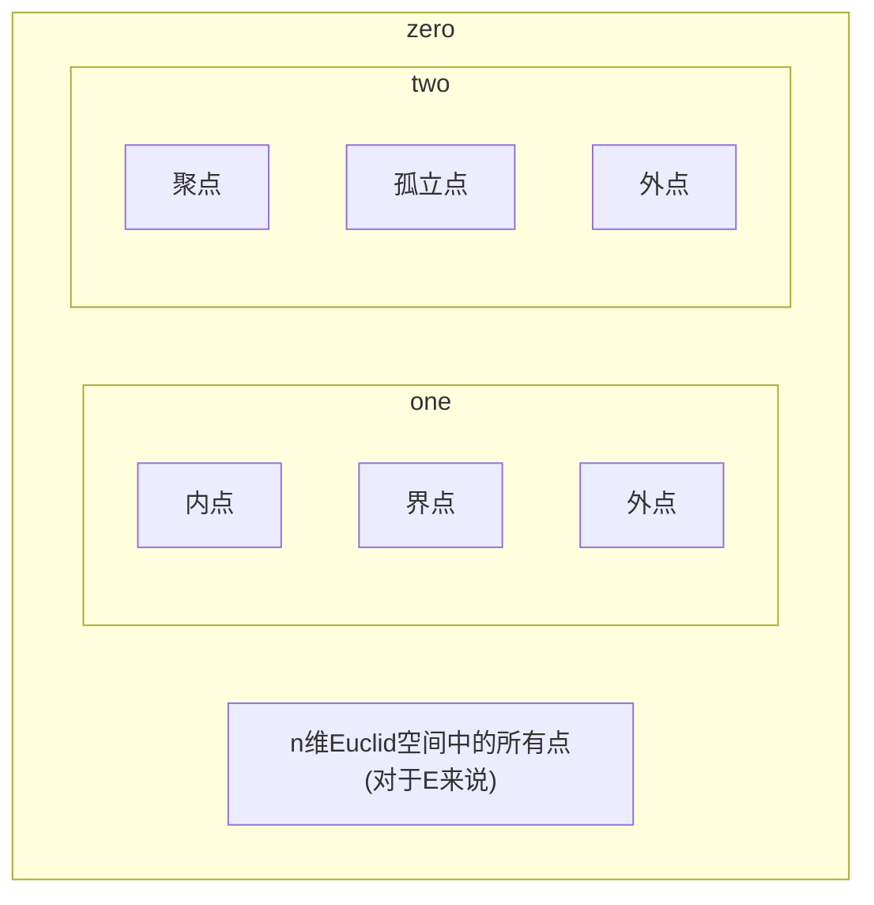

以下均在n维Euclid空间上讨论

# 序列的极限
## 1 Euclid空间上的点集

### 1.1 邻域
>  「Definition:邻域」
>  设$x_{0}\in\mathbb{R}^n,\delta>0$,称点集$\{ x\in \mathbb{R}^n|d(x,x_{0})<\delta \}$为$\mathbb{R}^n$中以$x_{0}$为中心,以$\delta$为半径的开球,也称$x_{0}$的$\delta$(球)邻域,记为$U(x_{0},\delta)$(或$B,O$)
>   
> 「Definition:两个非空点集的距离」
> 定义两个非空点集$A,B$的距离为$d(A,B)=\inf\{ d(x,y)|x\in A,y\in B \}$  
> 
>  「Definition:直径」
>  设$E$是$\mathbb{R}^n$中的点集,令$\mathrm{diam}(E)=\sup\{ d(x,y)|x,y\in E \}$,称为点集$E$的直径.(或用$\delta(E)$表示)
>  
> 「Definition:有界集」
> 设$E$是$\mathbb{R}^n$中的点集,若$\mathrm{diam}(E)<+\infty$,则称$E$为有界集
> 
> 显然,$E$是有界集的充要条件是:$\exists M>0,|x|<M(\forall x)$

### 1.2 聚点,内点,界点
>设$E$是$\mathbb{R}^n$中的一个点集(记$E^c=\mathbb{R}^n\setminus E$),$x_{0}$是$\mathbb{R}^n$中的一个定点,考察$x_{0}$与$E$的关系:
> 「Definition:内点,外点,界点」
> 若$\exists U(x_{0}),s.t.U(x_{0})\subset E$,则称$x_{0}$为$E$的内点
> 若$x_{0}$是$E^c$的内点,则称$x_{0}$是$E$的外点
> 若$x_{0}$既不是$E$的内点也不是$E^c$的内点,即$\forall U(x_{0}),\exists x_{1},x_{2}\in U(x_{0}),s.t.x_{1}\in E,x_{2}\not\in E$,则称$x_{0}$为$E$的(边)界点
> 
>  「Definition:聚点」
>  **第一定义** 设$x_{0}$的任一邻域都含有$E$中的无穷多个点,则称$x_{0}$是$E$的聚点
>  **第二定义** 设$x_{0}$的任一邻域都含有$E$中的一个异于$x_{0}$的点,则称$x_{0}$是$E$的聚点
>  >[!note] 
>  >显然,无限集才存在聚点
>  
>  ==度量空间中某点是聚点的充要条件== $x_{0}$是$E$的极限点当且仅当$x_{0}$是某个点列的极限
>  
>  「Definition:孤立点」
>  若$x_{0}\in E$但不是$E$的聚点,则称$x_{0}$是$E$的孤立点
>  显然,$x_{0}$是$E$的孤立点的充要条件是:$\exists U(x_{0}),s.t.E\cap U(x_{0})=\{ x_{0} \}$
>  因此,$E$的界点不是聚点就是孤立点

> 「Definition:常见点集」
> 1)$E$中所有内点所成的集合,称为$E$的开核,记为$\mathring{E}$,即$\mathring{E}=\{ x|\exists U(x)\subset E \}$
> 2)$E$中所有聚点所成的集合,称为$E$的导集,记为$E'$,即$E'=\{ x|\forall U(x):\mathring{U}(x)\cap E\neq \emptyset \}$
> 3)$E$中所有界点所成的集合,称为$E$的边界,记为$\partial E$,即$\partial E=\{ x|\forall U(x),U(x)\cap E\neq \emptyset,U(x)\cap E^c\neq \emptyset \}$
> 4)$\{ \text{isolated points of E} \}=\{ x|\exists U(x),U(x)\cap E=\{ x \} \}$
> 5)$E\cup E'$称为$E$的闭包,记为$\bar{E}$,即$\bar{E}=\{ x|\forall U(x),U(x)\cap E\neq \emptyset \}$
> 
> ==🖇️Properties：==
> 1)(对偶关系)$(\mathring{E})^c=\overline{E^c},(\bar{E})^c=\mathring{E^c}$
> 2)设$A\subset B$,则$A'\subset B',\mathring{A}\subset \mathring{B},\bar{A}\subset \bar{B}$
> 3)$(A\cup B)'=A'\cup B'$

### 1.3 开集与闭集
> 「Definition:开集与闭集」 
> 设$E\subset \mathbb{R}^n$,
> 如果$E$的每一点都是$E$的内点,则称$E$为开集
> $E$为开集的充要条件是$E\subset \mathring{E}$,亦即$E=\mathring{E}$
>  
> 如果$E$的每一个聚点都属于$E$,则称$E$为闭集
> $E$是闭集的充要条件是$E'\subset E$,或$\partial E\subset E$
> 
> ==🖇️Properties：==
> 1)$\mathring{E}$是开集,$E',\bar{E}$是闭集
> 2)(**对偶性**)若$E$是开集,则$E^c$是闭集;设$E$是闭集,则$E^c$是开集
> 3)任意多个开集的并仍为开集,有限多个开集的交仍为开集
> 4)任意多个闭集的交仍为闭集,有限多个闭集的并仍为闭集

Proof :

**2)对偶性**
$1^\circ$ 若$E$为开集,则$\forall x\in E,\exists U(x)\subset E$,即$x$不是$E^c$的聚点,即如果$E^c$有聚点,则它一定属于$E^c$.因此$E^c$为闭集
$2^\circ$ 若$E$为闭集,则$E$的一切聚点属于$E$,即$\forall x\in E^c$,$x$不是$E$的聚点,即$\exists U(x):U(x)\cap E=\emptyset$,即$U(x)\subset E^c$,故$E^c$为开集

> 「Definition:自密集」
> 若$E\subset E'$,则称$E$是自密集,亦即集合中每个点都是聚点,亦即没有孤立点
> 
>  「Definition:完备集」
>  若$E=E'$,则称$E$为完备集或完全集
>  
>  完备集就是自密闭集,也就是没有孤立点的闭集

## 2 收敛序列
> 「Definition:点列的极限」
> 设$\{ \boldsymbol{x_{i}} \}$是$\mathbb{R}^n$中的一个点列,$\boldsymbol{a}\in \mathbb{R}^n$.如果$\forall\varepsilon>0,\exists N\in \mathbb{N}^*,\forall i>N:\lvert \boldsymbol{x_{i}-a} \rvert\leqslant \varepsilon$,就称点$\boldsymbol{a}$是点列$\{ \boldsymbol{x_{i}} \}$的极限,记作$\lim_\limits{ i \to \infty }\boldsymbol{x_{i}}=\boldsymbol{a}$,也称点列$\{ \boldsymbol{x_{i}} \}$收敛于$\boldsymbol{a}$
> 
> ==🖇️Properties：==
> 相比于数列的极限,点列的极限有以下性质:
> 1)唯一性
> 2)有界性
> 3)极限运算的加(减)法,数乘
>
> 「Definition:按分量收敛」
> 设$\{ \boldsymbol{x_{i}} \}$是$\mathbb{R}^n$中的一个点列,且有$\boldsymbol{x_{i}}=(x_{1}^{(i)},x_{2}^{(i)},\dots x_{n}^{(i)})\quad(i=1,2,\dots)$,如果对于$k=1,2,\dots n$,有$\lim_\limits{ i \to \infty }x_{k}^{(i)}=a_{k}$,那么称点列$\{ \boldsymbol{x_{i}} \}$按分量收敛于$\boldsymbol{a}=(a_{1},a_{2},\dots a_{n})$
> 
> Theorem:点列收敛的充要条件
> $\lim_\limits{ i \to \infty }\boldsymbol{x_{i}}=\boldsymbol{a}$等价于点列$\{ \boldsymbol{x_{i}} \}$按分量收敛于$\boldsymbol{a}$

Proof :

## 3 实数系基本定理的推广
>实数系基本定理可推广到多维Euclid空间中的有:
>Theorem:闭集套定理
>设$\{ S_{k} \}$为$\mathbb{R}^n$中的非空闭集序列,满足$S_{1}\supset S_{2}\supset\dots S_{k}\supset\dots$以及$\lim_\limits{ k \to \infty }\mathrm{diam}S_{k}=\lim_\limits{ k \to \infty }\sup\{ \lvert \boldsymbol{x-y} \rvert:\forall \boldsymbol{x,y}\in S_{k} \}$,则$\exists!\boldsymbol{a}\in \bigcap\limits_{k=1}^\infty S_{k}$
>
>Theorem:Bolzano-Weierstrass定理
>有界无穷点列必然存在收敛子列
>
>Theorem:Cauchy收敛准则
>$\{ \boldsymbol{x_{i}} \}$称为Cauchy列(基本列),如果:$\forall\varepsilon>0,\exists N\in \mathbb{N}^*,\forall m,n>N:\lvert \boldsymbol{x_{m}}-\boldsymbol{x_{n}} \rvert<\varepsilon$
>
>Cauchy列等价于收敛列
>
>Theorem:紧性与列紧性定理
>设$E\subset \mathbb{R}^n$.如果$E$中任意点列都有一子列收敛于$E$中的一个点,则称$E$是$\mathbb{R}^n$中的一个自列紧集
>设$E\subset \mathbb{R}^n$,$\mathscr{O}=\{ O_{\alpha} \}$是$\mathbb{R}^n$中的一个开集族.如果$E\subset \bigcap \limits_{\alpha}O_{\alpha}$,则称开集族$\mathscr{G}$覆盖了$E$,或称$\mathscr{G}$是$E$的一个开覆盖
>设$E\subset \mathbb{R}^n$.如果$E$的任意开覆盖存在有限子覆盖,则称$E$是$\mathbb{R}^n$中的一个紧(致)集
>以下三个命题等价:
>1)$S$是有界闭集
>2)(**Heine-Borel有限覆盖定理**)$S$是紧集
>3)(**列紧性定理**)$S$是自列紧集

Proof :

# 多元函数的极限

# 多元函数的连续性
>Lemma
>连续映射将紧集映射成紧集

Proof :

>Theorem:有界性定理
>设$K$为$\mathbb{R}^n$中紧集,$f$是$K$上的连续函数,则$f$在$K$上有界
>
>Theorem:最值定理
>设$K$为$\mathbb{R}^n$中紧集,$f$是$K$上的连续函数,则$f$在$K$上必能取到最大值和最小值,即$\exists \xi_{1},\xi_{2},s.t.f(\xi_{1})\leqslant f(x)\leqslant f(\xi_{2})(\forall x\in K)$

> 「Definition:一致连续性」
> 
>Theorem:Cantor定理
>设$K$为$\mathbb{R}^n$中紧集,$\boldsymbol{f}:K\to \mathbb{R}^m$为连续映射,则$\boldsymbol{f}$在$K$上一致连续 
>Corollary-边界延拓问题
>设$f(x)$在$\mathbb{R}^n$的有界开区域$D$内连续.则$f(x)$在$D$内一致连续的充要条件是$\forall x_{0}\in \partial D,\lim_\limits{ x \to x_{0} }f(x)\quad(x\in D)$存在
>Proposition:逼近问题
>设$\varphi(x)$在$\mathbb{R}^n$上一致连续,$f(x)$在$\mathbb{R}^n$连续,且$\lim_\limits{ \lVert x \rVert \to +\infty }[f(x)-\varphi(x)]=0$,则$f(x)$在$\mathbb{R}^n$中一致连续

> 「Definition:道路与连通」
> 设$S$为$\mathbb{R}^n$中点集,若连续映射$\boldsymbol{\gamma}:[0,1]\to \mathbb{R}^n$的值域全部落在$S$中,即满足$\boldsymbol{\gamma}([0,1])\subset S$,则称$\boldsymbol{\gamma}$为$S$中的道路,$\boldsymbol{\gamma}(0),\boldsymbol{\gamma}(1)$分别称为道路的起点与终点.
> 若$S$中的任意两点$x,y$之间,都存在$S$中以$x$为起点,$y$为终点的道路,则称$S$为道路连通的,或称$S$为连通集.
> 
> Lemma
> 连续映射将连通集映射成连通集

Proof :

> Theorem:介值定理
> 设$K$为$\mathbb{R}^n$中紧集,$f$是$K$上的连续函数,则$f$在$K$上必能取到最大值和最小值之间的一切值,即$f$的值域是闭区间$[m,M]$
> Corollary
> 

