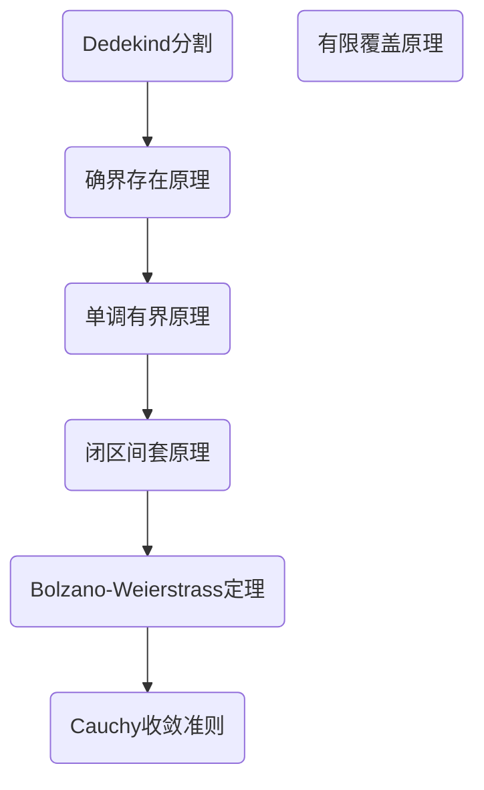
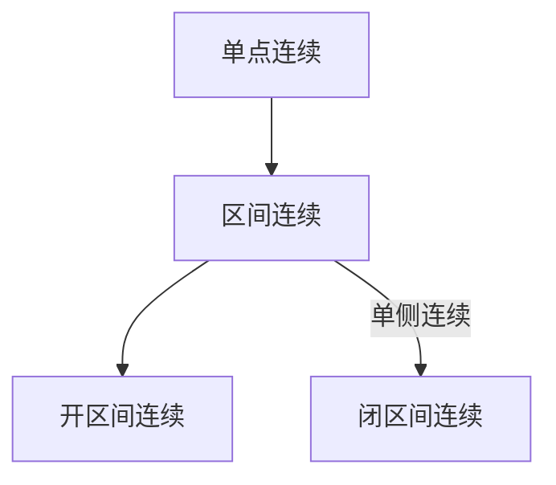
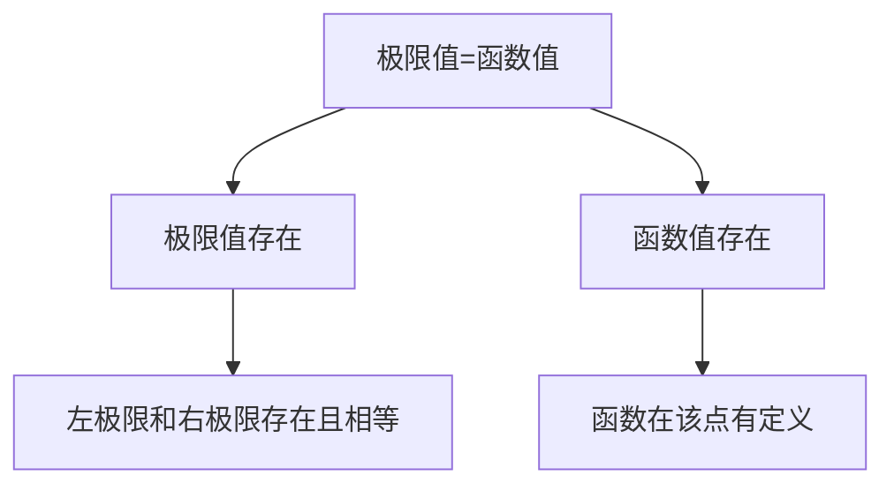
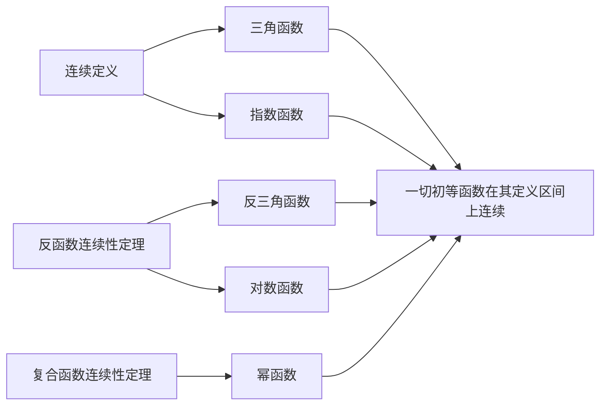

# 数列极限与实数系连续性

> Theorem:三角公式
>
> **积化和差**：
>
> $$sin\alpha cos\beta= \frac{1}{2}[sin(\alpha + \beta )+sin(\alpha - \beta )] \quad cos\alpha sin\beta= \frac{1}{2}[sin(\alpha + \beta )-sin(\alpha - \beta )]$$
>
> $$cos\alpha cos\beta= \frac{1}{2}[cos(\alpha + \beta )+cos(\alpha - \beta )] \quad sin\alpha sin\beta= -\frac{1}{2}[cos(\alpha + \beta )-cos(\alpha - \beta )]$$
>
> **🌟和角公式🌟：**
>
> $$sin(\alpha +\beta) = sin\alpha cos\beta+cos\alpha sin\beta \quad sin(\alpha-\beta) =sin\alpha cos\beta - cos\alpha sin\beta$$
>
> $$cos(\alpha +\beta) = cos\alpha cos\beta-sin\alpha sin\beta \quad cos(\alpha-\beta) =cos\alpha cos\beta + sin\alpha sin\beta$$
>
> **和差化积：**
>
> $$sin\alpha +sin\beta =2sin{\frac{\alpha+\beta}{2}}cos{\frac{\alpha-\beta}{2}} \quad sin\alpha -sin\beta =2sin{\frac{\alpha-\beta}{2}}cos{\frac{\alpha+\beta}{2}}$$
>
> $$cos\alpha +cos\beta =2cos{\frac{\alpha+\beta}{2}}cos{\frac{\alpha-\beta}{2}} \quad cos\alpha -cos\beta =-2sin{\frac{\alpha+\beta}{2}}sin{\frac{\alpha-\beta}{2}}$$
>
> **倍角公式：** 
>
> $$\sin2\alpha=2\sin\alpha \cos\alpha\quad \cos2\alpha=\cos^2\alpha-\sin^2\alpha=2\cos^2\alpha-1=1-2\sin^2\alpha\quad$$
>
> $$ \tan2\alpha= \frac{2\tan\alpha}{1-\tan^2\alpha}$$
>
> **半角公式：** 
> $$\sin \frac{\alpha}{2}=\pm \sqrt{ \frac{1-\cos\alpha}{2} }$$
>
> $$\cos \frac{\alpha}{2}=\pm \sqrt{ \frac{1+\cos\alpha}{2} }$$
>
> $$\tan \frac{\alpha}{2}= \frac{1-\cos\alpha}{\sin\alpha}=\frac{\sin\alpha}{1-\cos\alpha}$$
>
> **降幂公式：** 
>
> $$\sin^2\alpha= \frac{1-\cos2\alpha}{2}\quad \cos^2\alpha= \frac{1+\cos2\alpha}{2}$$
>
> **拆分角公式：** 
>
> $$\sin^2\alpha-\sin^2\beta=\sin(\alpha+\beta)\sin(\alpha-\beta)\quad \cos^2\alpha-\sin^2\beta=\cos(\alpha+\beta)\cos(\alpha-\beta)$$

- 灰色三角形上方两数之平方和为下方一数之平方。
- 顺时针的三个函数有这些性质: $\tan x=\frac{\sin x}{\cos x}\dots$

> Theorem:n次方和差公式
>
> $a^n+b^n=(a+b)(a^{n-1}b^0-a^{n-2}b^1+a^{n-3}b^2+\cdots-a^1b^{n-2}+a^0b^{n-1}),n\in\mathbb{N^+},且n为奇数$
>
> 当 n 为偶数时，没有 n 次方和公式
>
> $a^n-b^n=(a-b)(a^{n-1}b^0+a^{n-2}b^1+a^{n-3}b^2+\cdots+a^0b^{n-1}),n\in \mathbb{N^+}$​
>
> 常用的有：
>
> 平方差公式：$a^2-b^2=(a+b)(a-b)$
>
> 立方和差公式：$a^3+b^3=(a+b)(a^2-ab+b^2) \quad a^3-b^3=(a-b)(a^2+ab+b^2)$
>
> 四次方差公式：$\begin{align} a^4-b^4 &=(a^2+b^2)(a^2-b^2)=(a^2+b^2)(a+b)(a-b)=(a-b)(a^3+a^2b+ab^2+b^3) \\&=(a-b)(a^3+a^2b+ab^2+b^3) \end{align}$
>
> b = 1 时：$x^n+1=(x+1)(x^{n-1}-x^{n-2}+x^{n-3}-\cdots+x-1),n\in\mathbb{N^+},且n为奇数$      $x^n-1=(x-1)(x^{n-1}+x^{n-2}+x^{n-3}+\cdots+x+1),n\in\mathbb{N^+}$

> Theorem:反向归纳法
> 反向归纳法（Backward Induction）又名柯西归纳法
> 设 $P(n)$表示一个与自然数 n 有关的命题，若
> （1）$P(n)$对无数多个自然数 n 都成立；(或者说对于自然数的某个子列成立)
> （2）证明假设$P(k+1)$成立，必然可推出 $P(k)$也成立；
> 则 $P(n)$对一切自然数 n 都成立。
> 用反证法易证反向归纳法原理的正确性。

## 1 不等式

### 1.1 平均值不等式

>Theorem:平均值不等式
>
> 对于 n 个`正数` $a_1,a_2 \cdots a_n,$ 有
>
> $${\huge \frac{a_1+a_2 +\cdots +a_n}{n} \geqslant \sqrt[n]{a_1a_2 \cdots a_n} \geqslant \frac{n}{\frac1a_1+\frac1a_2+\cdots+\frac1a_n} }  $$
>
> 即 ${\large算术平均值（Arithmetic）\geqslant 几何平均值（Geometric）\geqslant 调和平均值（Hamornic）}$
>
> 当且仅当 $a_1=a_2=\cdots=a_n$ 时等号成立

 Proof 1：
先证 $\frac{a_1+a_2 +\cdots +a_n}{n} \geqslant \sqrt[n]{a_1a_2 \cdots a_n}$ : 
当 n = 1,2 时，显然成立; 
当 n = $2^k(k\in \mathbb{N}^+)$ 时，不等式是 $\frac{a+b}{2} \geqslant \sqrt{ab}$ 的推论；
当 $n \ne 2^k(k\in \mathbb{N}^+)$ 时，取 $l \in \mathbb{N}^+$，使 $2^{l-1}<n<2^l$，记 $\sqrt[n]{a_1a_2 \cdots a_n} = \bar{a}$, 在 $2^1,2^2 \dots 2^n$ 后加上 $(2^l-n)$ 个 $\bar{a}$，将其扩充为 $2^l$ 个正数，对它们使用不等式，有：$\frac{1}{2^l}[a_1+a_2+\dots+a_n+(2^l-n)\bar{a}] \geqslant (a_1a_2\dots a_n\bar{a}^{2^l-n})^{\frac{1}{2^l}}=\bar{a}$ 
整理得：$\frac{a_1+a_2 +\cdots +a_n}{n} \geqslant \sqrt[n]{a_1a_2 \cdots a_n}$ 
对 $\frac1a_1,\frac1a_2\dots\frac1a_n$ 使用上述结论，便得到 $\sqrt[n]{a_1a_2 \cdots a_n} \geqslant \frac{n}{\frac1a_1+\frac1a_2+\cdots+\frac1a_n}$ 
证毕

 Proof 2（Bernoulli Inequality）：
$$记A_n=\frac{a_1+a_2 +\cdots +a_n}{n},G_n=\sqrt[n]{a_1a_2 \cdots a_n} $$

显然有 $\frac{A_n}{A_{n-1}}-1>-1$，故 $(1+\frac{A_n}{A_{n-1}}-1)^n \geqslant 1+n(\frac{A_n}{A_{n-1}}-1)=\frac{nA_n-(n-1)A_{n-1}}{A_{n-1}}=\frac{a_n}{A_{n-1}}$
由上式得：$$\begin{align} (A_n)^n \geqslant &a_n(A_{n-1})^n \\  \geqslant &a_na_{n-1}(A_{n-2})^{n-2} \\ \geqslant & \dots \\ \geqslant & (a_n)^n \end{align}$$
即 $A_n \geqslant a_n$
 $\sqrt[n]{a_1a_2 \cdots a_n} \geqslant \frac{n}{\frac1a_1+\frac1a_2+\cdots+\frac1a_n}$ 的证明同 Proof1
 证毕

### 1.2 Bernoulli 不等式

> Lemma:Newton二项式定理
>
> ${\large (x+y)^n=\sum\limits^n_{k=0} \mathrm{C}_n^kx^{n-k}y^k}$
>
> 矩阵形式：$(x+y)^n=\begin{bmatrix} a^0 & a^1&\cdots&a^n  \end{bmatrix}\begin{bmatrix}     \mathrm{C}_n^0     \\   & \mathrm{C}_n^1  \\ &&\ddots \\  & & &\mathrm{C}_n^n   \end{bmatrix}\begin{bmatrix}     &&&1     \\   &&\cdots& \\  &\cdots&& \\1&&&     \end{bmatrix}\begin{bmatrix}     b^0     \\   b^1 \\ \cdots \\ b^n     \end{bmatrix}$
> ​
>Theorem:Bernoulli不等式
>
> 对于 $\forall x>-1,n\ge1$时成立 $(1+x)^n \geqslant 1+nx$ ；$0\le n<1$时成立$(1+x)^n \leqslant 1+nx$ ；当且仅当 n = 0或 x = 1 时等号成立

 Proof ：
当 n = 1 或 x = 0 时显然成立；
n > 1 且 x > 0 时，由 Newton 二项式定理有 $(1+x)^n=1+nx+\mathrm{C}_n^1x^2+\cdots >1+nx$ 显然成立
当-1 <x<0时，$(1+x)^n-1=x[1+(1+x)+(1+x)^2+\cdots+(1+x)^{n-1}]> nx$
证毕

> Corollary-1
>
> 设 $A>0,A+B>0,n\in \mathbb{N^+}$，则成立不等式：
>
> $(A+B)^n \geqslant A^n +nA^{n-1}B$，当且仅当 x = 0 时等号成立

 Proof ：
令 $x=\frac BA$ 即可
证毕

>Corollary-2
>
> $x\geqslant 0,n\in \mathbb{N^+}$，成立 $(1+x)^n\geqslant 1+\frac{n(n-1)}{2}x^2$，当且仅当 x = 0 时等号成立

>Corollary-3
>若$a_{i}>-1(i=1,2,3\dots n)$且同号，则$\prod\limits_{i=1}^{n}(1+a_{i})\geqslant1+\sum\limits_{k=1}^{n}a_{i}$

Proof ：
对n作数学归纳法
当n=1时，显然成立 
假设n=k时已成立，对于n=k+1，不妨设$a_{i}>0$，其它情况类似，有：
$\begin{align}\prod\limits_{i=1}^{k+1}(1+a_i)&=\prod\limits_{i=1}^{n}(1+a_{i})+a_{k+1}\prod\limits_{i=1}^{k}(a+a_{i})\\&\geqslant1+\sum\limits_{i=1}^{k}a_{i}+a_{k+1}\prod\limits_{i=1}^{k}(a+a_{i})\\&\geqslant1+\sum\limits_{i=1}^{k+1}a_{i}\end{align}$

### 1.3 三角不等式

>Theorem:三角不等式
> $\forall a,b\in\mathbb{R}$，有 $||a|-|b||\leqslant |a+b|\leqslant |a|+|b|$

 Proof ：
由于 $\forall a,b\in\mathbb{R}$，有 $-|a||b|\leqslant ab\leqslant |a||b|$，故 $|a|^2-2|a||b|+|b|^2 \leqslant a^2+2ab+b^2 \leqslant |a|^2+2|a||b|+|b|^2$，开方即得
证毕

### 1.4 Cauchy-Schwarz 不等式

> Theorem: Cauchy-Schwarz 不等式
>
> 对于实数 $a_1,a_2\cdots a_n$ 和 $b_1,b_2\cdots b_n$ 成立：
>
> ${\huge \sum\limits_{i=1}^{n}a_i^2\sum\limits_{i=1}^{n}b_i^2 \geqslant (\sum\limits_{i=1}^{n}a_ib_i)}$
>
> 等号成立条件：$\frac{a_1}{b_1}=\frac{a_2}{b_2}=\cdots=\frac{a_n}{b_n}$ 或者 $a_i,b_i$ 中至少一方全部为 0

 Proof ：
引入变量 λ，写出下面的非负二次三项式：$0\leq \sum\limits_{i=1}^n(\lambda a_i+b_i)^2=\lambda^2\sum\limits_{i=1}^na_i^2-2\lambda\sum\limits_{i=1}^na_ib_i+\sum\limits_{i=1}^n b_i^2$ 
若 $a_1=a_2=\dots=a_n=0$，则显然成立，否则 $\lambda^2$ 项系数不为 0，因此其判别式非正，这就有：$(\sum\limits_{i=1}^{n}a_ib_i)^2\leq(\sum\limits_{i=1}^{n}a_i^2)(\sum\limits_{i=0}^{n}b_i^2)$ 
证毕

> Theorem: Cauchy-Schwarz 不等式(vector.version)
>
> $|\vec{a}|\cdot |\vec{b}|\ge |\vec{a}\cdot \vec{b}|,\vec{a}=(a_1,a_2\dots a_n),\vec{b}=(b_1,b_2\dots b_n)$
> 
> Theorem: Cauchy-Schwarz 不等式(integral.version)
>
> $(\int f(x)g(x)\mathrm{d}x)^2 \le \int f^2(x)\mathrm{d}x\cdot \int g^2(x)\mathrm{d}x$
>
> Theorem:Carlson不等式
>
> $(x_1+y_1+\dots)(x_2+y_2+\dots)\dots(x_n+y_n+\dots) \ge [(\prod\limits_{i=1}^{n}x_i)^{\frac1n}+(\prod\limits_{i=1}^{n}y_i)^{\frac1n}+\dots]^n$
> 亦即 $(x_1^n+y_1^n+\dots)(x_2^n+y_2^n+\dots)\dots(x_n^n+y_n^n+\dots)\ge (\prod\limits_{i=1}^{n}x_i+\prod\limits_{i=1}^{n}y_i+\dots)^n$
>
> Theorem:Lagrange恒等式
>
> $\sum\limits_{i=1}^{n}a_i^2\sum\limits_{i=1}^{n}b_i^2-(\sum\limits_{i=1}^{n}|a_i||b_i|)^2=\frac12 \sum\limits_{k=1}^{n}\sum\limits_{i=1}^{n}(|a_k||b_i|-|a_i||b_k|)^2$

### 1.5 Fan Ky 不等式

> Theorem:Fankay不等式
>
> 设 $0<x_i\le \frac12,i=1,2,...n$，则：
>
> ${\huge \frac{\prod\limits_{i=1}^{n}x_i}{\sum\limits_{i=0}^{n}x_i}\le \frac{\prod\limits_{i=1}^{n}(1-x_i)}{[\sum\limits_{i=0}^{n}(1-x_i)]^n}}$
>

 Proof ：
由反向归纳法证明，若 $x_1\ne x_2$，有：$\frac{x_1x_2}{(1-x_1)(1-x_2)}-(\frac{x_1+x_2}{(1-x_1)(1-x_2)})^2=\frac{(x_1-x_2)^2(x_1+x_2-1)}{(1-x_1)(1-x_2)((1-x_1)+(1-x_2))2}<0\qquad式(1)$ 
因而有
$\begin{aligned} \frac{x_1x_2x_3x_4}{(1-x_1)(1-x_2)(1-x_3)(1-x_4)}&\le(\frac{x_1+x_2}{(1-x_1)(1-x_2)})^2(\frac{x_3+x_4}{(1-x_3)(1-x_4)})^2=(\frac{\frac{x_1+x_2}{2}}{1-\frac{x_1+x_2}{2}})^2(\frac{\frac{x_3+x_4}{2}}{1-\frac{x_3+x_4}{2}})^2 \\ &\le (\frac{\frac{x_1+x_2}{2}+\frac{x_3+x_4}{2}}{(1-\frac{x_1+x_2}{2})(1-\frac{x_3+x_4}{2})})^4=(\frac{x_1+x_2+x_3+x_4}{(1-x_1)(1-x_2)(1-x_3)(1-x_4)})^4  \end{aligned}$ 
上式中若非 $x_1=x_2=x_3=x_4$，则不等号至少有一处成立，重复此论证 m 此，若非所有 x 相等，则有：$\frac{\prod\limits_{i=1}^{2^m}x_i}{\prod\limits_{i=1}^{2^m}(1-x_i)}<\frac{(\sum\limits_{i=1}^{2^m}x_i)^{2^m}}{(\sum\limits_{i=1}^{2^m}(1-x_i))^{2^m}}$，此即式(1)，不过此时 n 为 2 的幂
现在进行反向归纳，若式(1)对 n 成立，且令 $A=\frac{x_1+x_2+...x_{n-1}}{n-1}$，则应用式(1)于 n 个数 $x_1,x_2,...x_{n-1},A$，得 
$(\frac{A}{1-A})^n=(\frac{x_1+x_2+...+x_{n-1}+A}{(1-x_1)(1-x_2)...(1-x_{n-1})(1-A)})^n>\frac{x_1x_2x_{n-1}A}{(1-x_1)(1-x_2)...(1-x_{n-1})(1-A)}$ 
证毕

> [!NOTE]   
>
> 算数-几何不等式可看做 Fan Ky 不等式的极限形式：设 $a\in\mathbb{R^+},0<x_i<\frac a2,i=1,2,3...n$，则应用式(1)于 n 个数 $\frac{x_1}{a},\frac{x_2}{a}...\frac{x_n}{a}$，即得 $\frac{\prod\limits_{i=1}^{n}x_i}{\prod\limits_{i=1}^{n}(1-x_i)}\le \frac{(\sum\limits_{i=1}^{n}x_i)^n}{(\sum\limits_{i=1}^{n}(1-\frac{x_i}{a}))^n}$，当 $a\to +\infty$ 时，便得到 A-G 不等式

 eg.1 

设 $k\in \mathbb{N^+}$ 试证 $\frac{k}{n+k}<\ln (1+\frac kn)<\frac kn$​.

 Proof ：
由均值不等式 $(1+\frac kn )^n=1\times (1+\frac kn )^n<(\frac{1+n(1+\frac kn)}{n+1})^{n+1}=(1+\frac{k}{n+1})^{n+1}$ 
同理 $(\frac{n}{n+k})^{n+k}<(\frac{n+1}{n+1+k})^{n+k+1}$ 
又有 $\lim_{n\to\infty}(1+\frac kn)^n=e^k$ 可得 $(1+\frac kn)^n<e^k<(\frac{n}{n+k})^{n+k}$ 
取自然对数有 $\frac{k}{n+k}<\ln (1+\frac kn)<\frac kn$
证毕

 eg.2 

试证 $(\frac{n+1}{e})^n<n!<e(\frac{n+1}{e})^{n+1}$

 Proof ：
根据 $(1+\frac1n)^n<e<(1+\frac1n)^{n+1}$ 进行推导，
分别取 n = 1,2,3...n 有 $(\frac21)^1<e<(\frac21)^2,(\frac32)^2<e<(\frac32)^3...(\frac{n+1}{n})^n<n!<(\frac{n+1}{n})^{n+1}$ 累乘得：$\frac{(n+1)^n}{n!}<e^n<\frac{(n+1)^{n+1}}{n!}$ 
整理得：$(\frac{n+1}{e})^n<n!<e(\frac{n+1}{e})^{n+1}$ 
证毕

 eg. 3 

设 $S_n=1+2^2+3^3+...+n^n,n\in \mathbb{N^+}$，试证，对于 $n\ge2$，有 $n^n[1+\frac{1}{4(n-1)}] \le S_n \leq n^n[1+\frac{2}{e(n-1)}]$

 Proof ：
当 n = 3 时，显然成立
令 $u_n=n^n,v_n=(1-\frac1n)^n$, 则 $\{u_n\}$ 递增，$\{v_n\}$ 递增且以 $e^{-1}$ 为极限且当 $n\ge 3$ 时，$\frac{u_{n-1}}{u_n}=(\frac{n-1}{n})^n\frac{1}{n-1}=\frac{1}{n-1}v_n,v_2<v_n<e^{-1}$，$S_{n-1}=u_1+u_2+...+u_{n-1}<(n-1)u_{n-1}=(n-1)^n<n^n=u_n$ 
故 $S_n=S_{n-1}+u_n<2u_n,S_{n-1}<2u_{n-1}=2u_n(\frac{u_{n-1}}{u_n})=2u_n\frac{v_n}{n-1}<\frac{2u_n}{e(n-1)}$ 
故 $S_n=S_{n-1}+u_n<\frac{2u_n}{e(n-1)}+u_n=u_n[1+\frac{2}{e(n-1)}]$ 
另一方面，$n\ge 3$ 时，由 $\frac{u_{n-1}}{u_n}=\frac{1}{n-1}v_n$ 得，$u_{n-1}=\frac{u_{n-1}}{n-1}v_n>\frac{u_n}{4(n-1)}$ 
故 $n\ge 3$ 时，$S_n=S_{n-1}+u_n>u_{n-1}+u_n>u_n[1+\frac{1}{4(n-1)}]$ 
合起来就有：$n^n[1+\frac{1}{4(n-1)}]<S_n<n^n[1+\frac{1}{e(n-1)}]$ 
证毕

## 2 序列极限

### 2.1 收敛序列

>  「Definition：收敛数列」
>
> 度量空间 X 中的序列 $\{x_n\}$ 叫做收敛的，如果有一个下述性质的 $a\in X$：
> $\forall\epsilon>0,\exists N\in \mathbb{N^+},s.t.\forall n>N时，有d(x_n,a)<\epsilon$，则称 $\{x_n\}$ 收敛于 a，记为 $\lim_{n\to\infty}x_n=a$
> 相反的，$\exists\epsilon>0,\forall n\ge N时，有d(x_n,a)\ge\epsilon$，则称 $\{x_n\}$ 发散

> [!note]
>
> 定义中 $\forall n>N$ 与 $d(x_n,a)<\epsilon$ 均可改为 $\le$ 或 $\ge$​，定义仍然正确。
> $\lim_\limits{ n \to \infty }a_n=A\Longleftrightarrow\forall \varepsilon>0,在(a-\varepsilon,a+\varepsilon)$外，仅有有限项。

>[!tip] 
>$\lim_\limits{ n \to \infty }x_{n}=0\Longleftrightarrow\lim_\limits{ n \to \infty }|x_{n}|=0$
>$\lim_\limits{ n \to \infty }x_{n}=a\not\Longleftrightarrow\lim_\limits{ n \to \infty }|x_{n}|=a(a\neq0)$

>  「Definition：有界数列」
> 一个数列 $\{x_n\}$ 既有上界又有下界，则称之为有界数列。等价定义为：$\exists X\in\mathbb{R^+},s.t.|x_n|\le X,n=1,2,...$

> ==🖇️Properties：==
> 1. 唯一性：收敛数列的极限唯一
> 2. 有界性：收敛数列必定有界
> 3. 保序性：设 $\{x_n\}$ $\{y_n\}$ 均收敛，$\lim x_n=a,lim y_n=b,且a<b,则\exists N\in \mathbb{N^+},\forall n>N,有x_n\le y_n.$
> 	1. 若 $\lim y_n =b>0,$ 则 $\exists N\in \mathbb{N^+},\forall n>N$ 时，有 $y_n>\frac{b}{2}>0$
> 	2. 若 $\lim a_n=a,\lim b_n=b,$ 且 $x_n<y_n$ 对 $n>N$ 成立，则 $a\le b$
> 4. 夹逼性：若三个数列 $\{x_n\},\{y_n\},\{z_n\}，从某一项开始成立x_n\le y_n\le z_n,n>N_0,且\lim a_n=\lim b_n=a,则\lim y_n=a$
> 5. 四则运算：设 $\lim x_n=a,\lim y_n=b,$ 则
> 	5.1. $\lim(\alpha x_n+\beta y_n)=\alpha a+\beta b(\alpha,\beta为常数)$
> 	5.2. $\lim(x_ny_n)=ab$
> 	5.3. $\lim\frac{x_n}{ y_n}=\frac ab(b\ne 0)$
> 	5.4. $\lim_\limits{ n \to \infty }x_{n}=a\geqslant0(x_{n}\geqslant0)\Longrightarrow\lim_\limits{ n \to \infty }\sqrt{ x_{n} }=\sqrt{ a }$
> >[!caution] 
> >必须先有极限才能使用四则运算法则
> >四则运算法则可扩展到有限情况，不能推广到无限，比如$\lim_\limits{ n \to \infty }\left( \underbrace{\frac{1}{n}+\frac{1}{n}+\dots \frac{1}{n}}_{n个} \right)$是1而非0

 Proof ：
1.设 ${x_n}$ 有极限 a，b 
根据定义有 $\forall\epsilon>0,\exists N_1,\forall n>N:|x_n-a|<\frac\epsilon2;\exists N_2,\forall n>N:|x_n-a|<\frac\epsilon2$ 
取 $N=\max(N_1,N_2),\forall n>N,$ 有 $|a-b|=|a-x_n+x_n-b|\le |x_n-a|+|x_n-b|<\frac\epsilon2+\frac\epsilon2=\epsilon$ 
由 ε 任意接近 0，得 a = b 
2.设 $\{x_n\}$ 收敛于 a，由此取 ε = 1，则：$\exists n>N,s.t.|x_n-a|<1.即a-1<x_n<a+1$ 
取 $M=\max(x_1,x_2,...,x_N,a+1),m=\min(x_1,x_2,...,x_N,a-1),有m\le x_n\le M.$ 
3.取 $\epsilon=\frac{b-a}{2}>0$，由 $\lim x_n=a,\exists N,\forall n>N,|x_n-a|<\frac{a-b}{2},$，有 $x_n<\frac{a+b}{2}$
同理可得 $y>\frac{a+b}{2},$ 取 $N=\max(N_1,N_2),\forall n>N,x_n\le \frac{a+b}{2} \le y_n.$
	1.取 $x_n=\frac{b}{2}$ 即可
	2.如 $a_n=\frac{1}{4n},b_n=\frac{1}{2n},\forall n\ge 1有a_n\le b_n，而\lim a_n=\lim b_n=1$
4.对于 $\forall \varepsilon>0,由\lim x_n=a可知，\exists N_1,有|x_n-a|<\varepsilon,从而a-\varepsilon<x_n$
由 $\lim z_n=a可知，\exists N_2,有|z_n-a|<\varepsilon,从而z_n\le a+\varepsilon$
取 $N=\max(N_0,N_1,N_2),\forall n>N,有a-\varepsilon<x_n\le y_n\le z_n\le a+\varepsilon，即|y_n-a|<\varepsilon$
5.由 $\lim x_n=a可知\exists X>0,s.t. |x_n|<X,且\forall\varepsilon>0,\exists N_1,\forall n>N_1,|x_n-a|<\varepsilon$
由 $\lim y_n=b可知\exists N_2,\forall n>N_2,|y_n-b|<\varepsilon$
取 $N=\max(N_1,N_2),\forall n>N,$
$|\alpha x_n+\beta y_n-(\alpha a+\beta b) |\le |\alpha||x_n-a|+|\beta||y_n-b| <|\alpha+\beta|\varepsilon$
$|x_ny_n-ab|=|x_n(y_n-b)+b(x_n-a)|<(X+|b|)\varepsilon$
故5.1,5.2成立
对于（3），运用保序性推论，$\exists N_0,\forall n>N_0,y_n>\frac{|b|}{2},取N=max(N_0,N_1,N_2),\forall n>N,$
$|\frac{x_n}{y_n}-\frac ab|=|\frac{b(x_n-a)-a(y_n-b)}{y_nb}|<\frac{2(|a|+|b|)}{|b|^2}\varepsilon$
故5.3成立
对于5.4，只需注意到$|\sqrt{ a }-\sqrt{ b }|\leqslant\sqrt{ |a-b| }$即可(两边同时四次方就有$a+b\geqslant2\sqrt{ ab }$)
证毕

### 2.2 Cauchy 命题与拟合法

> Theorem:Cauchy命题
>
> 设 $\lim x_n=l,则\lim\frac{a_1+a_2+...+a_n}{n}=l$

 Proof 1（Fitting）：

由于 $\lim x_n=l,故\forall\varepsilon>0,取定N,\forall n>N,|x_n-l|<\varepsilon$，可估计如下：
$\begin{aligned}|\frac{x_1+x_2+...+x_n}{n}-l|&=|\frac{(x_1-l)+(x_2-l)+...+(x_n-l)}{n}|\\&\le \frac{|(x_1-l)+(x_2-l)+...+(x_N-l)|}{n}+\frac{|x_{N+1}-l|+|x_{N+2}-l|+...+|x_n-l|}{n}\\&\le \frac{M}{n}+\frac{n-N}{n}\varepsilon\end{aligned}$
其中 $M=|(x_1-l)+(x_2-l)+...+(x_N-l)|$ 是一个确定的数，只需要取 $N_1=\max(N_1,\frac{M}{\varepsilon})$
就可以保证当 $n\ge N_1$ 时，$|\frac{x_1+x_2+...+x_n}{n}-l|<2\varepsilon$
证毕

 Proof 2：

直接运用 Stolz 定理

> Corollary-1
>
> 上述命题中，l 可取 $+\infty$ 或 $-\infty$

>Corollary-2
>
> 设 $\lim x_n=l,$ 则 $\lim \frac{x_1+x_2+...+x_n}{n}=\lim \sqrt[n]{x_1x_2...x_n}=\lim\frac{n}{\frac{1}{x_1}+\frac{1}{x_2}+...+\frac{1}{x_n}}=l$

 Proof ：

由均值不等式 $A_n\ge G_n\ge H_n,$ 由于 $\lim x_n=l,$ 故 $\lim\frac{1}{x_n}=\frac{1}{l}$，易得 $\lim H_n=l$
再由夹逼准则 $\lim\sqrt[n]{x_1x_2...x_n}=l$
证毕

>[!note] 
>为了证明$\lim_\limits{ n \to \infty }x_{n}=A$，关键在于证明$|x_{n}-A|$能够任意小。为此，一般来说应该尽量将$x_{n}$的表达式化简，但是，有时，也可以将A变复杂，变成与$x_{n}$类似的形式，这种方法叫做拟合法。拟合法的思想实质，就是将单位1作适当的分解。

 eg. 1 

设 $\lim a_n=a,\lim b_n =b$，试证 $\lim\frac{a_0b_n+a_1b_{n-1}+...+a_nb_0}{n}=ab$

 Proof1 ：

由于 $\lim a_n=a,\lim b_n=b$，故 $\{a_n\},\{b_n\}$ 均有界，即 $\exists M>0,s.t.|a_n|<M,|b_n|<M,a<M$
$\forall\varepsilon>0,\exists N_1\in \mathbb{N^+},\forall n>N_1,|a_n-a|<\frac{\varepsilon}{4M},|b_n-b|<\frac{\varepsilon}{4M}$
固定 $N_1$，取自然数 $N>\max(N_1,\frac{2M}{\varepsilon}(|a_0-a|+|a_1-a|+...+|a_{N_1}-a|+|b_0-b|+|b_1-b|+...+|b_{N_1}-b|+|b|))$
$\forall n>N$，有

$$\begin{aligned} |&\frac{a_0b_n+a_1b_{n-1}+...+a_nb_0}{n}-ab|\\&=|\frac{1}{n}[(a_0b_n-ab)+(a_1b_{n-1}-ab)+...+(a_nb_0-ab)]+\frac{ab}{n}|\\&=|\frac{1}{n}[b_n(a_0-a)+a(b_n-b)]+...+[b_0(a_n-a)+a(b_0-b)]+\frac{ab}{n}|\\&\le \frac{M}{n}[|a_0-a|+|a_1-a|+...+|a_{n}-a|+|b_0-b|+|b_1-b|+...+|b_{n}-b|]
\\&\le \frac{M}{N}(|a_0-a|+|a_1-a|+...+|a_{N_1}-a|+|b_0-b|+|b_1-b|+...+|b_{N_1}-b|+|b|)\\&\qquad+\frac{M}{n}(|a_{N_1+1}-a|+|a_{N_1+2}-a|+...+|a_n-a|+|b_{N_1+1}-b|+|b_{N_1+2}-b|+...+|b_n-b|)\\&<\frac{\varepsilon}{2}+\frac{2M}{n}(n-N_1)\frac{\varepsilon}{4M}\\&<\varepsilon\end{aligned}$$
证毕

 Proof2 ：

令 $\alpha_n=a_n-a, \beta_n=b_n-b$ 有 $\lim\alpha_n=\lim\beta_n=0$ 由 Cauchy 不等式：
$0\le (\frac{\alpha_0\beta_n+\alpha_1\beta_{n-1}+\cdots+\alpha_n\beta_0}{n})^2\le \frac{\alpha_0^2+\alpha_1^2+\cdots+\alpha_n^2}{n}\cdot\frac{\beta_0^2+\beta_1^2+\cdots+\beta_n^2}{n}$
由 Cauchy 命题 $\lim \frac{\alpha_0^2+\alpha_1^2+\cdots+\alpha_n^2}{n}\cdot\frac{\beta_0^2+\beta_1^2+\cdots+\beta_n^2}{n}=\lim \frac{\alpha_0^2+\alpha_1^2+\cdots+\alpha_n^2}{n+1}\cdot\frac{\beta_0^2+\beta_1^2+\cdots+\beta_n^2}{n+1}\cdot(\frac{n+1}{n})^2=0$
由夹逼定理 $\lim \frac{\alpha_0\beta_n+\alpha_1\beta_{n-1}+\cdots+\alpha_n\beta_0}{n}=0$
于是$$\begin{aligned}
   \lim &\frac{a_0b_n+a_1b_{n-1}+...+a_nb_0}{n}\\&=\lim \frac{1}{n}[(\alpha_0+a)(\beta_n-b)+(\alpha_1+a)(\beta_{n-1}-b)+...+(\alpha_n+a)(\beta_0-b)]
   \\&=\lim \frac{\alpha_0\beta_n+\alpha_1\beta_{n-1}+\cdots+\alpha_n\beta_0}{n}+b\frac{\alpha_0+\alpha_1+\cdots+\alpha_n}{n+1}\frac{n+1}{n}+a\frac{\beta_0+\beta_1+\cdots+\beta_n}{n+1}\frac{n+1}{n}+\frac{n+1}{n}ab
   \\&= ab
\end{aligned}$$
证毕

 eg.2 

$\lim a_n=a$，试证 $\lim\frac{1}{2^n}\sum\limits_{k=1}^n\mathrm{C}_n^ka_k=a$

 Proof 1：

利用 $2^n=\sum\limits_{k=0}^{n}\mathrm{C}_n^k$，可做估计如下
$|\frac{1}{2^n}\sum\limits_{k=0}^{n}\mathrm{C}_n^ka_k-a|=|\frac{1}{2^n}\sum\limits_{k=0}^{n}\mathrm{C}_n^k(a_k-a)|\le \frac{1}{2^n}\sum\limits_{k=0}^{n}\mathrm{C}_n^k|a_k-a|$
$\forall\varepsilon>0,\exists N,k>N时，有|a_k-a|<\varepsilon$，对 n > N 将上式分拆
$\frac{1}{2^n}\sum\limits_{k=0}^{N}\mathrm{C}_n^k|a_k-a|+\frac{1}{2^n}\sum\limits_{k=N+1}^{n}\mathrm{C}_n^k|a_k-a|\qquad (1)$
n > N 时，(1)后半部分估计如下：$\frac{1}{2^n}\sum\limits_{k=N+1}^{n}\mathrm{C}_n^k|a_k-a|<\frac{1}{2^n}\sum\limits_{k=N+1}^{n}\mathrm{C}_n^k\varepsilon<\varepsilon$
对于(1)中的前半部分，固定 $N,\exists M>0,s.t. |a_k-a|<M,k=0,1,2...N$，又有 $\mathrm{C}_n^k<n^k$
估计如下: $\frac{1}{2^n}\sum\limits_{k=0}^{N}\mathrm{C}_n^k|a_k-a|<\frac{M(1+n+...+n^N)}{2^n}$
由于 N 已经固定，右边 $n\to+\infty$ 时极限为 0，由此 $\exists N_1>N,n>N_1$ 时成立 $\frac{1}{2^n}\sum\limits_{k=0}^{n}\mathrm{C}_n^k|a_k-a|<\varepsilon$
合并得 $|\frac{1}{2^n}\sum\limits_{k=0}^{n}\mathrm{C}_n^ka_k-a|<2\varepsilon$
证毕

 Proof 2（Toeplitz）：

令 $t_{nk}=\frac{\mathrm{C}_n^k}{2^n}$，有 $\lim_{n\to+\infty}t_{nk}=0,\sum\limits_{k=0}^{n}\frac{\mathrm{C}_n^k}{2^n}=1$, 由 Toeplitz 定理直接求解

 eg.3 
设 $0<\lambda<1,\lim a_n=a,$ 试证 $\lim_{n\to+\infty}(a_n+\lambda a_{n-1}+\lambda^2a_{n-2}+\cdots+\lambda^{n-1}a_1+\lambda^n a_0)=\frac{a}{1-\lambda}$

 Proof 1（Fitting）：

由收敛数列性质, 取 $N_0$，当 $n>N_0$ 时，可令 $|a_n-a<1|$，取 $M=\max(1,|a_1-a|,|a_2-a|,\cdots,|a_{N_0}-a|)$，则有 $|a_n-a|<M$ 恒成立
又有 $\forall\varepsilon>0,\exists N_1,N>N_1时，|a_n-a|<\frac{|1-\lambda|}{3(1-\lambda)}\varepsilon$，由 $\lambda<1$ 得 $\lim_{n\to+\infty}\lambda^n=0,\lim_{n\to+\infty}a\lambda^{n+1}=0$
故 $\exists N_2,n>N_2$ 时，$\lambda^n<\frac{\varepsilon}{3N_1M|1-\lambda|},|a\lambda^{n+1}|<\frac{\varepsilon}{3}$，因此当 $n>N=N_1+N_2+1$ 时，有：
$$\begin{aligned}|(1-\lambda)(a_n+\lambda a_{n-1}+\lambda^2a_{n-2}+\cdots+&\lambda^{n-1}a_1+\lambda^n a_0)-a|\\&=|(1-\lambda)[(a_n-a)+\cdots+(a_{N_1+1}-a)\lambda^{n-N_1-1}]+\cdots+(a_1-a)\lambda^n-a\lambda^{n+1}|
\\&<(1-\lambda)[\frac{|1-\lambda|}{3(1-\lambda)}\varepsilon\cdot\frac{1-\lambda^{n-N_1}}{1-\lambda}+N_1M\frac{\varepsilon}{3N_1M(1-\lambda)}]+\frac{\varepsilon}{3}
\\&<\frac{\varepsilon}{3}+\frac{\varepsilon}{3}+\frac{\varepsilon}{3}
\\&=\varepsilon
\end{aligned}$$
即 $\lim_{n\to+\infty}(1-\lambda)(a_n+\lambda a_{n-1}+\lambda^2a_{n-2}+\cdots+\lambda^{n-1}a_1+\lambda^n a_0)=a$，又有 $1-\lambda\ne0$，得：
$\lim_{n\to+\infty}(a_n+\lambda a_{n-1}+\lambda^2a_{n-2}+\cdots+\lambda^{n-1}a_1+\lambda^n a_0)=\frac{a}{1-\lambda}$
证毕

 Proof 2（Stolz）：

可以令 $k=\lambda^{-1}$，经适当变换后即可使用 Stolz 定理
证毕

 eg.4 

设 $\{a_{2k-1}\}$ 收敛于 a，$\{a_{2k}\}$ 收敛于 b，$a\ne b$，试证 $\lim_{n\to+\infty}\frac{a_1+a_2+\cdots+a_n}{n}=\frac{a+b}{2}$，注意，即便 $\{a_n\}$ 发散，但前 n 项算术平均值仍然可以有极限，典型例子是 $(-1)^n$

 Proof ：

有 $\frac{a_1+a_2+\cdots+a_{2n-1}+a_{2n}}{2n}=\frac{1}{2}\frac{a_1+a_3+\cdots+a_{2n-1}}{n}+\frac{1}{2}\frac{a_2+a_4+\cdots+a_{2n}}{n}$
利用 Stolz 定理，有：$\begin{aligned}&\lim_{n\to+\infty}\frac{a_1+a_3+\cdots+a_{2n-1}}{n}=\lim_{n\to+\infty}a_{2n-1}=a\\&\lim_{n\to+\infty}\frac{a_2+a_4+\cdots+a_{2n}}{n}=\lim_{n\to+\infty}a_{2n}=b\end{aligned}$
故 $\lim_{n\to+\infty}\frac{a_1+a_2+\cdots+a_{2n}}{2n}=\frac{a+b}{2}$，故 $\lim_{n\to+\infty}\frac{a_1+a_2+\cdots+a_n}{n}=\frac{a+b}{2}$
证毕

### 2.3 待定型

#### 2.3.1 无穷小量与无穷大量

>  「Definition：无穷小量」
>
> 称收敛于 0 的数列为无穷小量
>
>  「Definition：无穷大量」
>
> 若对于任意给定的 G > 0，可以找到正整数 N，使得 n > N 时，成立 $\{x_n\}>G$，则称数列 $\{x_n\}$ 为无穷大量，记为 $\lim_{n\to+\infty}=\infty$
> 如果无穷大量 $\{x_n\}$ 从某一项开始都是正的或负的，则称其为无穷大正量或无穷大负量，记为 $\lim_{n\to+\infty}=\pm\infty$​，统称为定号无穷大量

> Theorem:无穷大量与无穷小量相关定理
> 1)设 $x_n\ne0$，则 $\{x_n\}$ 为无穷大量的充分必要条件是 $\{\frac{1}{x_n}\}$ 是无穷小量
> 2)设 $\{x_n\}$ 是无穷大量，$\lim_{n\to+\infty}y_n=b\ne0$，则 $\{x_ny_n\}$ 与 $\{\frac{x_n}{y_n}\}$ 均为无穷大量 
> 3)设 $\{x_n\}$ 是无穷大量，当 $n\ge N_0$ 时，$|y_n|\ge\delta>0$ 成立，则 $\{x_ny_n\}$​​​为无穷大量

 Proof ：

1)$necessary\;condition\Rightarrow$ 设 $\{x_n\}$ 为无穷大量，$\forall\varepsilon>0，令G=\frac{1}{\varepsilon}>0$，于是 $\exists N,\forall n>N,|x_n|> G=\frac{1}{\varepsilon}$，从而 $|\frac{1}{x_n}|<\varepsilon$
$\ sufficient\;condition\Rightarrow$ 设 $\{\frac{1}{x_n}\}$ 为无穷小量 $\forall G>0，取\varepsilon=\frac{1}{G}>0$，于是 $\exists N,\forall n>N,|\frac{1}{x_n}|<\frac{1}{G}=\varepsilon$，从而 $|x_n|>G$ 为无穷大量
2)3)易证，略
#### 2.3.2 待定型

>  「Definition：待定型」
>
> 以 $\mathbf{+\infty},\mathbf{-\infty},\mathbf{\infty},\mathbf{0}$ 分别代表正无穷大量，负无穷大量，无穷大量与无穷小量，那么 $\mathbf{\infty}\pm\mathbf{\infty},\mathbf{0}\cdot\mathbf{\infty},\frac{\mathbf{0}}{\mathbf{0}},\frac{\mathbf{\infty}}{\mathbf{\infty}}$ 等级限，结果是不确定的，称这种类型的极限为待定型

> Theorem:Stolz定理
> $\frac{\mathbf{0}}{\mathbf{0}}$ 型：设 $\{a_n\},\{b_n\}$ 都是**无穷小量**，其中 $\{a_n\}$ 还是**严格单调递减**数列，且 $\lim_{n\to\infty}\frac{b_{n+1}-b_n}{a_{n+1}-a_n}=l(有限或\pm\infty)$，则有 $\lim_{n\to\infty}\frac{a_n}{b_n}=l$
> $\frac{*}{\mathbf{\infty}}$ 型：设 $\{a_n\}$ 为**严格单调递增的无穷大量**，又存在 $\lim_{n\to\infty}\frac{b_{n+1}-b_n}{a_{n+1}-a_n}=l(有限或\pm\infty)$，则有 $\lim_{n\to\infty}\frac{a_n}{b_n}=l$​
>
> >  [!caution]
> >
> > 1)Stolz 定理逆命题不成立
> >
> > 2)若 l 改为不定号无穷大量 $\mathbf{\infty}$，不成立

 Proof ：

$\frac{\mathbf{0}}{\mathbf{0}}$ 型，只对有限情况作证明：
$\forall\varepsilon>0,\exists N,s.t.n>N$ 时，成立 $|\frac{b_n-b_{n+1}}{a_n-a_{n+1}}-l|<\varepsilon$
由于对于每个 n 都有 $a_n>a_{n+1}$，这样就有 $(l-\varepsilon)(a_n-a_{n+1})<b_n-b_{n+1}<(l+\varepsilon)(a_n-a_{n+1})$
任取 m > n，并将上述不等式中的换为 n+1, n+2...m-1，将它们相加，得到
$(l-\varepsilon)(a_n-a_m)<b_n-b_m<(l+\varepsilon)(a_n-a_m)$ 即 $|\frac{b_n-b_m}{a_n-a_m}-l|<\varepsilon$
由于 $\lim_{n\to\infty}a_m=\lim_{n\to\infty}b_m=0$，得到 n > N 时成立 $|\frac{b_n}{a_n}-l|\le\varepsilon$
$\frac{\mathbf{*}}{\mathbf{\infty}}$ 型，只对有限情况作证明：
$\forall\varepsilon>0,\exists N,s.t.n>N$ 时，成立 $|\frac{b_{n+1}-b_n}{a_{n+1}-a_n}-l|<\varepsilon$
由于对于每个 n 都有 $a_n<a_{n+1}$，这样就有 $(l-\varepsilon)(a_{n+1}-a_n)<b_{n+1}-b_n<(l+\varepsilon)(a_{n+1}-a_n)$
即 $|\frac{b_n-b_N}{a_n-a_N}-l|<\varepsilon$，为进一步得到 $|\frac{b_n}{a_n}-l|$ 的估计，可利用恒等式 $\frac{b_n}{a_n}-l=(1-\frac{a_N}{a_n})(\frac{b_n-b_N}{a_n-a_N}-l)+\frac{b_N-la_N}{a_n}$
由于 $\lim_{n\to\infty}a_n=+\infty,\exists N_1,s.t.n>N_1$ 时，成立 $0<1-\frac{a_N}{a_n}<2$ 和 $|\frac{b_N-la_N}{a_n}|<\varepsilon$
则在 $n>\max(N,N_1)$ 时有 $|\frac{b_n}{a_n}-l|<3\varepsilon$
证毕

> Theorem:Toeplitz定理
> 设 $n,k \in\mathbb{N},t_{nk}\ge0,\sum\limits_{k=0}^{n}t_{nk}=1,\lim_{n\to\infty}t_{nk}=0$，若 $\lim_{n\to\infty}a_{n}=a$，则有 $\lim_{n\to\infty}\sum\limits_{k=0}^{n}t_{nk}a_k=a$
> 1)$\sum\limits_{k=0}^{n}t_{nk}=1$ 可改为 $\lim_{n\to\infty}\sum\limits_{k=0}^{n}t_{nk}=1$
> 2)不要求 $t_{nk}$ 非负，将 1)中条件改为 $\exists M>0,s.t.$ 对于每个 n，成立 $|t_{n1}|+|t_{n2}|+...+|t_{nn}|\le M$，则结论对于 a = 0 时仍然成立

 Proof ：
由 $\lim_{n\to\infty}a_n=a$ 得，$\exists M>0$，s.t 对于 $\forall n,|a_n-a|<M$
对 $\forall \varepsilon>0, \exists N_1\in\mathbb{N},n>N_1$ 时有 $|a_n-a|<\frac{\varepsilon}{2}$
固定 $N_1$, 由于 $\lim_{n\to\infty}t_{nk}=0$，故 $\exists N_2,\forall n>N_2,$ 有 $0\le t_{n,k}\le\frac{\varepsilon}{2N_1M},k=1,2,3...N_1$
令 $N=\max(N_1,N_2)$，当 n > N 时，利用 $\sum\limits_{k=0}^{n}t_{nk}=1$ 有：
$$\begin{aligned}
|\sum\limits_{k = 0}^{n}t_{nk}a_k-a|&=|\sum\limits_{k = 0}^{n}t_{nk}(a_k-a)|
\\&\le t_{n1}|a_1-a|+...+t_{nN_1}|a_{N_1}-a|+...+t_{nn}|a_{n}-a|
\\&< M(t_{n1}+...t_{nN_1})+\frac{\varepsilon}{2}(t_{n(N_1+1)}+...+t_{nn})
\\&\le M\cdot N_1\cdot \frac{\varepsilon}{2N_1M}+\frac{\varepsilon}{2}\cdot1
\\&=\varepsilon
\end{aligned}$$
证毕

> [!note]
>
> 令 $a_n=y_n-y_{n-1},b_n=x_n-x_{n-1}$，其中 $y_0=0=x_0$，于是 $b_n>0$，令 $t_{nk}=\frac{b_k}{b_1+b_2+\cdots+b_n},k=1,2,3...n$，即可由 Toeplitz 定理推导出 Stolz 定理的 $\frac{\mathbb{\infty}}{\mathbb{\infty}}$ 型

 eg.1 

设 $\{a_n\}$ 满足 $\lim_{n\to\infty}a_n \sum\limits_{i=1}^{n}a_i^2=1,$ 试证 $\lim_{n\to\infty}\sqrt[3]{3n}\;a_n=1$
 Proof ：

设 $S_n=\sum\limits_{i=1}^{n}a_i^2$ 显然 $\{S_n\}$ 递增，下面证明 $S_n\to+\infty(n\to+\infty)$：
假设 $S_n\to S$(有限), 则 $a_n^2=S_n-S_{n-1}\to S-S=0(n\to+\infty)$，从而 $\lim_{n\to\infty}a_n=0$，即 $\lim_{n\to\infty}a_n \sum\limits_{i=1}^{n}a_i^2=\lim_{n\to\infty}a_n\lim_{n\to\infty}S_n=0$，矛盾
故 $S_n\to+\infty(n\to+\infty)$
再由 $\lim_{n\to\infty}a_n \sum\limits_{i=1}^{n}a_i^2=\lim_{n\to\infty}a_n\lim_{n\to\infty}S_n=1$ 得：$\lim_{n\to\infty}a_n=\lim_{n\to\infty}(a_n \sum\limits_{i=1}^{n}a_i^2)\cdot \frac{1}{\sum\limits_{i=1}^{n}a_i^2}=1·0=0$
又有$$\qquad\begin{aligned}
   S_n^3-S_{n-1}^3&=(S_n-S_{n-1})(S_n^2+S_nS_{n-1}+S_{n-1}^2)
   \\&= a_n^2 [S_n^2+S_n(S_n-a_n^2)+(S_n-a_n^2)^2]
   \\&= 3(a_nS_n)^2-3a_n^4S_n+a_n^6
   \\&= 3(a_n \sum\limits_{i = 1}^{n}a_i^2)^2-3a_n^3(a_n \sum\limits_{i = 1}^{n}a_i^2)+a_n^6
   \\&\to3\times1-3\times0\times1+0
   \\&= 3
\end{aligned}$$
所以 $\lim_{n\to\infty}\frac{1}{3na_n^3}=\lim_{n\to\infty}\frac{1}{(a_nS_n)^3}\cdot\frac{S_n^3}{3n}=\lim_{n\to\infty}\frac{1}{(a_nS_n)^3}\cdot \lim_{n\to\infty}\frac{S_n^3}{3n}\xlongequal{Stolz}1·\lim_{n\to\infty}\frac{S_n^3-S_{n-1}^3}{3}=\frac{3}{3}=1$
即 $\lim_{n\to\infty}3na_n^3=1$
又由 $\varepsilon-N$ 法可证明 $\lim_{n\to\infty}b_n=b_0$ 时, $\lim_{n\to\infty}\sqrt[3]{b_n}=\sqrt[3]{b_0}=\sqrt[3]{\lim_{n\to\infty}b_n}$，于是 $\lim_{n\to\infty}\sqrt[3]{3n}\;a_n=1$
证毕

> [!note]
>
> 由 $\frac{1}{a_n}\sim S_n(n\to+\infty)$ 与 $\lim_{n\to\infty}\sqrt[3]{b_n}=\sqrt[3]{\lim_{n\to\infty}b_n}$ 有 $\lim_{n\to\infty}\frac{1}{3na_n^3}\xlongequal{等价代换}\lim_{n\to\infty}\frac{S_n^3}{3n}\xlongequal{Stolz}\frac{S_n^3-S_{n-1}^3}{3}=1$

 eg.2 

求极限 $\lim_{n\to\infty}\sum\limits_{k=1}^{n}\frac{1}{k(k+1)(k+2)\dots(k+v)}$(其中 v 为正整数)

 Solution ：

由于 $\frac{1}{k(k+1)(k+2)\dots(k+v)}=\frac{1}{v}[\frac{1}{k(k+1)\dots(k+v-1)}-\frac{1}{(k+1)(k+2)\dots(k+v)}]$
故$$\qquad\begin{aligned}
   \lim_{n\to\infty}\sum\limits_{k = 1}^{n}\frac{1}{k(k+1)(k+2)\dots(k+v)}&=\frac{1}{v}\lim_{n\to\infty}[\frac{1}{k(k+1)\dots(k+v-1)}-\frac{1}{(n+1)(n+2)...(n+v)}]
   \\&=\frac{1}{vk(k+1)\dots(k+v-1)}
\end{aligned}$$

 eg.3 

设 $\{a_n\}$ 满足条件 $0<a_1<\frac{1}{q},a_{n+1}=a_n(1-qa_n)(n\ge1)$，试证 $\lim_{n\to\infty}na_n=q$

 Proof ：

首先用数学归纳法说明 $0<a_n<\frac{1}{q}.$
n = 1 时，有 $0<a_1<\frac{1}{q}$;
假设 $0<a_{n-1}<\frac{1}{q},$ 则 $a_n=a_{n-1}(1-qa_{n-1})<a_{n-1}<q$，又有 $x_n>0$，则 $0<a_n<\frac{1}{q}$
同时有 $\frac{a_n}{a_{n-1}}=1-qa_{n-1}<1\qquad(1)$ 即 $\{a_n\}$ 递减又有下界 0，故设 $\lim_{n\to\infty}a_n=a$，解方程得 a = 0，即 $\{a_n\}$ 递减趋于 0
对(1)两侧同时令 $n\to\infty$，得 $\lim_{n\to\infty}\frac{a_n}{a_{n-1}}=1$
又有 $\{\frac{1}{x_n}\}$ 递增趋于 $+\infty$。求 $na_n$ 即求 $\frac{n}{\frac{1}{a_n}}$ 极限，利用 Stolz 定理
$\lim_{n\to\infty}\frac{n-(n-1)}{\frac{1}{x_n}-\frac{1}{x_{n-1}}}=\lim_{n\to\infty}\frac{x_nx_{n-1}}{x_{n-1}-x_n}=\lim_{n\to\infty}\frac{x_nx_{n-1}}{qx_{n-1}^2}=\lim_{n\to\infty}\frac{x_n}{qx_{n-1}}=\frac{1}{q}$
证毕

## 3 收敛准则

### 3.1 子列与上下极限

>  「Definition：子列」
>
> 设 $\{x_n\}$ 是一个数列，而 $n_1<n_2<\dots<n_k<n_{k+1}<\dots$ 是一串严格递增的正整数，则 $x_{n_1},x_{n_2},\dots$ 也形成一个数列，称为 $\{x_n\}$ 的子列，记作 $\{x_{n_k}\}$。显然有 $n_k\ge k,k\in\mathbb{N}$
> 
> 1)若 $\{x_n\}$ 收敛于 a，则它的任何子列也收敛于 a，逆否命题常用于判断发散
>
> 2)若 $\{x_n\}$ 的偶子列与奇子列均收敛于 a，则 $\{x_n\}$ 收敛于 a
>
> 3)若 $\{x_{2k}\}$，$\{x_{2k+1}\}$，$\{x_{3k}\}$ 收敛，则 $\{x_k\}$ 收敛于 a

 Proof ：

1)由 $\lim_{n\to\infty}x_n=a$，得 $\forall\varepsilon>0,\exists N,\forall n>N:|x_n-a|<\varepsilon$
取 $k=N,$ 于是 k > K 时，有 $n_k>K>N$，故 $|x_{nk}-a|<\varepsilon$
2)$\forall\varepsilon_1>0,$ 取 $N_1,n>N_1$ 时，有 $|x_{2n+1}-a|<\varepsilon_1$
$\forall\varepsilon_2>0,$ 取 $N_2,n>N_2$ 时，有 $|x_{2n}-a|<\varepsilon_2$
取 $N=\max(2N_1+1,2N_2+1),n>N$ 时，有 $|x_n-a|<\varepsilon_1$
3)设它们的极限分别为 $\alpha,\beta,\gamma$，
则 $\forall\varepsilon>0,\exists N_1,s.t.\forall n>N_1,|x_{2k-1}-\alpha|<\varepsilon$
$\forall\varepsilon>0,\exists N_2,s.t.\forall n>N_2,|x_{2k}-\beta|<\varepsilon$
$\forall\varepsilon>0,\exists N_3,s.t.\forall n>N_3,|x_{3k}-\gamma|<\varepsilon$
分别取子列有 $\lim_{n\to\infty}x_{6k-3}=\alpha=\gamma,\lim_{n\to\infty}a_{6k}=\beta=\gamma,$ 故 $\alpha=\beta$
证毕

>  「Definition：上下极限」
>数列的**极限点**就是数列收敛子列的极限。
> 设 $\{s_n\}$ 为实数序列，E 是其所有子序列的极限(扩大了的实数系)组成的集合，即 $E={x|\lim_{n\to\infty}s_{n_k}=x}$，令 $s^*=supE,s_*=infE,$ 它们分别叫做 $\{s_n\}$ 的上极限和下极限，
> 记作 $\lim_{n\to\infty}\mathrm{sup}s_n=s^*=\varlimsup\limits_{n\to \infty}x_{n},\lim_{n\to\infty}\mathrm{inf}s_n=s_*=\varliminf\limits_{n\to \infty}x_{n}$
>
> $s^*$ 具有以下性质(对于 $s_*$ 类似的性质也成立):
>
> 1)$s^*\in E$
> 2)若 $x>s^*，$ 则 $\exists N,s.t.n>N$ 时，有 $s_n<x$，此外 $s^*$ 是唯一具有 1)2)性质的数
> 3)$\lim_{n\to\infty}s_n=s$ 的充分必要条件是 $\lim_{n\to\infty}\mathrm{sup}s_n=\lim_{n\to\infty}\mathrm{inf}s_n=s$

### 3.2 单调有界原理

> Theorem:单调有界原理
>
> 单调有界数列必定收敛

 Proof ：

不妨假设 $\{x_n\}$ 单调递增有上界，根据确界存在原理由 $\{x_n\}$ 组成的数集必定有上确界 $\beta$，满足：
$(1)\forall n \in\mathbb{N^+}:x_n\le\beta\qquad(2)\varepsilon>0,\exists x_{n_0}:x_{n_0}>\beta-\varepsilon$
取 $N=n_0,\forall n>N$ 时有 $\beta-\varepsilon<x_{n_0}\le x_n\le\beta$
因而 $|x_n-\beta|<\varepsilon$，于是有 $\lim_{n\to\infty}x_n=\beta$
证毕

---

 eg.1 

试证 $\{(1+\frac{1}{n})^n\}$ 单调递增，$\{(1+\frac{1}{n})^{n+1}\}$ 单调递减，两者收敛于同一极限，记为 e

 Proof ：

记 $x_n=(1+\frac{1}{n})^n,\quad y_n=(1+\frac{1}{n})^{n+1}$，利用 $A\ge G$ 得
$x_n=(1+\frac{1}{n})^n·1\le[\frac{n(1+\frac{1}{n})+1}{n+1}]^{n+1}=x_{n+1}$
$\frac{1}{y_n}=(\frac{n}{n+1})^{n+1}·1\le[\frac{(n+1)\frac{n}{n+1}+1}{n+2}]^{n+2}=\frac{1}{y_{n+1}}$
即 $\{x_n\}$ 递增 $\{y_n\}$ 递减
又由于 $2=x_1\le x_n<y_n\le y_1=4,y_n=x_n(1+\frac{1}{n})$​
可知它们都收敛且具有相同极限，记为 e
证毕

> [!note] 
> **e 的性质**
>
> 1)对于一个数，当等分成的每一部分和 e 最为接近时，它们的乘积最大，对于 10 来说，就是等分成四部分
>
> 2)$e=\sum\limits_{n=0}^{\infty}\frac{1}{n!}=1+1+\frac{1}{2!}+\frac{1}{3!}+\frac{1}{4!}+\cdots$，记 $\varepsilon_n=e-(1+1+\frac{1}{2!}+\frac{1}{3!}+\cdots+\frac{1}{n!})$，则有 $\lim_{n\to\infty}\varepsilon_n(n+1)!=1$, 且 $\frac{1}{(n+1)!}<\varepsilon_n<\frac{1}{n!n}$
>
> 3)$\lim_{n\to\infty}\frac{n}{\sqrt[n]{n!}}=e$
>
> 4)e 为无理数，且为超越数

 Proof ：

2)由于 $\lim_{n\to\infty}\varepsilon_n(n+1)!=\lim_{n\to\infty}\frac{\varepsilon_n}{\frac{1}{(n+1)!}}$
又有 $\varepsilon_{n+1}-\varepsilon_n=-\frac{1}{(n+1)!},\quad\frac{1}{(n+2)!}-\frac{1}{(n+1)!}=-\frac{1}{n!(n+2)}$
利用 Stolz 定理可得 $\lim_{n\to\infty}\varepsilon_n(n+1)!=1$
由 $\varepsilon_n=\sum\limits_{k=n+1}^{\infty}$ 可见 $\varepsilon_n>\frac{1}{(n+1)!}$ 成立，对于 $\forall m>n,$ 估计有
$$\begin{aligned}
   \frac{1}{(n+1)!}+\frac{1}{(n+2)!}+\dots+\frac{1}{m!}&<\frac{1}{(n+1)!}(1+\frac{1}{n+2}+\dots+\frac{1}{(n+2)^k}+\dots)\\
   &=\frac{1}{(n+1)!}\cdot\frac{1}{1-\frac{1}{n+2}}\\
   &=\frac{n+2}{(n+1)!(n+1)}\\
   &<\frac{1}{n! n}
\end{aligned}$$
再令 $m\to\infty$，即得左边等式
3)可直接由不等式 $(\frac{n+1}{e})^n<n!<e(\frac{n+1}{e})^{n+1}$ 得到，或者取对数，这时只需要证明其极限为 1
整理得 $\ln \frac{n}{\sqrt[n]{n!}}=\frac{n\ln n-(\ln2+\ln3+\dots+\ln n)}{n}=\frac{b_n}{n}$，利用 Cauchy 命题可知
$\lim_{n\to\infty}(b_{n+1}-b_n)=l\Rightarrow \lim_{n\to\infty}\frac{b_n}{n}=l$，又有 $b_{n+1}-b_n=n\ln (1+\frac{1}{n})=\ln(1+\frac{1}{n})^n\to1$
4)假设 e 为有理数，则可令 $e=\frac{p}{q}$，其中 p, q 互质，又可以使 $e=\frac{p}{q}=(1+\frac{1}{1!}+...+\frac{1}{q!})+\varepsilon_q$
因此 $\varepsilon_q$ 一定是 $\frac{1}{q!}$ 的整数倍，但是又有 $0<\varepsilon_q<\frac{1}{q!q}$，矛盾
或者换个写法有 $0<\frac{p}{q}-(1+\frac{1}{1!}+...+\frac{1}{q!})<\frac{1}{q!q}$，两边同时乘以 $\frac{p}{q}$ 可知中间的整数介于 0 和 1，矛盾
证毕

 eg. 2 
试证明：
1)$\{n\sin\frac{180\deg}{n}\}$ 收敛，将其极限记为 π
2)用 $p(n)$ 表示能够整除 n 的素数的个数，试证 $\lim_{n\to\infty}\frac{p(n)}{n}=0$
3)设 $a_n=\sqrt[]{1+\sqrt{2+\sqrt{3+\dots+\sqrt{n}}}},n \in\mathbb{N^+},$ 试证 $\{a_n\}$ 收敛
4)对于每个正整数 n 成立 $(1+\frac{1}{n})^n>\sum\limits_{k=0}^{n}\frac{1}{k!}-\frac{e}{2n}$
5)设 $u_0,u_1...$ 为满足 $u_n=\sum\limits_{k=0}^{n}u_{n+k}^2(n=0,1,2,3\dots)$ 的实数列，且 $\sum\limits_{n=0}^{\infty}u_n$ 收敛，试证 $\forall k \in\mathbb{N},u_k=0$。
6)$\sin n,\cos n,\tan n(n\to+\infty)$不存在
 Proof ：
1)
2)设$p_{1},p_{2}\dots p_{k}$为能够整除n的素数，共k个，则$p_{i}\geqslant2$，则$2^k\leqslant p_{1}p_{2}\dots p_{k}\leqslant n,k=p(n)$
则$1\leqslant k\leqslant\log_{2}n$ 
$\frac{1}{n}\leqslant \frac{k}{n}=\frac{p(n)}{n} \leqslant \frac{\log_{2}n}{n}\to0$
3)由于$\lim_\limits{ n \to \infty } \frac{\ln n}{2^n}=0$，因此$\exists M>0,s.t.\frac{\ln n}{2^n}\leqslant\ln M$，即$n\leqslant M^{2n}$
因此$a_{n}\leqslant\sqrt{ M^2+\sqrt{ M^4+\dots +\sqrt{ M^{2n} } } }=M\sqrt{ 1+\sqrt{ 1+1+\sqrt{ 1+\dots \sqrt{ 1 } } } }<3M$
即$a_{n}$递增有上界，故收敛
(可以利用数学归纳法证明$\sqrt{ 1+\sqrt{ 1+1+\sqrt{ 1+\dots \sqrt{ 1 } } } }<3$，事实上它的极限为$\frac{1+\sqrt{ 5 }}{2}$)

4)由Bernoulli不等式推论3有：$\prod\limits_{i=1}^{n}(1+a_{i})\geqslant1+\sum\limits_{k=1}^{n}a_{i}$
因此$\left( 1-\frac{1}{n} \right)\left( 1-\frac{2}{n} \right)\cdots\left( 1-\frac{k-1}{n} \right)\geqslant1-\left( \frac{1}{n}+\frac{2}{n}+\dots\frac{k-1}{n} \right)=1- \frac{k(k-1)}{2n}$
则有：
$\begin{align}\left( 1+\frac{1}{n} \right)^n&\geqslant1+\sum\limits_{k=1}^{n} \frac{1}{k!}\left( 1- \frac{k(k-1)}{2n} \right)\\&=\sum\limits_{k=1}^{n} \frac{1}{k!}-\frac{1}{2n}\sum\limits_{k=1}^{n} \frac{k(k-1)}{k!}\\&=\sum\limits_{k=1}^{n} \frac{1}{k!}-\frac{1}{2n}\sum\limits_{k=1}^{n-2} \frac{1}{k!}\\&>\sum\limits_{k=1}^{n} \frac{1}{k!}-\frac{e}{2n}\end{align}$
5)
6)假设$\lim_\limits{ n \to \infty }\sin n=a$，就有$\sin(n+1)-\sin(n-1)\to0$
由于$\sin(n+1)-\sin(n-1)=2\sin1\cos n$，因此就有$\cos n\to0$
再利用$\cos(n+1)-\cos(n-1)=-2\sin n\sin1\to0$就有$\sin n\to0$
即$\lim_\limits{ n \to \infty }\sin n=\lim_\limits{ n \to \infty }\cos n=0$
这与$\sin^2n+\cos^2n=1$矛盾
或利用图像得，对于每一个$k\in \mathbb{N}_{+}$，可以找到正整数$n_{k}',n''_{k}$，使得$\sin n'_{k}\geqslant \frac{\sqrt{ 2 }}{2},\sin n_{k}''\geqslant0$
因此，$\sin n'_{k}-\sin n''_{k}>0.5$ ，因此它不是Cauchy列，不收敛
 eg. 3 

求极限：
1)$\lim\limits_{n\to\infty}\frac{n!2^n}{n^n}$(事实上，对于$\lim\limits_{n\to\infty}\frac{n!\alpha^n}{n^n}(\alpha<e)$都存在)
2)$\lim\limits_{n\to\infty}n\sin(2\pi n!e)$
3)$\lim_\limits{ n \to \infty }\left(  \frac{\sqrt[n]{ a }+\sqrt[n]{ b }}{2} \right)^n$ 
4)$\lim_\limits{ n \to \infty } \frac{1\cdot3\cdot5\cdots(2n-1)}{2\cdot4\cdot6\cdots(2n)}$
5)设 $a_n=\sum\limits_{k=1}^{n}(\sqrt[]{1+\frac{k}{n^2}}-1),n \in\mathbb{N^+}$，求 $\lim\limits_{n\to\infty}a_n$
6)$\lim_\limits{ n \to \infty }\sum\limits_{k=n^2}^{(n+1)^2} \frac{1}{\sqrt{ k }}$
 Solution ：
1)令$x_{n}=\frac{n!2^n}{x^n}$，则$\frac{x_{n}}{x_{n+1}}=\frac{n!2^n}{n^n} \frac{(n+1)^{n+1}}{(n+1)!2^{n+1}}=\frac{1}{2}\left( 1+\frac{1}{n} \right)^n$
由于$\left( 1+\frac{1}{n} \right)^n\to e$，故$\exists N>0,\forall n>N,\frac{x_{n}}{x_{n+1}}>1$，即从第N项开始，$x_{n}$递减，显然$x_{n}$有下界0，故由单调有界原理，$x_{n}$有极限 
对于$x_{n}=\frac{1}{2}x_{n+1}\left( 1+\frac{1}{n} \right)^n$，两边同时取极限，得$x_{n}\to0$
2)由e的性质，$e=1+\frac{1}{1!}+\frac{1}{2!}+\dots+\frac{1}{n!}+\frac{\theta_{n}}{n!n}$，其中$\frac{n}{n+1}<\theta_{n}<1$
因此，$n\sin(2\pi n!e)=n\sin\left[ 2\pi\left( n!\left( 1+\frac{1}{1!}+\frac{1}{2!}+\dots+\frac{1}{n!} \right)+\frac{\theta_{n}}{n} \right) \right]=n\sin\left( 2\pi \frac{\theta_{n}}{n} \right)=2\pi \theta_{n} \frac{\sin\left( 2\pi \frac{\theta_{n}}{n} \right)}{2\pi \frac{\theta_{n}}{n}}\to2\pi$
3)由于$n\left( \frac{\sqrt[n]{ a }+\sqrt[n]{ b }}{2}-1 \right)=\frac{1}{2}\left( \frac{a^{\frac{1}{n}}-1}{\frac{1}{n}}+\frac{b^{\frac{1}{n}}-1}{\frac{1}{n}} \right)\to \frac{1}{2}(\ln a+\ln b)(n\to +\infty)$
因此：
$\begin{align}\lim_\limits{ n \to \infty }\left(  \frac{\sqrt[n]{ a }+\sqrt[n]{ b }}{2} \right)^n&=\lim_\limits{ n \to \infty }\left\{ \left[ 1+\left( \frac{\sqrt[n]{ a }+\sqrt[n]{ b }}{2}-1 \right) \right]^{\frac{1}{\frac{\sqrt[n]{ a }+\sqrt[n]{ b }}{2}-1 }} \right\}^{n\left( \frac{\sqrt[n]{ a }+\sqrt[n]{ b }}{2}-1 \right)}\\&=e^{\frac{1}{2}(\ln a+\ln b)}\\&=\sqrt{ ab }\end{align}$
4)由于$4k^2>4k^2-1$，故$2k>\sqrt{ (2k+1)(2k-1) }$
因此$0<\frac{1\cdot3\cdot5\cdots(2n-1)}{2\cdot4\cdot6\cdots(2n)}< \frac{1}{\sqrt{ 2n+1 }}\to0$
5)$\sqrt{1+\frac{k}{n^2}}-1=\frac{\frac{k}{n^2}}{\sqrt{1+\frac{k}{n^2}}+1}$
放缩有：$\left( \sum\limits_{k=1}^{n} \frac{k}{n^2}\right) \frac{1}{1+\sqrt{ 1+\frac{1}{n} }}\leqslant\left( \sum\limits_{k=1}^{n} \frac{k}{n^2}\right) \frac{1}{1+\sqrt{ 1+\frac{k}{n^2} }}\leqslant\left( \sum\limits_{k=1}^{n} \frac{k}{n^2}\right) \frac{1}{1+\sqrt{ 1+\frac{1}{n^2} }}$
故$\lim_\limits{ n \to \infty }a_{n}=\frac{1}{4}$
6)它共有2n+2项，最小项为$\frac{1}{n+1}$，最大项为$\frac{1}{n}$
因此$\frac{2n+2}{n+1}\leqslant\sum\limits_{k=n^2}^{(n+1)^2} \frac{1}{\sqrt{ k }}\leqslant \frac{2n+2}{n}$

### 3.3 闭区间套原理

>  「Definition：闭区间套」
>
> 如果一列闭区间 $\{[a_n,b_n]\}$ 满足条件：1)$[a_{n+1},b_{n+1}]\in[a_n,b_n],n=1,2,3\dots$ 2)$\lim_{n\to\infty}(b_n-a_n)=0$，则称这列闭区间形成一个闭区间套
>
> Theorem:闭区间套原理
>
> 如果 $\{[a_n,b_n]\}$ 形成一个闭区间套，则存在唯一实数 $\varepsilon$ 属于所有闭区间 $[a_n,b_n]$，且 $\xi =\lim_{n\to\infty}a_n=\lim_{n\to\infty}b_n$

 Proof ：

由于 $a_1\le a_2\le \dots\le a_{n-1}\le a_n\le b_n\le \dots\le b_{n-1}\le b_1$，
显然 $\{a_n\}$ 单调递增有上界，$\{b_n\}$ 单调递减有下界，故它们均收敛
设 $\lim_{n\to\infty}a_n=\xi,$ 则 $\lim_{n\to\infty}b_n=\lim_{n\to\infty}(b_n+a_n-a_n)=\lim_{n\to\infty}(b_n-a_n)+\lim_{n\to\infty}a_n=\xi$
于是 $\xi$ 是 $\{a_n\}$ 构成数集的上确界，也是 $\{b_n\}$ 构成数集的下确界，即 $a_n\le\xi\le b_n,n=1,2,3\dots$
假设 $\exists\xi'$ 也属于 $[a_n,b_n]$，则也有 $a_n\le\xi'\le b_n$, 由极限夹逼性 $\xi'\lim_{n\to\infty}a_n=\lim_{n\to\infty}b_n=\xi$，故唯一性得证
证毕

### 3.4 凝聚原理

> Theorem:Bolzano-Weierstrass 定理(列紧性/聚点原理) 
> 有界数列必有收敛子列。
> 有界无限数集必有凝聚点属于该数集(闭区间\[a, b]上的列紧性)。

 Proof ：

设数列 $\{x_n\}$ 有界，则 $\exists a_1,b_1,s.t.a_1\le x_n\le b_1,n=1,2,3\dots$
将 $[a_1,b_1]$ 分为 $[a_1,\frac{a_1+b_1}{2}],[\frac{a_1+b_1}{2},b_1]$, 则其中至少一个含有 $\{x_n\}$ 中的无穷多项，记为 $[a_2,b_2]$
重复上述操作，得到闭区间套 $\{[a_k,b_k]\}$，则存在 $\xi \in\mathbb{R},s.t.\xi=\lim_{k\to\infty}a_k=\lim_{k\to\infty}b_k$
现证明 $\{x_n\}$ 必有一子列收敛于 $\xi$，首先在 $[a_1,b_1]$ 中选取 $\{x_n\}$ 中某一项记为 $x_{n_1}$，然后由于 $[a_2,b_2]$ 中含有 $\{x_n\}$ 中无穷多项，可选取位于 $x_{n_1}$ 后的一项，记为 $x_{n_2},n_2>n_1$，，这样进行下去有 $a_k\le x_{n_k}\le b_k$
利用极限夹逼性 $\lim_{k\to\infty}x_{n_k}=\xi$
证毕

>[!info] 
>若 $\{x_n\}$ 为无界数列，则 $\exists \{x_{n_k}\},s.t.\lim_{k\to\infty}x_{n_k}=\infty$

 Proof ：
由于 $\{x_n\}$ 无界，$\forall M>0,\{x_n\}$ 中必定存在无穷多个 $x_n,s.t.|x_n|>M$，分别取 M = 1,2,3, 这样取出其子列，趋于无穷
证毕

### 3.5 Cauchy 收敛原理

>  「Definition：Cauchy列」
>
> $\{x_n\}$ 被称为 Cauchy 列，如果对于任意 $\epsilon>0$，存在 $N$ 使得 $n,m>N$ 时，成立 $|x_n-x_m|<\varepsilon$
>
> 
> Theorem:Cauchy收敛准则
>
> Cauchy 列 $\mathop{\rightleftharpoons}\limits^{Compact Metric Space}_{Metric Space}$ 收敛列

>[!caution] 
>命题：$\lim_\limits{ n \to \infty }a_{n}=a\Longleftrightarrow$对于任一自然数p，都有$\lim_\limits{ n \to \infty }|a_{n+p}-a_{p}|=0$
>是错误的。对于所有$p\in \mathbb{N}$应当同时成立，而出现在极限定义之首的$\forall \varepsilon>0$的含义是“对于每一个给定的...”。

 Proof ：

仅在 $\mathbb{R}$ 中证明
$necessary\;condition\Rightarrow$ 设 $\{x_n\}$ 收敛于 a, $\forall\varepsilon>0,\exists N\in\mathbb{N}$ 使得 $n,m>N$ 时，
$|x_n-a|<\varepsilon,|x_m-a|<\varepsilon$
于是 $|x_m-x_n|<|x_m-a|+|x_n-a|<2\varepsilon$
$sufficient\;condition\Rightarrow$ 先证 Cauchy 列有界
取 $\varepsilon_0=1,\exists N_0,\forall n>N_0,|x_n-x_{N_0+1}|<1$
令 $M=\max(|x_1|,|x_2|,...,|x_{N_0+1}|+1)$, 则 $\forall n,|x_n|<M$，即 $\{x_n\}$ 有界
由 Bolzano-Weierstrass 定理，$\{x_n\}$ 中必有收敛子列，，记为 $\{x_{n_k}\}，\lim_{k\to\infty}x_{n_k}=\xi$，
又有 $\forall\varepsilon>0,\exists N\in\mathbb{N}$ 使得 $n,m>N$ 时，$|x_n-x_m|<\varepsilon$，
上式中取 $x_m=x_{n_k}$, 其中 k 充分大，满足 $n_k>N$，令 $k\to\infty$，则 $|x_{n}-\xi|<\varepsilon$，
证毕

>  「Definition：完备性」
>
> E 是闭集，且 E 中每个点都是 E 的极限点，即 $E=\bar{E}\Longleftrightarrow$ E 中 Cauchy 列等价于收敛列

 eg. 1 

试证 1)$\lim_{n\to\infty}(a_1^n+a_2^n+...+a_p^n)^\frac{1}{n}=\max_{1\le i\le p}(a_i)$

​	2)$\lim_{n\to\infty}\sqrt[n]{n}=1(\lim_{n\to\infty}\sqrt[n]{n^k}=1)$

​	3)$\lim_{n\to\infty}\sqrt[n]{a}=1$

 Proof ：

1)使用夹逼准则.2)3)可令 $\sqrt[n]{n}=1+y_n,\sqrt[n]{a}=1+y_n$，借助 Newton 二项式定理展开放缩
证毕

>
>$y=x^{\frac{1}{x}}$与$y=x^{-\frac{1}{x}}$，它们均趋于1，事实上，对于$\sqrt[n]{ n^\alpha }$，无论$\alpha$取何值，极限均为1

 eg.2 

试证：1)$\zeta(s)=\sum\limits_{n=1}^\infty\frac{1}{n^s}$, s > 1 时收敛，$s\le1$ 时为正无穷大量
2)记 $b_n=1+\frac{1}{2}+\frac{1}{3}+\frac{1}{4}+\dots+\frac{1}{n}-\ln n,b_n$ 收敛于 $\gamma=0.577215$, 称为欧拉常数
3)(**Catalan 恒等式**)$a_{2n}=1-\frac{1}{2}+\frac{1}{3}-\frac{1}{4}+\dots-\frac{1}{2n}=(1+\frac{1}{2}+\frac{1}{3}+\dots+\frac{1}{2n})-(1+\frac{1}{2}+\frac{1}{3}+\dots+\frac{1}{n})=\frac{1}{n+1}+\frac{1}{n+2}+\dots+\frac{1}{2n}\to\ln2$

 Proof ：

1)显然其单调递增，是否收敛取决于其是否有界.
当 s = 1 时，记 $\frac{1}{2^{s-1}}=r$，则 0 < r < 1，由于 $\frac{1}{2^s}+\frac{1}{3^s}<\frac{1}{2^s}+\frac{1}{2^s}=r$
$\frac{1}{4^s}+\frac{1}{5^s}+\frac{1}{6^s}+\frac{1}{7^s}<\frac{1}{4^s}+\frac{1}{4^s}+\frac{1}{4^s}+\frac{1}{4^s}=r^2$
$\dots$
$\frac{1}{2^{ks}}+\frac{1}{(2^k+1)^s}+\dots+\frac{1}{(2^{k+1}-1)^s}<\frac{2^k}{2^{ks}}=r^k$
可知 $a_n\le a_{2^n-1}<1+r+\dots+r^{n-1}<\frac{1}{1-r}$，即 s > 1 时收敛
当 $0\le s\le1$ 时有 $\frac{1}{2^s}>\frac{1}{2}$，同理可得 $a_{2^n}\ge 1+\frac{n}{2}$，即无穷大量
s < 0 时，结果显然
2)由于 $(1+\frac{1}{n})^n<e<(1+\frac{1}{n})^{n+1}$，取对数得 $\frac{1}{n+1}<\ln\frac{n+1}{n}<\frac{1}{n}$
于是 $b_{n+1}-b_n=\frac{1}{n+1}-\ln(n+1)+\ln n=\frac{1}{n+1}-\ln\frac{n+1}{n}<0$
$b_n=1+\frac{1}{2}+\frac{1}{3}+\frac{1}{4}+\dots+\frac{1}{n}-\ln n>\ln\frac{2}{1}+\ln\frac{3}{2}+\ln\frac{4}{3}+\dots+\ln\frac{n}{n+1}=\ln\frac{2}{1}+\ln\frac{3}{2}+\dots+\ln\frac{n+1}{n}-\ln n=\ln\frac{n+1}{n}>0$
即递减有下界

> [!note]
>
> $\gamma记作Euler-Mascheroni常数$，事实上用 $1+\frac{1}{2}+\frac{1}{3}+\dots+\frac{1}{n}=\ln n+\gamma+\frac{1}{2n}$ 估计效果会更好一些

3)记 $c_n=\frac{1}{n+1}+\frac{1}{n+2}+\dots+\frac{1}{2n}$，有 $c_n=b_{2n}-b_n+\ln(2n)-\ln n=b_{2n}-b_n+\ln2$
有 $\lim_{n\to\infty}b_n=\gamma$ 有 $\lim_{n\to\infty}b_{2n}=\gamma$，故 $\lim_{n\to\infty}c_n=\ln2$
证毕

## 4 迭代
>Theorem:第一律
>设数列$\{x_{n}\}$满足递推公式$x_{n+1}=f(x_{n}),n\in \mathbb{N}_{+}$，若有$\lim_\limits{ n \to \infty }x_{n}=\xi,\lim_\limits{ n \to \infty }f(x_{n})=f(\xi)$，则$\xi$一定是方程$f(x)=x$的根，此时$\xi$又称为$f(x)$的不动点
>Theorem:第二律
>设数列$\{x_{n}\}$满足递推公式$x_{n+1}=f(x_{n}),n\in \mathbb{N}_{+}$，其中$f(x)$在区间I上单调，同时数列$\{x_{n}\}$的每一项都在I中，则只有两种可能：
>1)当$f(x)$单调增加时，$\{x_{n}\}$为单调数列
>2)当$f(x)$单调减少时，$\{x_{n}\}$的奇子列和偶子列分别为单调数列，且有相反的单调性

>
>蛛网(cobweb)工作法

## 5 实数系连续性

> [!note]
>
> 实数连续统的本质属性直观表现为实数与直线上的点一一对应

### 5.1 实数系连续性定理

#### 5.1.1 Dedekind 分割

>  「Definition：Dedekind分割」
>
> 1)设两个非空有理数集合满足以下条件: $\mathbb{Q}=\mathbb{A}\cap\mathbb{B}$，且 $\forall a \in\mathbb{A},b \in\mathbb{B}存在有a<b$，则称 $\mathbb{A}$ 和 $\mathbb{B}$ 构成 $\mathbb{Q}$ 的一个切割，记作 $\mathbb{A}|\mathbb{B}$
> 显然，对于 $\mathbb{Q}$ 的任意切割 $\mathbb{A}|\mathbb{B}$，下述四种情况有且仅有一种成立:
> (ⅰ)$\mathbb{A}$ 有最大数，$\mathbb{B}$ 无最小数(ⅱ)$\mathbb{A}$ 无最大数，$\mathbb{B}$ 有最小数(ⅲ)$\mathbb{A}$ 无最大数，$\mathbb{B}$ 无最小数(ⅳ)$\mathbb{A}$ 有最大数，$\mathbb{B}$ 有最小数
> 其中(ⅳ)是不可能的
> 2)设 $\mathbb{A}|\mathbb{B}$ 是有理集合 $\mathbb{Q}$ 的一个切割，若出现情况(ⅲ)，则称切割 $\mathbb{A}|\mathbb{B}$ 确定了一个无理数 c，c 大于 $\mathbb{A}$ 中的任何一个有理数，小于 $\mathbb{B}$ 中的任何一个有理数
> 3)有有理数全体和 2)定义的无理数全体组成的集合称为实数集，记为 $\mathbb{R}$
> 4)设两个非空实数集合 $\mathbb{\tilde{A}},\mathbb{\tilde{B}}$ 满足 $\mathbb{\tilde{A}}\cup\mathbb{\tilde{B}}=\mathbb{R}$，且 $\forall a\in\mathbb{\tilde{A}},b\in\mathbb{\tilde{B}}$ 成立 a < b，则称 $\mathbb{\tilde{A}},\mathbb{\tilde{B}}$ 构成 $\mathbb{{R}}$ 的一个切割，记为 $\mathbb{\tilde{A}}|\mathbb{\tilde{B}}$​
>
>Theorem:Dedekind分割
> 设 $\mathbb{\tilde{A}}|\mathbb{\tilde{B}}$ 是实数集 $\mathbb{R}$ 的一个切割，则或者 $\mathbb{\tilde{A}}$ 有最大数，$\mathbb{\tilde{B}}$ 有最小数

 Proof ：

令 $\mathbb{A}$ 为 $\mathbb{\tilde{A}}$ 中有理集合，$\mathbb{B}$ 为 $\mathbb{\tilde{B}}$ 中有理集合，构造出有理切割 $\mathbb{A}|\mathbb{B}$，其有上述三种情况
对于(ⅰ)，可证明 $a_0$ 是 $\mathbb{A}$ 最大数，也是 $\mathbb{\tilde{A}}$ 最大数，而 $\mathbb{\tilde{B}}$ 无最小数，用反证法
若有 $\tilde{a}\in\mathbb{\tilde{A}}$，且 $a_0<\tilde{a}$，由有理数稠密性，在 $(a_0,\tilde{a})$ 中存在有理数 a，$a>a_0$，矛盾
$\forall\tilde{b}\in\mathbb{\tilde{B}}$，由于 $a_0<\tilde{b}$, 在 $(a_0,\tilde{b})$ 中必定存在有理数 b，$b\in\mathbb{\tilde{B}},b<\tilde{b}$，可知 $\mathbb{\tilde{B}}$ 无最小数，矛盾
对于(ⅱ)，可仿照(ⅰ)进行证明
对于(ⅲ)，记 $\mathbb{\tilde{A}}|\mathbb{\tilde{B}}$ 确定的无理数为 c，且 $\forall a\in\mathbb{\tilde{A}},b\in\mathbb{\tilde{B}}$ 有 a < c < b
又有 $c \in\mathbb{R}=\mathbb{\tilde{A}}\cup\mathbb{\tilde{B}}$，故只有 $c\in\mathbb{\tilde{A}}$ 或 $c\in\mathbb{\tilde{B}}$
若 $c\in\mathbb{\tilde{A}}$，则 c 必定为 $\mathbb{\tilde{A}}$ 中的最大数，否则 $\exists\tilde{a}\in\mathbb{\tilde{A}}$，$c<\tilde{a},(c,\tilde{a})$ 中又有有理数，矛盾。类证 $c\in\mathbb{\tilde{B}}$
证毕

#### 5.1.2 确界存在原理

>Theorem:确界存在原理
> 非空有上(下)界实数集必有上(下)确界

 Proof ：

设非空实数集 S 有上界，则令 S 上界集为 $\tilde{B},\tilde{B}=\{y|y\ge t,\forall t\in S\}$
设 $\tilde{A}$ 为 $\tilde{B}$ 的补集, $\tilde{A}=\{x|x\notin S\}$，于是 $\tilde{A}|\tilde{B}$ 为 $\mathbb{R}$ 的一个 Dedekind 分割，于是 $\tilde{A}$ 有最大值或者 $\tilde{B}$ 有最小值
$\forall x\in\tilde{A},$ x 不是 S 上界，即 $\exists t\in S,s.t.x<t$，令 $x^*=\frac{x+t}{2}$，则 $x<\frac{x+t}{2}<t$
由 $x^*<t$ 可知 $x^*$ 也不是 S 上界，于是 $x^*\in\tilde{A}$，再由 $x<x^*$ 可知 x 不是 $\tilde{A}$ 的最大值，故 $\tilde{A}$ 无最大值
故 $\tilde{B}$​有最小值，即证 S 有上确界
证毕

>  「Definition：确界」
>
> 若 $\beta$ 为 S 上确界，记为 $\beta=\sup S,\beta$ 满足条件:(1)$\beta$ 为 S 上界: $\forall x\in S,$ 有 $x\le\beta$；(2)任意小于 $\beta$ 的数不是 S 上界: $\forall\varepsilon>0,\exists x\in S,s.t.x>\beta-\varepsilon$
> 下确界 $\inf S$ 类似

>Theorem:Archimedean Property
> 若 $x \in\mathbb{R},y \in\mathbb{R}$，则 $\exists n \in\mathbb{N^+},s.t.nx>y$ 成立

 Proof ：

令 A 为所有 nx 的集合，若命题不成立，那么 $nx\le y$，即 y 为 A 上界，由确界存在定理，A 存在上确界，记为 $\alpha$
取 $\alpha-x$，它一定不是 A 上界，即有 $mx>\alpha-x$，即 $\alpha<(m+1)x$, 而 $(m+1)x\in A$，矛盾
证毕

>[!note] 
>给出一种通过迭代构造有理数列的方法：$f_{i}(x)=\frac{2ix}{x^2+i},x_{n+1}=f(x_{n})$
>如$f_{2}(x)=\frac{4x}{x^2+2}$,当$0<x_{0}<\sqrt{ 2 },x_{0}\in \mathbb{Q}$时，生成一个有理数列，且满足$x_{0}<x_{1}<x_{2}<\dots<x_{n}<\dots \sqrt{ 2 }$，这样就能构造出一列趋于无理数的有理数列。
>用这种方法也可以证明某个$\mathbb{Q}$无确界。
> 

#### 5.1.3 有限覆盖原理

>  「Definition：开覆盖」
>
> 设有 $[a,b]\subset\cup_\alpha\mathcal{O}_\alpha$, 其中每个 $\mathcal{O}_\alpha$ 为开集，则称 $\{\mathcal{O}_\alpha\}$ 为 $[a,b]$​的一个开覆盖
>
>Theorem:Heine-Borel 有限覆盖原理
> 如果 $\{\mathcal{O}_\alpha\}$ 为 $[a,b]$​的一个开覆盖，则存在 $\{\mathcal{O}_\alpha\}$ 的一个有限子集 $\{\mathcal{O_1,O_2\dots O_n}\}$，它是\[a, b]的开覆盖，也就是说有 $[a,b]\subset\mathop{\cup}\limits_{i=1}^n\mathcal{O_i}$，可简单表述为\[a, b]的任一开覆盖必定存在有限子覆盖

### 5.2 实数系连续性

>  「Definition：稠密」
>
> A 在 B 中稠密，当且仅当 $\bar{A}=B$.如 $\mathbb{Q}$ 在 $\mathbb{R}$ 中稠密
>
> Theorem:实数连续性等价命题
> 它们之间可以互相证明
> Cauchy收敛准则代表着实数的完备性，确界存在原理(Dedekind分割)代表着实数的连续性，通过它们之间的互相证明，可以得出**实数的连续性等价于实数的完备性**。

Proof ：
==实数系连续性定理的互相证明：==
**(1)确界存在原理为起点：**
(1.1)单调有界原理：已证
(1.2)闭区间套原理：
(1.3)Bolzano-Weierstrass定理
(1.4)Cauchy收敛准则
**(2)单调有界原理为起点：**
(2.1)确界存在原理
(2.2)闭区间套原理：已证
(2.3)Bolzano-Weierstrass定理
(2.4)Cauchy收敛准则
**(3)闭区间套原理为起点：**
(3.1)确界存在原理：
设S是非空有上界的实数集合，T是S的上界集合，只需证T有最小数，即S有上确界。
取$a_{1}\notin T,b_{1}\in T$，显然$a_{1}<b_{1}$,按照下面的规则构造一列闭区间：
$$[a_{2},b_{2}]=\begin{cases}[ a_{1}, \frac{a_{1}+b_{1}}{2}],若 \frac{a_{1}+b_{1}}{2}\in T \\
[ \frac{a_{1}+b_{1}}{2},b_{1}],若\frac{a_{1}+b_{1}}{2}\notin T \end{cases}$$
$$[a_{3},b_{3}]=\begin{cases}[ a_{2}, \frac{a_{2}+b_{2}}{2}],若 \frac{a_{2}+b_{2}}{2}\in T \\
[ \frac{a_{2}+b_{2}}{2},b_{2}],若\frac{a_{2}+b_{2}}{2}\notin T \end{cases}$$
$$\dots$$
由此得到一个闭区间套$\{[a_{n},b_{n}]\}$，满足$a_{n}\notin T,b_{n}\in T,n=1,2,3\dots$
由闭区间套原理，存在唯一实数$\xi$属于所有闭区间$[a_{n},b_{n}]$，且$\lim_\limits{ n \to \infty }a_{n}=\lim_\limits{ n \to \infty }b_{n}=\xi$，现在只需说明$\xi$是T的最小数，也就是S的上确界。
若$\xi \not\in T$，即它不是S的上界，则存在$x\in S,s.t.\xi<x$，由$\lim_\limits{ n \to \infty }b_{n}=\xi$可知当n充分大时，成立$b_{n}<x$,这与$b_{n}\in T$矛盾。故$\xi \in T$
若存在$\eta \in T,\eta<\xi$，由$\lim_\limits{ n \to \infty }a_{n}=\xi$,可知n充分大时，成立$\eta<a_{n}$,由于$a_{n}\not\in T$,于是存在y，使得$\eta<a_{n}<y$，这与$\eta \in T$矛盾。 
证毕。
(3.2)单调有界原理
(3.3)Bolzano-Weierstrass定理：已证
(3.4)Cauchy收敛准则
**(4)Bolzano-Weierstrass定理为起点：**
(4.1)确界存在原理
(4.2)单调有界原理
(4.3)闭区间套原理
(4.4)Cauchy收敛准则：已证
**(5)Cauchy收敛准则为起点：**
(5.1)确界存在原理
(5.2)单调有界原理：
假设单调递增有界数列$\{x_{n}\}$不收敛
则由Cauchy收敛准则有：$\exists \varepsilon_{0}>0,\forall N>0,\exists m>n>N:x_{m}-x_{n}<\varepsilon_{0}$
令$N_{1}=1,\exists m_{1}>m_{0}>N_{1}:x_{m_{1}}-x_{m_{0}}>\varepsilon_{0}$
令$N_{2}=m_{1},\exists m_{2}>m_{1}=N_{2}:x_{m_{2}}-x_{m_{1}}>\varepsilon_{0}$
$\dots$
令$N_{k}=m_{k-1},\exists m_{k}>m_{k-1}=N_{k}:x_{m_{k}}-x_{m_{k-1}}>\varepsilon_{0}$
累加有$x_{m_{k}}-x_{m_{0}}>k \varepsilon_{0}\to+ \infty(k\to +\infty)$
这与有界性矛盾
证毕
(5.3)闭区间套原理：
设$\{[a_{n},b_{n}]\}$是一列闭区间，满足$[a_{n+1},b_{n+1}]\subset[a_{n},b_{n}],n=1,2,3\dots$且$\lim_\limits{ n \to \infty }(b_{n}-a_{n})=0$
设m>n，则$0\le a_{m}-a_{n}<b_{n}-a_{n}\rightarrow0(n\rightarrow\infty)$
故$\{a_{n}\}$是Cauchy列，从而$\lim_\limits{ n \to \infty }a_{n}=\xi,\lim_\limits{ n \to \infty }b_{n}=\lim_\limits{ n \to \infty }(b_{n}-a_{n})+\lim_\limits{ n \to \infty }a_{n}=\xi$
由于$\{a_{n}\}$单调递增，$\{b_{n}\}$单调递减，可以知道$\xi$是属于所有闭区间$[a_{n},b_{n}]$的唯一实数。
(5.4)Bolzano-Weierstrass定理

# 函数极限与连续性
## 1 函数极限 
> 「Definition：函数极限」
>设函数y=f(x)在$x_{0}$的某个去心邻域有定义，即$\exists \rho>0,s.t.\mathring{U}(x_{0},\rho)\subset D_{f}$.如果存在实数A，对于$\forall \varepsilon>0,\exists \delta>0,s.t.$当$0<|x-x_{0}|<\delta$时，成立$|f(x)-A|<\varepsilon$，则称A是函数f(x)在$x_{0}$处的极限，记为$\lim\limits_{ x \to x_{0} }f(x)=A$.
>如果不存在，则称函数f(x)在该点处的极限不存在。
>>[!tip]
>>之所以要求$0<|x-x_{0}|<\delta$，而不是$0\le|x-x_{0}|$，是因为x在$x_0$处不一定有定义。
>
>==🖇️Properties：==
>1）极限的唯一性：设A与B均为f(x)在$x_{0}$处的极限，则A=B。
>2)局部保序性：若$\lim_\limits{ x\to x_0}f(x)=A,\lim_\limits{ x \to  x_0 }g(x)=B,A>B$，且$\exists\delta>0,s.t.$当$0<|x-x_{0}|<\delta$时，成立$f(x)>g(x)$.
>	Corollary:i.若$\lim_\limits{ x \to  x_0 }f(x)=A\ne0,$则$\exists\delta>0，s.t.$当$0<|x-x_{0}|<\delta$时，有$|f(x)|> \frac{|A|}{2}$.
>	ii.若$\lim_\limits{ x\to x_0}f(x)=A,\lim_\limits{ x \to  x_0 }g(x)=B$，且$\exists r>0,s.t.$当$0<|x-x_{0}|<r$时，有$g(x)\le f(x)$，则$B\le A$.
>	>[!tip] 
>	>即使是$g(x)<f(x),$也1只能得到$B\le A$的结论，而非$B<A$.
>3)局部有界性：若$\lim_\limits{ x \to  x_0 }f(x)=A,$则存在$\delta>0,s.t.f(x)$在$\mathring{U}_(x_{0},\delta)$中有界.
>4)夹逼性：若$\exists r>0,s.t.$当$0<|x-x_{0}|<r$时，有$g(x)\le f(x)\le h(x),$且$\lim_\limits{ x \to  x_0 }g(x)=\lim_\limits{ x \to  x_0 }h(x)=A$，则$\lim_\limits{ x \to  x_0 }f(x)=A$.
>5）四则运算：设$\lim_\limits{ x\to x_0}f(x)=A,\lim_\limits{ x \to  x_0 }g(x)=B,$则：
>	i.$\lim_\limits{ x \to  x_0 }(\alpha f(x)+\beta g(x))=\alpha A+\beta B$
>	ii.$\lim_\limits{ x \to  x_0 }(f(x)g(x))=AB$
>	iii.$\lim_\limits{ x \to  x_0 } \frac{f(x)}{g(x)}=\frac{A}{B}(B \ne0)$

Proof ：
1)类似数列证明，利用三角不等式。
2)取$\varepsilon=\frac{A-B}{2}$
	i.由于$||f(x)|-|A||\le|f(x)-A|$可知$\lim_\limits{ x \to  x_0 }|f(x_{0})|=A$，再取$g(x)=\frac{|A|}{2}$，即可由保序性证明。
	ii.假设B>A，由保序性，$\exists\delta>0,s.t.$当$0<|x-x_{0}|<\delta$时，有$g(x)>f(x)$，取$\eta=\min(\delta,r)$，则当$0<|x-x_{0}|<\eta$时，有$g(x)\le f(x)$，矛盾
以下证明类似数列证明

 eg. 1 
已知$\lim_\limits{ x \to a}f(x)=A,(a\ge0)$试证：$\lim_\limits{ x \to \sqrt{ a }}f(x^2)=A$

Proof ：
由于$\forall \varepsilon>0,\exists\delta_{1}>0,\forall x(0<|x-a|<\delta_{1}):|f(x)-A|<\varepsilon$
取$\delta=\min\left( 1, \frac{\delta_{1}}{1+2\sqrt{ a }} \right)$，当$0<|x-\sqrt{ a }|<\delta$时，有$0<|x+\sqrt{ a }|<1+2\sqrt{ a }$，故$0<|x^2-a|<\delta_{1}$，故$|f(x^2)-A|<\varepsilon$
证毕

---

> 「Definition：单侧极限」
> 
>设f(x)在$(x_{0}-\rho,x_{0})(\rho>0)$处有定义.如果$\exists B \in \mathbb{R}$，对于$\forall \varepsilon>0,\exists\delta>0,s.t.$当$-\delta<x-x_{0}<0$时，有$|f(x_{0})-B|<\varepsilon$,则称B是函数f(x)在$x_{0}$处的左极限，记为$\lim\limits_{ x \to x_{0^-} }f(x)=f(x_{0^-})=B$.
>右极限类似。
>唯一性，保序性，四则运算在单侧极限上仍然成立。
>显然，函数f(x)在$x_{0}$处存在极限的充分必要条件是f(x)在$x_{0}$处的左极限与右极限**存在且相等**。

> 「Definition：广义极限」
> 
>对于四种函数值和六种自变量存在扩充的极限定义：
>$$\begin{cases}
f(x)\rightarrow A(有限):\forall \varepsilon>0,\dots|f(x)-A|<\varepsilon  \\
f(x)\rightarrow \infty:\forall G>0,\dots |f(x)|>G \\
f(x)\rightarrow +\infty:\forall G>0,\dots f(x)>G \\ 
f(x)\rightarrow -\infty:\forall G>0,\dots f(x)<-G 
\end{cases}
\begin{cases}
x \rightarrow x_{0}:\dots,\exists\delta>0,\forall x(0<|x-x_{0}|<\delta):\dots \\
x \rightarrow x_{0^+}:\dots,\exists\delta>0,\forall x(0<x-x_{0}<\delta):\dots \\ 
x \rightarrow x_{0^-}:\dots,\exists\delta>0,\forall x(-\delta<x-x_{0}-\rho<0):\dots  \\
x \rightarrow \infty:\dots,\exists X>0,\forall x(|x|>X):\dots  \\
x \rightarrow +\infty:\dots,\exists X>0,\forall x(x>X):\dots \\
x \rightarrow -\infty:\dots,\exists X>0,\forall x(x<-X):\dots
\end{cases}$$

 eg. 1 
证明：当$x\to +\infty$时,$x^x\gg[x]!\gg a^x\gg x^\alpha\gg \ln^kx\qquad(a>1,\alpha>0,k>0)$

Proof ：
先证$\lim_\limits{ x \to +\infty} \frac{[x]!}{x^x}=0$

再证$\lim_\limits{ x \to +\infty} \frac{a^x}{[x]!}=0$

再证$\lim_\limits{ x \to +\infty} \frac{x^\alpha}{a^x}=0$
令$[x]=n,$有$0<\frac{x^\alpha}{a^x}<\frac{(n+1)^\alpha}{a^n}$
只需证明$\lim_\limits{ n \to +\infty} \frac{n^\alpha}{a^n}=\lim_\limits{ n \to +\infty} \frac{(n+1)^\alpha}{a^n} \frac{n^\alpha}{(n+1)^\alpha}=0$即可
令数列$x_{n}=\frac{n^\alpha}{a^n}$,则$\frac{x_{n+1}}{x_{n}}=\frac{\left( 1+\frac{1}{n} \right)^\alpha}{a}\in\left( \frac{1}{a} , \frac{2^\alpha}{a}\right)$，又有$\frac{x_{n+1}}{x_{n}}$递减，$\frac{1}{a}<1$，故从某项开始$\frac{x_{n+1}}{x_{n}}<1,$$\{x_{n}\}$递减 
忽略前有限项，有$\{x_{n}\}$递减有下界，故其收敛，设极限代入$x_{n+1}=x_{n} \frac{a^n}{n^\alpha} \frac{(n+1)^\alpha}{a^{n+1}}$解得极限为0
最后证$\lim_\limits{ x \to +\infty} \frac{\ln^kx}{x^\alpha}=0$
设$t=\ln x$，则只需证明$\lim_\limits{ x \to +\infty} \frac{\ln^k x}{x^\alpha}=0$
证毕
 eg. 2 
证明**两个重要极限**：1）$\lim_\limits{ x \to \infty}\left( 1+ \frac{1}{x} \right)^x=e$
2）$\lim_\limits{ x \to 0} \frac{\sin x}{x}=1$

Proof ：
1)先证$\lim_\limits{ x \to +\infty}\left( 1+\frac{1}{x} \right)^x=e$，对于任意$x\ge1$，有：$\left( 1+\frac{1}{[x]+1} \right)^{[x]}<\left( 1+\frac{1}{x} \right)^x<\left( 1+\frac{1}{[x]} \right)^{[x]+1}$
当$x\to+\infty$时，不等式两侧表现为两个数列极限，利用函数极限夹逼性得证。
再证$\lim_\limits{ x \to -\infty}\left( 1+\frac{1}{x} \right)^x=e$，令$y=-x$，于是$x\to +\infty$时，$y\to -\infty$，从而：
$\lim_\limits{ x \to -\infty}\left( 1+\frac{1}{x} \right)^x=\lim_\limits{ y \to +\infty}\left( 1-\frac{1}{y} \right)^{-y}=\lim_\limits{ y \to +\infty}\left( 1+\frac{1}{y-1} \right)^{y-1}\left( 1+\frac{1}{y-1} \right)=e$
合起来，就得到结果
2）

 eg. 3 
计算极限$\lim_\limits{ n \to \infty }\prod\limits_{k=1}^n\cos \frac{x}{2^k}$，并证明Viète公式：$\huge{\frac{\pi}{2}=\frac{1}{\sqrt{ \frac{1}{2} }\sqrt{ \frac{1}{2}+\frac{1}{2}\sqrt{ \frac{1}{2} } }\sqrt{ \frac{1}{2}+\sqrt{ \frac{1}{2}+\frac{1}{2}\sqrt{ \frac{1}{2} } } }\dots}}$

Proof ：
$\begin{align}\lim_\limits{ n \to \infty }\prod\limits_{k=1}^n\cos \frac{x}{2^k}&=\lim_\limits{ n \to \infty } \frac{\cos\frac{x}{2}\cos\frac{x}{2^2}\dots\cos\frac{x}{2^n}\sin\frac{x}{2^n}}{\sin\frac{x}{2^n}}\\&=\lim_\limits{ n \to \infty } \frac{\sin x}{2^n\sin\frac{x}{2^n}}\\&=\lim_\limits{ n \to \infty }\frac{\sin x}{2^n\frac{x}{2^n}}\\&=\lim_\limits{ n \to \infty } \frac{\sin x}{x}\end{align}$
由于$\cos2\theta=-1+2\cos^2\theta$，故$\cos \theta=\sqrt{ \frac{1}{2}+\frac{1}{2}\cos2\theta }$
取$x=\frac{\pi}{2}$得$\cos \frac{x}{2}=\sqrt{ \frac{1}{2} },\cos \frac{x}{4}=\sqrt{ \frac{1}{2}+\frac{1}{2} \sqrt{ \frac{1}{2} } },\dots$
故$\frac{1}{\sqrt{ \frac{1}{2} }\sqrt{ \frac{1}{2}+\frac{1}{2}\sqrt{ \frac{1}{2} } }\sqrt{ \frac{1}{2}+\sqrt{ \frac{1}{2}+\frac{1}{2}\sqrt{ \frac{1}{2} } } }\dots}=\frac{\frac{\pi}{2}}{\sin \frac{\pi}{2}}=\frac{\pi}{2}$
证毕

## 2 函数极限与数列极限
>Theorem:Heine归结定理
>  $\lim_\limits{ x \to  x_0 }f(x)=A$的充分必要条件是：
>  对于任意满足条件$\lim_\limits{ n \to \infty }x_{n}=x_{0}(x_{n}\ne x_{0},n=1,2,3\dots)$的数列$\{x_{n}\}$，相应的函数值数列$\{f(x_n)\}$成立：$\lim_\limits{ x \to  x_0 }f(x_{n})=A$

Proof ：
$\Longrightarrow:$ 由于$\lim_\limits{ x \to  x_0 }f(x)=A$，有$\forall \varepsilon>0,\exists\delta>0,\forall x(0<|x-x_{0}|<\delta):|f(x)-A|<\varepsilon$
由于$\lim_\limits{ n \to \infty }x_{n}=x_{0},x_{n}\ne x_{0}(n=1,2,3\dots)$，对于上述$\delta,\exists N,\forall n>N:0<|x_{n}-x_{0}|<\delta$ 
由此当n>N时成立$|f(x_{n})-A|<\varepsilon$,即$\lim_\limits{ x \to  x_0 }f(x_{n})=A$
$\Longleftarrow:$假设f(x)在$x_{0}$点处不以A为极限，即$\exists \varepsilon_{0}>0,\forall\delta>0,\exists x(0<|x-x_{0}|<\delta):|f(x)-A|\varepsilon_{0}$
现取一列$\{\delta_{n}\}= \frac{1}{n}(n=1,2,3\dots)$
对于$\delta_{1}=1,\exists x_{1}(0<|x_{1}-x_{0}|<\delta_{1}),s.t.|f(x_{1})-A|\ge\varepsilon_{0};$
对于$\delta_{1}= \frac{1}{2},\exists x_{2}(0<|x_{1}-x_{0}|<\delta_{2}),s.t.|f(x_{2})-A|\ge\varepsilon_{0};$
......
一般的，对于$\delta_{k}= \frac{1}{k},\exists x_{k}(0<|x_{k}-x_{0}|<\delta_{k}),s.t.|f(x_{k})-A|\ge\varepsilon_{0};$
于是得到数列$\{x_{n}\}$,满足$x_{n}\ne x_{0},\lim_\limits{ n \to \infty }x_{n}=x_{0}$，但相应的函数值数列$\{f(x_{n})\}$不可能以A为极限，故矛盾。
证毕

> Theorem:弱Heine定理
> $\lim_\limits{ x \to  x_0 }f(x)$存在的充分必要条件是： 
> 对于任意满足条件$\lim_\limits{ n \to \infty }x_{n}=x_{0}(x_{n}\ne x_{0},n=1,2,3\dots)$的数列$\{x_{n}\}$，相应的函数值数列$\{f(x_n)\}$收敛

>[!note] 
>弱Heine定理没有强调$\{f(x_{n})\}$是否收敛于同一个数。

Proof ：
只需要注意到：若存在数列$\{x_{n}'\},\{x_{n}''\},x_{n}'\ne0,x_{n}''\ne0,\lim_\limits{ n \to \infty }x_{n}'=\lim_\limits{ n \to \infty }x_{n}''=x_{0},且\lim_\limits{ n \to \infty }f(x_{n}')\ne\lim_\limits{ n \to \infty }f(x_{n}'')$
取新的数列$\{x_{n}\},x_{2n-1}=x_{n}',x_{2n}=x_{n}''$，显然$x_{n}\ne x_{0},\lim_\limits{ n \to \infty }x_{n}=x_{0}$，但相应的函数值数列必定不收敛，矛盾。

> Theorem:Cauchy收敛准则(fun.version)
>  函数极限$\lim_\limits{ x \to  +\infty }f(x)$存在且有限的充分必要条件是： 
>  $\forall \varepsilon>0,\exists X>0,s.t.\forall x',x''>X$，有$|f(x')-f(x'')|<\varepsilon$ 

Proof ：
$\Longrightarrow:$设$\lim_\limits{ x \to +\infty }f(x)=A$，按照定义，$\forall \varepsilon>0,\exists X>0,\forall x',x''>X:|f(x')-A|< \frac{\varepsilon}{2},|f(x'')-A|< \frac{\varepsilon}{2}$ 
于是$|f(x')-f(x'')|\le|f(x')-A|+|f(x'')-A|<\varepsilon$ 
$\Longleftarrow:$ 设$\forall \varepsilon>0,\exists X>0,\forall x',x''>X:|f(x')-f(x'')|<\varepsilon$
任意选取无穷大量数列$\{x_{n}\}$，则对于上述$X>0,\exists N, \forall m>n>N,:x_{n>X}$
有$|f(x_{m})-f(x_{n})|<\varepsilon$ 
故$\{f(x_{n})\}$是Cauchy列，必收敛。由Heine归结定理，$\lim_\limits{ x \to +\infty}f(x)$存在且收敛。

>[!note] 
>Heine归结定理和Cauchy收敛原理对于不同的广义极限可以有不同的形式，但内容都是一样的。

## 3 连续函数

>  「Definition：单点连续」
>  设函数f(x)在$x_{0}$的某个**邻域**有定义，并且成立$\lim_\limits{ x \to  x_0 }f(x)=f(x_{0})$，则称函数在点$x_{0}$处连续，而称$x_{0}$是函数f(x)的连续点。用符号表述为：$\forall \varepsilon>0,\exists\delta>0,\forall x(|x-x_{0}|<\delta):|f(x)-f(x_{0})|<\varepsilon$
>  第二定义：$\lim_\limits{ \Updelta x \to 0}\Updelta y =\lim_\limits{ \Updelta x \to  0 } (f(x+\Updelta x)-f(x))=0$
>
>  >[!caution]
>  >f(x)须在$x_{0}$处有定义。
>
>  >[!tip] 
>  >函数的连续性实现了极限与函数名的换序，即$\lim_\limits{ x \to  x_0 }f(x)=f(\lim_\limits{ x \to  x_0 }x)$
>
>  >[!important] 
>  >连续性说的就是在该点的：**极限值=函数值**
>
>  对于点$a$的邻域$U(a,\delta)$，定义函数$f(x)$在这个邻域上的振幅为：$\omega_{f}(a,\delta)=\sup\limits_{x\in U(a,\delta)}\{ f(x) \}-\inf\limits_{x\in U(a,\delta)}\{ f(x) \}$
>  然后令$\omega_{f}(a)=\lim_\limits{ \delta \to  0^+ }\omega_{f}(a,\delta)$称为函数在点$a$处的振幅
>  对于振幅，易证：函数$f(x)$在点$a$处连续的充分必要条件是$\omega_{f}(a)=0$

  
>  「Definition：开区间连续」
>  若函数f(x)在区间(a,b)上的每一点都连续，则称函数f(x)在开区间(a,b)上连续。
>
>  「Definition：单侧连续」
>  若$\lim_\limits{ x \to  x_0^- }f(x)=f(x_{0})$，则称函数f(x)在$x_{0}$左连续。表述为：$\forall \varepsilon>0,\exists\delta>0,\forall x(-\delta<x-x_{0}\le \delta):|f(x)-f(x_{0})|<\varepsilon$
>  右极限类似。
>  
>>[!note] 
>>一个函数在该点左连续且右连续，则函数在该点连续；但在该点有左极限和右极限，却不一定有极限。因为极限要求左右极限存在且相等，而连续性由于左右连续都是与该点函数值比较，实际上已经暗含相等。
>
>
>  「Definition：闭区间连续」
>  若f(x)在(a,b)连续，且在左端点a右连续，右端点b左连续，则称函数f(x)在闭区间$[a,b]$上连续。
>
>  「Definition：区间连续」
>  f(x)在区间I上每一点都连续，则称函数f(x)在区间I上连续。若I包含端点，须在端点处单侧连续。表述为：$\forall x_{0}\in I,\forall \varepsilon>0,\exists\delta>0,\forall x\in I(|x-x_{0}|< \delta):|f(x)-f(x_{0})|<\varepsilon$

>[!note] 
>用定义证明$f$在$I$上一致连续，通常的方法是设法证明$f$在$I$上满足**Lipschitz条件** ：$|f(x')-f(x'')|\le L|x'-x''|,\forall x',x''\in I$，其中$L>0$是某一个常数。

 eg. 1 
试证明指数函数$f(x)=a^x(a>0,a\ne1)$在$(-\infty,+\infty)$上连续。

Proof ：
对于任意一点$x_{0}\in(-\infty,+\infty)$，有$a^x-a^{x_{0}}=a^{x_{0}}(a^{x-x_{0}}-1)$
故要证明$\lim_\limits{ x \to  x_0 }a^x=a^{x_{0}}$只需证$\lim_\limits{ t \to 0}a^t=1$
$1^\circ$ 当$t\to0+$时，
当$a>1$时，成立$1<a^t\leqslant a^{\frac{1}{\left[ \frac{1}{t} \right]}}$
由于$\lim_\limits{ n \to \infty }\sqrt[n]{ a }=1$，由极限的夹逼性，$\lim_\limits{ t \to  0+ }a^t=1$
当$0<a<1$时，由极限的除法运算，$\lim_\limits{ t \to 0+}a^t=\lim_\limits{ t \to 0+} \frac{1}{\left( \frac{1}{a} \right)^t}=\frac{1}{\lim_\limits{ t \to 0+}\left( \frac{1}{a} \right)^t}=1$
$2^\circ$ 当$t\to0-$时，
令$u=-t$，则$\lim_\limits{ t \to 0-}a^t=\lim_\limits{ u \to 0+} \frac{1}{a^u}=1$
合起来就有$\lim_\limits{ t \to 0}a^t=1$
证毕

---

>  Theorem:连续函数的四则运算
>设$\lim_\limits{ x \to  x_0 }f(x)=f(x_{0}),\lim_\limits{ x \to  x_0 }g(x)=g(x_{0})$，则：
>1. $\lim_\limits{ x \to  x_0 }(\alpha f(x)+\beta g(x))=\alpha f(x_{0})+\beta g(x_{0})(\alpha,\beta是常数)$
>2. $\lim_\limits{ x \to  x_0 }(f(x)g(x))=f(x_{0})g(x_{0})$
>3. $\lim_\limits{ x \to  x_0 } \frac{f(x)}{g(x)}=\frac{f(x_{0})}{g(x_{0})}(g(x_{0})\ne0)$
>

---

> 「Definition：不连续点」
> 函数f(x)在点$x_{0}$连续必须满足：

>如果函数f(x)在$x_{0}$点不连续，即间断，而$x_{0}$称为f(x)的不连续点或间断点。
> 间断点分为三类：
> **第一类**：函数f(x)在点$x_{0}$的左右极限都存在但不相等，即$f(x_{0^+})\ne f(x_{0^-})$。
> >[!note] 
> >第一类间断点又称为跳跃点，右极限与左极限之差可称为函数在该点的跃度。
>
> >[!example] 
> >$f(x)=sgnx,x=0$是它的第一类间断点，在此处跃度为2。
>
> **第二类**：函数f(x)在点$x_{0}$的左右极限至少要有一个不存在。
> **第三类**：函数f(x)在点$x_{0}$的左右极限存在且相等，但是不等于$f(x_{0})$或在点$x_{0}$处无定义。
>
> >[!note] 
> >由于第三类间断点可以通过重新定义该点函数值的方式使之成为连续点，故也称为可去间断点。
>
> > [!example]
> >$f(x)=x\sin \frac{1}{x}$，它在0处没有定义，但左右极限都等于0，可通过重新定义使之成为连续点。

 eg. 1 
Riemann函数的定义为：
$R(x)=\begin{cases} \frac{1}{p},x= \frac{q}{p},其中p,q为互素整数，p>0，q\ne0\\1,x=0\\0,x是无理数\end{cases}$
试证明R(x)在任意点的极限存在且极限值为0.换言之，一切无理点是它的连续点，一切有理点是它的第三类间断点。

Proof ：
由于R(x)是周期为1的周期函数，故只需讨论$[0,1]$区间的性质。
由于对于任意正整数k，在$[0,1]$上分母不超过k的有理数个数是有限的，所以：
设$x_{0}\in[0,1]$是任意一点，对于任意给定的$\varepsilon>0,$设$k= [\frac{1}{\varepsilon}]$，设在$[0,1]$上分母不超过k的有理点为$r_{1},r_{2}\dots r_{n}$,令$\delta=\min\limits_{1\le i\le n,r_{i}\ne x_{0}}(|r_{i}-x_{0}|)$,显然$\delta>0.$
当$x\in[0,1]$且$0<|x-x_{0}|<\delta$时，若x是无理数，则$R(x)=0;$若x是有理数，其分母必定大于$\left[  \frac{1}{\varepsilon} \right]$，于是$R(x)\le \frac{1}{\left[  \frac{1}{\varepsilon} \right]}+1<\varepsilon$，于是成立$|R(x)-0|<\varepsilon$，故$\lim_\limits{ x \to  x_0 }R(x)=0$

 eg. 2 
试证明区间(a,b)上单调函数的不连续点必为第一类不连续点,且至多为可数个。

Proof ：
由于函数单调且处处有定义，故只需证明它在任意点的左右极限都存在即可。
不妨设f(x)在(a,b)上单调递增。
设$x_{0}\in(a,b)$是任意一点，显然集合$\{f(x)|x \in(a,x_{0})\}$有上界，故有上确界，记它为$\alpha=\sup\{f(x)|x \in(a,x_{0})\}$
对于一切$x<x_{0}$，成立$f(x)\le\alpha$ 
由确界定义，$\forall \varepsilon>0,\exists x'\in(a,x_{0}),s.t.f(x')>\alpha-\varepsilon$
取$\delta=x_{0}-x'>0,$则当$-\delta<x-x_{0}<0$时，有$x'<x<x_{0}$，于是成立$-\varepsilon<f(x')-\alpha<f(x)-\alpha \le0$
这就说明$\lim_\limits{ x \to  x_0^- }f(x)=\alpha$，同样可说明$\lim_\limits{ x \to  x_0^+ }f(x)=\beta,\beta=\inf\{f(x)|x \in(x_{0},b)\}$
>[!tip] 
>即证明$f(x_{0}^-)\le f(x_{0})\le f(x_{0}^+)$
>此即为单调函数的单侧极限存在定理

不妨设f(x)由无穷个间断点。
若$x_{0}\in(a,b)$是f(x)的一个间断点，则有$f(x_{0}^-)<f(x_{0}^+)$，这时有$f(x_{0}^-)\le f(x_{0})\le f(x_{0}^+)$，称$(f(x^-_{0}),f(x_{0}^+))$为间断点$x_{0}$的一个跳跃区间
只需证明，任意两个不同的间断点对应的跳跃区间不相交
设$x_{1}$是另一个间断点，$x_{1}>x_{0}$
插入$x,x'$，即$x_{0}<x<x'<x_{1}$
则有$f(x)\le f(x')$
固定$x'$，令$x\to x_{0}^+$，由单调函数的单侧极限存在定理和函数极限的比较定理，有$f(x_{0}^+)\le f(x')$
再令$x'\to x_{1}^-$，有$f(x_{0}^+)\le f(x_{1}^-)$ 
于是有$f(x_{0}^-)\le f(x_{0}^+)\le f(x_{1}^-)\le f(x_{1}^+)$
即$(f(x^-_{0}),f(x_{0}^+))\cap(f(x^-_{1}),f(x_{1}^+))=\emptyset$
证毕

 eg. 3 
研究函数$f(x)=\lim_\limits{ n \to \infty } \frac{x^n-1}{x^n+1}$的连续性

Solution ：
注意到$f(x)=\left\{\begin{align}&1,&|x|>1\\&0,&x=1\\&-1,&|x|<1\\&无意义,&x=-1\end{align}\right.$

---

>Theorem:反函数存在性定理
>若函数$y=f(x),x \in D_{f}$是严格单调增加(减少)的，则存在它的反函数$x=f^{-1}(y),y\in R_{f}$，且$f^{-1}(y)$也是严格单调增加(减少)的。

Proof ：
不妨设$y=f(x),x\in D_{f}$严格单调递增。
对于任意两点$x',x''\in D_{f},y'=f(x'),y''=f(x'')$
由递增可知$x'<x''\Rightarrow y'<y''$，显然它保证了逆像的唯一性，所以存在反函数$x=f^{-1}(y),y\in R_{f}$

> Theorem:反函数连续性定理
> 设函数$y=f(x)$在闭区间$[a,b]$上连续且严格单调增加，$f(a)=\alpha,f(b)=\beta$，则它的反函数$x=f^{-1}(y)$在$[\alpha,\beta]$上连续且严格单调增加。

Proof ：
首先证明$[\alpha,\beta]$上的任意一点都有原像,即$f([a,b])=[\alpha,\beta]$:
显然$[\alpha,\beta]\in f([a,b])$.设$\gamma\in(\alpha,\beta)$是任意一点，记$S=\{x|x\in(a,b),f(x)<\gamma\}$，S非空有上界故必有上确界，记$x_{0}=\sup S,x_{0}\in(a,b)$
由于f(x)严格单调递增，当$x<x_{0}$时，有$f(x)<\gamma$;当$x>x_{0}$时，有$f(x)>\gamma$,由上述eg.2,有$f(x_{0^-})\le\gamma\le f(x_{0^+})$
由于f(x)在$x_{0}$连续，得到$f(x_{0})=f(x_{0^-})=f(x_{0^+})=\gamma$,这就说明$f(x)$的值域是$[\alpha,\beta]$，又由于反函数存在性定理，$f^{-1}(y)$严格单调递增

现在只需要证明反函数$x=f^{-1}(y)$在$[\alpha,\beta]$上的连续性
设$y_{0}\in(\alpha,\beta)$，相应的有$f^{-1}(y_{0})=x_{0}\in(a,b)$
$\forall \varepsilon>0,$令$y_{1}=f(x_{0}-\varepsilon),y_{2}=f(x_{0}+\varepsilon)$，取$\delta=\min(y_{0}-y_{1},y_{2}-y_{0})$，显然当$|y-y_{0}|<\delta$时，成立$|f^{-1}(y)-f^{-1}(y_{0})|<\varepsilon$
如果$y_{0}=\alpha$，只需证明右连续性；如果$y_{0}=\beta$，只需证明左连续性；
证毕

---

>Theorem:复合函数连续性定理
>若$u=g(x)$在点$x_{0}$处连续，$g(x_{0})=u_{0}$，又有$y=f(u)$在$u_{0}$连续，则复合函数$y=f\circ g(x)$在点$x_{0}$连续。 

Proof ：
$\forall \varepsilon>0,\exists \eta>0,\forall u(|u-u_{0}|<\eta):|f(u)-f(u_{0})|<\varepsilon$
对于上述$\eta>0,$由于$\lim_\limits{ x \to  x_0 }g(x)=g(x_{0})=u_{0}$，所以$\exists\delta>0,\forall x(|x-x_{0}|<\delta):|g(x)-u_{0}|<\eta$
因此，当$|x-x_{0}|<\delta$时，有$|f\circ g(x)-f\circ g(x_{0})|<\varepsilon$ 
证毕

 eg. 1 
试证明对于任何实数$\alpha$，幂函数$f(x)=x^\alpha$在$(0,+\infty)$上连续。 

Proof ：
由于$f(x)=x^\alpha=e^{\alpha \ln x},x\in(0,+\infty)$
由复合函数连续性定理得证
证毕

>Theorem:初等函数连续性
>一切初等函数在其定义区间上连续。

>[!tip] 
>区间排除了孤立点，例如$f(x)=\sqrt{ x }+\sqrt{ -x }$，其定义域为$x=0$，但是在该点不连续。

 eg. 1 
试证明：$f(x)$在实轴X上连续$\Longleftrightarrow$任何开集的逆像仍为开集(即：设O为Y轴上的开集，则$f^{-1}(O)\equiv\{x|f(x\in O)\}$为X轴上的开集)

Proof ：
$\Longrightarrow:$ 只需证$\forall x_{0}\in f^{-1}(O),\exists\delta>0,s.t.(x_{0}-\delta,x_{0}+\delta)\subset f^{-1}(O)$
由$x_{0}\in f^{-1}(O)$得$y_{0}=f(x_{0})\in O$，由于O为开集，故$\exists\varepsilon>0,s.t.(f(x_{0})-\varepsilon,f(x_{0})+\varepsilon)=(y_{0}-\varepsilon,y_{0}+\varepsilon)\subset O$
由于f连续，对于$y_{0}$的邻域，$\exists\delta>0,s.t.f((x_{0}-\delta,x_{0}+\delta))\subset(y_{0}-\varepsilon,y_{0}+\varepsilon)\subset O$
从而$(x_{0}-\delta,x_{0}+\delta)\subset f^{-1}((y_{0}-\varepsilon,y_{0}+\varepsilon))\subset f^{-1}(O)$，故$f^{-1}(O)$为开集。
$\Longleftarrow:$ 已知任何开集的逆像为开集，故$\forall x_{0}\in X,\forall \varepsilon>0,$(设$y_{0}=f(x_{0})$)$(y_{0}-\varepsilon,y_{0}+\varepsilon)$的逆像$f^{-1}((y_{0}-\varepsilon,y_{0}+\varepsilon))$为开集 
由此对于$x_{0}\in f^{-1}((y_{0}-\varepsilon,y_{0}+\varepsilon))$,$\exists\delta>0,s.t.(x_{0}-\delta,x_{0}+\delta)\subset f^{-1}((y_{0}-\varepsilon,y_{0}+\varepsilon))$.故：
$f((x_{0}-\delta,x_{0}+\delta))\subset(y_{0}-\varepsilon,y_{0}+\varepsilon)=(f(x_{0})-\varepsilon,f(x_{0})+\varepsilon)$
所以f连续
证毕

> [!note]
>
> 建立了分析学和拓扑学之间的联系

 eg. 2 
设f,g是$(-\infty,+\infty)$上的连续函数，又在所有有理点上有$f(x)=g(x)$，试证明$f(x)\equiv g(x)$

Proof ：
只需证明$\mathbb{R}$中每个无理点x有$f(x)=g(x)$即可
取有理数列$\{ r_{n} \}$使$\lim_\limits{ n \to \infty }r_{n}=x$，例如，可以取x的不足近似值$r_{n}=\frac{[10^nx]}{10^n}=\frac{10^nx-\theta_{x,n}}{10^n},(0\leqslant\theta_{x,n}<1)$
由于$f(r_{n})=g(r_{n})$，则由连续性有$f(x)=\lim_\limits{ n \to \infty }f(r_{n})=\lim_\limits{ n \to \infty }g(r_{n})=g(x)$
证毕

 eg. 3 
试证明：定义在$\mathbb{R}$上的非常值的连续周期函数必有最小正周期。

Proof ：
$1^\circ:$ 由于集合$\{f的正周期\}$有下界0，由确界存在定理，$\inf\{f的正周期\}=T_{0}$存在 
$2^\circ:$ 证明$T_{0}\in\{f的周期\}$。由确界性质，$\exists T_{n}\in\{f的正周期\}(n=1,2,\dots),s.t.T_{n}\to T_{0}(n\to\infty)$
因此，对于$\forall x\in \mathbb{R},$有：$f(x+T_{0})=f(x+\lim_\limits{ n \to \infty }T_{n})=\lim_\limits{ n \to \infty }(x+T_{n})=f(x)$
此式表明$T_{0}$是f的周期
$3^\circ:$ 由于$T_{n}>0,T_{n}\to T_{0}(n\to\infty)$，因而$T_{0}\ge0$
假设$T_{0}=0$，则$T_{n}\to 0(n\to\infty)$,f的周期网点(指等于周期整数倍的点)在实轴$\mathbb{R}$上稠密
从而，$\forall x\in\mathbb{R},\exists\{x_{n}\}\to x$(其中$\{x_{n}\}$是一些由周期网点组成的序列)，于是：
$f(x)=f(\lim_\limits{ n \to \infty }x_{n})=\lim_\limits{ n \to \infty }f(x_{n})=\lim_\limits{ n \to \infty }f(0+x_{n})=f(0)$，即$f(x)\equiv f(0)$,矛盾
故$T_{0}>0$
证毕

## 4 无穷大量与无穷小量 
> 「Definition：无穷小量」
> 若$\lim_\limits{ x \to  x_0 }f(x)=0,$则称当$x\rightarrow x_{0}$时f(x)是无穷小量，用$o(1)$表示。
> >[!note] 
> >无穷小量是以0为极限的变量，$x\rightarrow x_{0}$可以扩充至其他情况。

>无穷小量的比较
>设$u(x),v(x)$是两个变量，当$x\rightarrow x_{0}$时，它们都是无穷小量，比较$\frac{u(x)}{v(x)}$的极限情况：
>
>**1)** 若$\lim_\limits{ x \to  x_0 } \frac{u(x)}{v(x)}=0$，表示当$x\rightarrow x_{0}$时，u(x)趋于0的速度比v(x)快。我们称：
>当$x\rightarrow x_{0}$时，u(x)关于v(x)是高阶无穷小量，或v(x)关于u(x)是低阶无穷小量，记为：
>$u(x)=o(v(x))\quad(x\rightarrow x_{0})$
>>[!Help] 
>>事实上，$u(x)=o(v(x))\quad(x\rightarrow x_{0})$代表的意思是$u(x)\in o(v(x)),0(v(x))$可以看作比$v(x)$高阶的无穷小量函数的集合。因此，不能写作$o(v(x))=u(x)$
>
>
>**2)** 若存在A>0，当x在$x_{0}$的某个去心邻域中，成立：$| \frac{u(x)}{v(x)}|\le A$，则称：
>当$x\rightarrow x_{0}$时，$\frac{u(x)}{v(x)}$是有界量，记为：
>$u(x)=O(v(x))\quad(x\rightarrow x_{0})$
>若又存在a>0,当x在$x_{0}$的某个去心邻域中，成立：$a\le| \frac{u(x)}{v(x)}|\le A$，则称：
>当$x\rightarrow x_{0}$时,u(x)与v(x)是同阶无穷小量。
>显然，若$\lim_\limits{ x \to  x_0 }\frac{u(x)}{v(x)}=c\ne0$，则u(x)与v(x)必是同阶无穷小量。
>
>**3)** 若$\lim_\limits{ x \to  x_0 } \frac{u(x)}{v(x)}=1$，则称：
>当$x\rightarrow x_{0}$时,u(x)与v(x)是等价无穷小量。记为：
>$u(x)\sim v(x)\quad(x\rightarrow x_{0})$
>上式也可以写成：$u(x)=v(x)+o(v(x))\quad(x\rightarrow x_{0})$
>

>[!important] 
>==无穷小量的运算法则==：
> $x\rightarrow0$条件下，对于$m>0,n>0$，有：
>**加法吸收性：** $o(x^m)\pm o(x^n)=o(x^{\min(m,n)})$
>**乘法累积性：** $x^mo(x^n)=o(x^{m+n})\qquad o(x^m)o(x^n)=o(x^{m+n})$
>**常数不动性：** $ko(x^n)=o(x^n)\qquad o(kx^n)=o(x^n)(k\ne0,k可替换成任意有界函数)$
>**复合性：** $o(x+o(x))=o(x)\qquad o(o(x))=o(x)$
>

>[!important] 
>==常见等价无穷小量==：
> 当$x\rightarrow0$时,
>$$\begin{matrix} \sin x\sim x&\tan x\sim x &\arcsin x\sim x &\arctan x\sim x \\
>1-\cos x\sim \frac{1}{2}x^2&\tan x-x\sim \frac{1}{3}x^3&x-\sin x\sim \frac{1}{6}x^3&\tan x-\sin x\sim \frac{1}{2}x^3 \\
>\arcsin x-x\sim \frac{1}{6}x^3&x-\arctan x\sim \frac{1}{3}x^3 \\ \\
>e^x-1\sim x&a^x-1\sim x\ln a \\
>\ln(1+x)\sim x&\log_{a}(1+x)\sim \frac{x}{\ln a} \\ \\
>(1+x)^\alpha-1\sim\alpha x \\  \\
>x-\ln(1+x)\sim \frac{1}{2}x^2 \\ \\
>\ln(x+\sqrt{ 1+x^2 })\sim x\end{matrix}$$
>
>当$x\rightarrow\infty$时：
>$\lim_\limits{ x \to \infty}\left( 1+ \frac{1}{x} \right)^x\sim e$
>
>其中的$x$代表的其实是一个在对应点趋于0或$\infty$的函数。

---

> 「Definition：无穷大量」
> 若$\lim_\limits{ x \to  x_0 }f(x)=\infty(或\pm \infty),$则称当$x\rightarrow x_{0}$时f(x)是无穷大量。

>无穷大量的比较
>设$u(x),v(x)$是两个变量，当$x\rightarrow x_{0}$时，它们都是无穷大量，比较$\frac{u(x)}{v(x)}$的极限情况：
>
>**1)** 若$\lim_\limits{ x \to  x_0 } \frac{u(x)}{v(x)}=\infty$，表示当$x\rightarrow x_{0}$时，u(x)趋于无穷大的速度比v(x)快。我们称：
>当$x\rightarrow x_{0}$时，u(x)关于v(x)是高阶无穷大量，或v(x)关于u(x)是低阶无穷大量
>
>**2)** 若存在A>0，当x在$x_{0}$的某个去心邻域中，成立：$| \frac{u(x)}{v(x)}|\le A$，则称：
>当$x\rightarrow x_{0}$时，$\frac{u(x)}{v(x)}$是有界量，记为：
>$u(x)=O(v(x))\quad(x\rightarrow x_{0})$
>若又存在a>0,当x在$x_{0}$的某个去心邻域中，成立：$a\le| \frac{u(x)}{v(x)}|\le A$，则称：
>当$x\rightarrow x_{0}$时,u(x)与v(x)是同阶无穷大量。
>显然，若$\lim_\limits{ x \to  x_0 }\frac{u(x)}{v(x)}=c\ne0$，则u(x)与v(x)必是同阶无穷大量。
>
>**3)** 若$\lim_\limits{ x \to  x_0 } \frac{u(x)}{v(x)}=1$，则称：
>当$x\rightarrow x_{0}$时,u(x)与v(x)是等价无穷大量。记为：
>$u(x)\sim v(x)\quad(x\rightarrow x_{0})$

>Theorem:等价量替换原理
>**乘积替换：** 设$\alpha(x),\beta(x),\beta'(x)$在$x_{0}$的某个去心邻域有定义，且$\lim_\limits{ x \to  x_0 } \frac{\beta(x)}{\beta'(x)}=1$，即$\beta(x)\sim \beta'(x)(x\rightarrow x_{0})$，那么：
>1）当$\lim_\limits{ x \to  x_0 }\alpha(x)\beta(x)=A$时，$\lim_\limits{ x \to  x_0 }\alpha(x)\beta'(x)=A$
>2）当$\lim_\limits{ x \to  x_0 } \frac{\alpha(x)}{\beta(x)}=A$时，$\lim_\limits{ x \to  x_0 } \frac{\alpha(x)}{\beta'(x)}=A$
>**和差替换：** 设$\alpha(x),\alpha'(x),\beta(x),\beta'(x)$在$x_{0}$的某个去心邻域有定义，且$\alpha(x)\sim\alpha'(x),\beta(x)\sim\beta'(x)(x\rightarrow x_{0}),\lim_\limits{ x \to  x_0 } \frac{\alpha'(x)}{\beta'(x)}=c(c\ne1)$，那么：
>当$\lim_\limits{ x \to  x_0 }(\alpha(x)-\beta(x))=A$时，$\lim_\limits{ x \to  x_0 }(\alpha'(x)-\beta'(x))=A$
>定理的证明可以由极限的四则运算法则直接得到，其中$x\rightarrow x_{0}$可以替换为其他的极限情况。

>[!caution] 
>使用等价无穷小量替换需要注意以下几点：
>1）被替换的量，必须是无穷小量（在取极限时为0）。
>2）**替换时必须整体替换，而不能替换局部。** 也就是说我们求$\lim_\limits{ x \to  x_0 }f(x)\pm g(x)$ 时，如果 f(x) 和 g(x) 都有极限，那无所谓，因为可以拆成两个极限分别求结果，然后在加起来，所以相当于独立求两个的极限，但如果只有一个有极限，或两个都没有，使用等价无穷小量的替换时，就必须要整体替换。

>[!tip] 
>等价无穷小量的替换本质上就是使用Taylor公式的第一项去估计极限值，所以，等价代换可以解决的问题，Taylor公式也一定可以，但反过来就不一定了。
>加减不能随意替换的原因是加减可能会导致项的抵消，抵消后，根据分母的阶数可能会需要泰勒展开第一项后的高阶近似，但因为等价无穷小量只取了泰勒展开的第一项，对后续的近似无能为力。
>但是乘除可以随意使用替换，因为乘除不会消去第一项近似，等价的那个无穷小量（即泰勒展开的第一项）总会在，在就意味着轮不到后面的高阶近似上场。
>因此，只要让相加减的两个函数的泰勒展开式的第一项（等价的无穷小量）不会被消去就可以在加减时使用替换，如下：
>已知$\lim_\limits{ x \to  x_0 } \frac{\alpha(x)}{\beta(x)}$存在，$\alpha(x),\alpha'(x),\beta(x),\beta'(x)$都是$x\rightarrow x_{0}$的无穷小量，且$\alpha(x)\sim\alpha'(x),\beta(x)\sim\beta'(x)$：
>若$\lim_\limits{ x \to  x_0 } \frac{\alpha(x)}{\beta(x)}\ne1$(两者Taylor展开第一项不相同)，则$\alpha-\beta\sim\alpha'-\beta'$
>若$\lim_\limits{ x \to  x_0 } \frac{\alpha(x)}{\beta(x)}\ne-1$(两者Taylor展开第一项不互为相反数)，则$\alpha+\beta\sim\alpha'+\beta'$

>[!note] 
>将不超过x的素数个数记为$\pi(x)$，则有素数定理：$\pi(x)\sim \frac{x}{\ln x}(x\to+\infty)$

## 5 闭区间上的连续函数
>[!tip] 
>约定记号$C_{[a,b]}=\{f(x)|f(x)在[a,b]上连续\}$(continuous)

>Theorem:有界性定理
>若函数$f(x)\in C_{[a,b]},$则它在$[a,b]$上有界。

Proof ：
假设$f(x)$在 $[a,b]$上无界。
将 $[a,b]$等分为两份，则这两个区间至少有一个无界，选出其中无界的，依次进行下去，得到闭区间套 $\{[a_{n},b_{n}]\}$，且 $f(x)$在其中任何一个$[a_{n},b_{n}]$都是无界的。
根据闭区间套原理，存在唯一实数$\xi$属于所有$[a_{n},b_{n}]$且：$\xi=\lim_\limits{ n \to \infty }a_{n}=\lim_\limits{ n \to \infty }b_{n}$
又有$f(x)$在$\xi$点连续，故而$\exists\delta>0,M>0,\forall x\in U(\xi,\delta)\cap[a,b]$成立$|f(x)|\le M$
对于充分大的n，又有$[a_{n},b_{n}]\subset U(\xi,\delta)\cap[a,b]$,故$f(x)$在这些$[a_{n},b_{n}]$上有界，矛盾。
证毕

Proof 2（Bolzano-Weierstrass）：
假设$f(x)$在$[a,b]$上连续但无界
由于无界表述为：$\forall G>0,\exists x\in[a,b],s.t.|f(x)|>G$
取$G_{n}=n$，得到点列$\{ x_{n} \}$满足$|f(x_{n})|>n$，即$\lim_\limits{ n \to \infty }f(x_{n})=\infty$
由Bolzano-Weierstrass定理，存在子列$\{ x_{n_{k}} \},\lim_\limits{ k \to \infty }x_{n_{k}}=\xi,\xi\in[a,b]$
由于$f(x)$在$\xi$连续，所以$\lim_\limits{ k \to \infty }f(x_{n_{k}})=f(\xi)$
这与$\lim_\limits{ n \to \infty }f(x_{n})=\infty$矛盾
证毕

>Theorem:最值定理
>若函数$f(x)\in C_{[a,b]},$则它在$[a,b]$上一定能取到最大值和最小值，即存在$\xi,\eta\in[a,b],s.t.\forall x\in[a,b]:f(\xi)\le f(x)\le f(\eta).$

Proof ：
由于有界性，集合$R_{f}=\{f(x)|x\in[a,b]\}$有界，故必有上下确界，设$\alpha=\sup R_{f},\beta=\inf R_{f}$
只需证明存在$\xi\in[a,b],s.t.f(\xi)=\alpha,\beta$同理。
由于$\forall x\in[a,b],$有$f(x)\le \alpha$；$\forall \varepsilon>0,\exists x\in[a,b],s.t.f(x)>\alpha-\varepsilon$ 
取$\varepsilon_{n}=\frac{1}{n}$，得到数列$\{x_{n}\},x_{n}\in[a,b],$满足$\alpha-\frac{1}{n}<f(x_{n})\le \alpha$
由Bolzano-Weierstrass定理，对于数列$\{x_{n}\}$存在收敛子列$\{x_{n_{k}}\}$，$\lim_\limits{ k \to \infty }x_{n_{k}}=\xi,\xi\in[a,b]$
又有$f(x)$在$\xi$点连续，又有极限的夹逼性，故$f(\xi)=\lim_\limits{ k \to \infty }f(x_{n_{k}})=f(\lim_\limits{ k \to \infty }x_{n_{k}})=\alpha$
证毕

>Theorem:零点存在定理
>若函数$f(x)\in C_{[a,b]},$且$f(a)f(b)<0,$则一定存在$\xi\in(a,b),s.t.f(\xi)=0.$

Proof ：
不妨设$f(a)<0,f(b)>0,$定义集合$V=\{x|f(x)<0,x\in[a,b]\},$显然V有上界故必有上确界$\xi=\sup V$
现证明$\xi\in(a,b)$且它是$f(x)$的一个零点。
由极限的保序性，$\exists \delta_{1}>0,\forall x\in[a,a+\delta_{1}]:f(x)<0;\exists \delta_{2}>0,\forall x\in[b-\delta_{2},b]:f(x)>0$.
于是$a+\delta_{1}\le \xi\le b-\delta_{2},$即证$\xi\in(a,b)$
取$\{x_{n}\}\in V(n=1,2,3\dots),\lim_\limits{ n \to \infty }x_{n}=\xi,$由于$f(x_{n})<0,$有$f(\xi)=\lim_\limits{ n \to \infty }f(x_{n})\le0$
假设$f(\xi)<0,$由$f(x)$在$\xi$的连续性，$\exists\delta>0,\forall x\in U(\xi,\delta):f(x)<0,$这与$\xi=\sup V$矛盾，于是必然有$f(\xi)=0$
证毕

Proof 2 ：
设$a=a_{1},b=b_{1}$
如果$f\left( \frac{a_{1}+b_{1}}{2} \right)=0$，则定理得证；如果$f\left( \frac{a_{1}+b_{1}}{2} \right)<0$，则令$a_{2}=\frac{a_{1}+b_{1}}{2},b_{2}=b_{1}$；如果$f\left( \frac{a_{1}+b_{1}}{2} \right)>0$，则令$a_{2}=a_{1},b_{2}=\frac{a_{1}+b_{1}}{2}$；
如果$f\left( \frac{a_{2}+b_{2}}{2} \right)=0$，则定理得证；如果$f\left( \frac{a_{2}+b_{2}}{2} \right)<0$，则令$a_{3}=\frac{a_{2}+b_{2}}{2},b_{3}=b_{2}$；如果$f\left( \frac{a_{2}+b_{2}}{2} \right)>0$，则令$a_{3}=a_{2},b_{3}=\frac{a_{2}+b_{2}}{2}$；
$\dots$
以此类推，如果存在某个k，使得$f\left( \frac{a_{k}+b_{k}}{2} \right)=0$，则定理得证；如果不存在，则得到一个闭区间套$\{ [a_{n},b_{n}] \}$，满足$f(a_{n})<0,f(b_{n})>0$
由闭区间套原理，可知存在$\xi\in[a_{n},b_{n}],\lim_\limits{ n \to \infty }a_{n}=\lim_\limits{ n \to \infty }b_{n}=\xi$
由$f(x)$在$\xi$的连续性，可知$f(\xi)=\lim_\limits{ n \to \infty }a_{n}\leqslant0,f(\xi)=\lim_\limits{ n \to \infty }b_{n}\geqslant0$
从而$f(\xi)=0$
证毕

 eg. 1 
若函数$f(x)\in C_{[a,b]},$且$f([a,b])\subset[a,b]$，则存在$\xi\in[a,b],s.t.f(\xi)=\xi,$这样的$\xi$称为f(x)的一个**不动点**。

Proof ：
即证$g(x)=f(x)-x$存在零点。
由于$f([a,b])\subset[a,b],$故有$g(a)\le0,g(b)\ge0$
若$g(a)=0或g(b)=0$零点存在性已证；若否，由零点存在定理，得证。
证毕

>Theorem:介值定理
>若函数$f(x)\in C_{[a,b]},$则它一定能取到最大值$M=\max\{f(x)|x\in[a,b]\}$和最小值$m=\max\{f(x)|x\in[a,b]\}$之间的任何一个值。

Proof ：
由最值定理，$\exists \xi,\eta\in[a,b],s.t.f(\xi)=m,f(\eta)=M,$不妨设$\xi<\eta,$对于任意一个中间值$C,m<C<M,$令$\varphi(x)=f(x)-C$
由于$\varphi(x)$在闭区间$[a,b]$上连续，$\varphi(\xi)<0,\varphi(\eta)>0,$由零点存在定理$\exists \zeta\in(\xi,\eta),s.t.\varphi(\zeta)=0,即f(x)=C$

---
> 「Definition：一致连续性」
> 设函数f(x)在区间I上定义，若$\forall \varepsilon>0,\exists\delta>0,\forall x',x''\in I(|x'-x''|<\delta):|f(x')-f(x'')|<\varepsilon$，则称函数f(x)在区间I上一致连续。
> 显然，f(x)在区间I上一致连续$\Longrightarrow$f(x)在区间$I$上连续，但逆命题不一定成立。

>[!note] 
>连续性的$\delta$依赖于$\varepsilon,x_{0}$;但一致连续性的$\delta$只依赖于$\varepsilon$，即对于所有$x_{0}$都成立。
>一致连续性反映到图像上表现为比较平缓。

>Theorem:一致连续性定理
>设函数f(x)在区间I上定义，则f(x)在I上一致连续的充要条件是：
>对于任意点列$\{x'_{n}\},\{x''_{n}\}(x'_{n},x''_{n}\in I)$，只要满足$\lim_\limits{ n \to \infty }(x'_{n}-x''_{n})=0,$就有$\lim_\limits{ n \to \infty }(f(x'_{n})-f(x''_{n}))=0$. 

Proof ：
$\Longrightarrow:$ 由于一致连续，有$\forall \varepsilon>0,\exists\delta>0,\forall x',x''\in I(|x'-x''|<\delta):|f(x')-f(x'')|<\varepsilon$
对于任意点列$\{x'_{n}\},\{x''_{n}\}(x'_{n},x''_{n}\in I)$，由于满足$\lim_\limits{ n \to \infty }(x'_{n}-x''_{n})=0,$故对于上述$\delta$，$\exists N,\forall n>N:|x'_{n}-x''_{n}|<\delta,$因而有$|f(x'_{n})-f(x''_{n})|<\varepsilon$,即证$\lim_\limits{ n \to \infty }(f(x'_{n})-f(x''_{n}))=0$
$\Longleftarrow:$ 假设f(x)在I上不一致连续，则：$\exists \varepsilon>0,\forall\delta>0,\exists x',x''\in I(|x'-x''|<\delta):|f(x')-f(x'')|\ge \varepsilon$
取$\delta_{n}=\frac{1}{n},$得到数列$\{x'_{n}\},\{x''_{n}\}(x'_{n},x''_{n}\in I),$满足$|x'_{n}-x''_{n}|< \frac{1}{n},|f(x')-f(x'')|\ge \varepsilon$
显然，$\lim_\limits{ n \to \infty }(x'_{n}-x''_{n})=0,但|f(x')-f(x'')|$不可能收敛于0.
证毕

> 「Definition：Lipschitz条件」
> 若$\exists L>0,s.t.\forall x_{1},x_{2}\in I:|f(x_{1})-f(x_{2})|<L|x_{1}-x_{2}|$，则称函数$f(x)$在区间I上满足Lipschitz条件；若$L<1$，f称为收缩映射
> 区间I上满足Lipschitz条件的函数一定是一致连续的

Proof ：
$\forall \varepsilon>0,取\delta=\frac{\varepsilon}{L}即可$
证毕

>Theorem:Cantor定理
>若函数$f(x)\in C_{[a,b]},$则它在区间$[a,b]$上一致连续。 

Proof ：
假设f(x)在I上不一致连续，则：$\exists \varepsilon>0,\forall\delta>0,\exists x',x''\in I(|x'-x''|<\delta):|f(x')-f(x'')|\ge \varepsilon$
取$\delta_{n}=\frac{1}{n},$得到数列$\{x'_{n}\},\{x''_{n}\}(x'_{n},x''_{n}\in I),$满足$|x'_{n}-x''_{n}|< \frac{1}{n},|f(x')-f(x'')|\ge \varepsilon$ 
由于$\{x'_{n}\}$有界，故存在收敛子列$\{x'_{n_{k}}\},\lim_\limits{ n \to \infty }x'_{n_{k}}=\xi,\xi\in[a,b].$
取$\{x''_{n}\}$的子列$\{x''_{n_{k}}\}$,其下标与$\{x'_{n_{k}}\}$相同，则由$|x'_{n_{k}}-x''_{n_{k}}|< \frac{1}{n_{k}}$，有$\lim_\limits{ k \to \infty }x''_{n}=\lim_\limits{ k \to \infty }(x'_{n}+x''_{n}-x'_{n})=\xi$
又有函数$f(x)$在$\xi$连续,有$\lim_\limits{ k \to \infty }f(x'_{n})=\lim_\limits{ k \to \infty }f(x''_{n})=f(\xi)$
于是$\lim_\limits{ k \to \infty }(f(x'_{n})-f(x''_{n}))=0$，这与$|f(x')-f(x'')|\ge \varepsilon$矛盾
证毕

>Corollary
>函数f(x)在有限开区间$(a,b)$上连续，则它在$(a,b)$上一致连续的充要条件是：$f(a+),f(b-)$存在。

Proof ：
$\Longleftarrow:$定义函数$g(x)=\begin{cases}f(a+),x=a\\f(x),a<x<b\\f(b-),x=b\end{cases}$
则函数$g(x)$是闭区间$[a,b]$上的一致连续函数，定义域缩小时，一致连续性仍然成立。
$\Longleftarrow:$ $\forall \varepsilon>0,\exists\delta>0,\forall x',x''\in(a,b)(|x'-x''|<\delta):f(x')-f(x'')<\varepsilon$ 
在区间$(a,b)$上任意选取数列$\{x_{n}\},x_{n}\in(a,b),\lim_\limits{ n \to \infty }x_{n}=a$
由于$\{x_{n}\}$是Cauchy列，从而对于上述$\delta,\exists N,\forall n,m>N:|x_{n}-x_{m}|<\delta$ ，因此$|f(x_{n})-f(x_{m})|<\varepsilon$ 
由Heine归结定理，$f(a+)=\lim_\limits{ x \to a+}f(x)$存在。 $f(b-)$相仿证明
证毕

 eg. 1 
$f(x)\in C_{[a,+\infty]},\lim_\limits{ x \to +\infty}f(x)=A(有限)$，试证：$f(x)$在$[a,+\infty)$上一致连续 

Proof ：
由Cauchy收敛准则，$\forall \varepsilon>0,\exists X>0,\forall x',x''>X(x',x''\in[a,+\infty)):|f(x')-f(x'')|<\varepsilon$
由于$f(x)$在$[a,X+1]$上连续，因此必定在$[a,X+1]$上一致连续，即：
$\forall \varepsilon>0,\exists\delta_{0}>0,\forall x_{1},x_{2}\in[a,X+1](|x_{2}-x_{1}|<\delta_{0}):|f(x_{1})-f(x_{2})|<\varepsilon$ 
设$\delta=\min(\delta_{0},1)$，则对于$\forall x_{1},x_{2}$，当$|x_{1}-x_{2}|<\delta$时，有三种情形：
(1)$x_{1},x_{2}\in[X,+\infty)$，则由第一个不等式得：$|f(x_{1})-f(x_{2})|<\varepsilon$ 
(2)$x_{1}\in[X,+\infty),x_{2}\in[a,X]$(或互换)，由$|x_{1}-x_{2}|<\delta\leqslant1$知：
$x_{1}\in[a,X+1],x_{2}\in[a,X+1]$
因此$|f(x_{1})-f(x_{2})|<\varepsilon$ 
(3)$x_{1},x_{2}\in[a,X]$，由闭区间上连续得：$|f(x_{1})-f(x_{2})|<\varepsilon$
综上所述，$\forall \varepsilon>0,\exists\delta>0,\forall|x_{1}-x_{2}|<\delta:|f(x_{1})-f(x_{2})|<\varepsilon$ 
即$f(x)$在$[a,+\infty)$上一致连续 
证毕

>[!warning] 
>错误证明：
>$1^\circ$由Cauchy收敛准则，$\forall \varepsilon>0,\exists X>0,\forall x',x''>X(x',x''\in[a,+\infty)):|f(x')-f(x'')|<\varepsilon$，由于$\varepsilon$的任意性，$f(x)$在$[X,+\infty]$上一致连续，
>$2^\circ$再由Cantor定理，$f(x)$在$[a,M+1]$上一致连续，
>$3^\circ$所以$f(x)$在$[a,+\infty)$上一致连续
>错误之处在于$1^\circ$中的$X$与$\varepsilon$有关，由于$\varepsilon$的任意性，$X$应该是动态的，由$1^\circ$得不出$f(x)$在$[X,+\infty]$上一致连续
>

 eg. 2 
利用一致连续的定义证明：若$f(x)$在$(a,b)$上一致连续，则$f(x)$在上面有界

Proof ：
由于$f(x)$在$(a,b)$上一致连续，取$\varepsilon=1,\exists\delta>0,\forall |x_{1}-x_{2}|<\delta(x_{1},x_{2}\in(a,b)):|f(x_{1})-f(x_{2})|<1$
取$n\in \mathbb{N}^+,s.t. \frac{b-a}{n}<\delta$，将$(a,b)$n等分，记分点$x_{k}=a+\frac{k}{n}(b-a),\quad(k=0,1,\dots n)$
$\forall x,\exists0\leqslant k\leqslant n-1,s.t.x_{k}\leqslant x\leqslant x_{k+1}$
则$|x-\frac{x_{k}+x_{k+1}}{2}|\leqslant x_{k+1}-x_{k}<\delta$
则$|f(x)|\leqslant|f(x)-f\left( \frac{x_{k}+x_{k+1}}{2} \right)|+|f\left( \frac{x_{k}+x_{k+1}}{2} \right)|\leqslant1+\max\limits_{0\leqslant k\leqslant n-1}|f\left( \frac{x_{k}+x_{k+1}}{2} \right)|$
证毕

 eg. 3 
$f(x)\in C_{[0,+\infty)},f(x)\in D_{(0,+\infty)},\lim_\limits{ x \to +\infty }|f'(x)|=A$，试证明当且仅当A有限时，$f(x)$在$[0,+\infty)$上一致连续

Proof ：
$1^\circ$ 当A有限时，由于$\lim_\limits{ x \to +\infty }|f'(x)|=A$，所以$\exists N>0,\forall x>N:|f'(x)|<A+1$
由Lagrange中值定理，$\forall x_{1},x_{2}>N,(x_{1}>x_{2}),\exists \xi\in(x_{2},x_{1}):f(x_{1})-f(x_{2})=f'(\xi)(x_{1}-x_{2})$
因此，$|f(x_{1})-f(x_{2})|<(A+1)|x_{1}-x_{2}|$满足Lipschitz条件，因而在$[N,+\infty)$上一致收敛
在$[0,N]$上，由Cantor定理，一致收敛；合起来就有，$f(x)$在$[0,+\infty)$上一致收敛

$2^\circ$ 当A无限时，
由于$\lim_\limits{ x \to +\infty}|f'(x)|=+\infty$，故$\forall G>0,\exists X>0,\forall x>X:|f'(x)|>G$
$\exists \varepsilon_{0}=1,\forall\delta>0,\exists x'=2X,x''=2X+\frac{1}{G}$，显然只要G足够大就有$|x'-x''|<\delta$
由Lagrange中值定理，$|f(x')-f(x'')|=|f'(\xi)||x'-x''|>G\cdot \frac{1}{G}=1=\varepsilon_{0}$
故$f(x)$在$[0,+\infty)$非一致连续
证毕

>[!note] 
>这提供了一种判断一致连续的简便方法
>事实上，可改为$f(x)\in D_{I},\exists M>0,s.t.|f'(x)|\leqslant M$，有，$f(x)$在$I$上一致连续，即导函数有界即可

 eg. 4 
试证明：连续周期函数必然一致连续

Proof ：
设$f(x)$有周期T，将$\mathbb{R}$分成周期段：$I_{i}=[iT,(i+1)T](i\in \mathbb{Z})$
由Cantor定理，在$[-T,2T]$上，$\forall \varepsilon>0,\exists\delta_{1}>0,\forall|x'-x''|<\delta_{1}:|f(x')-f(x'')|<\varepsilon$
取$d=\min\{ \delta_{1},T \}$即可
证毕

 eg. 5 
I为有限区间，f在I上有定义，试证：$f(x)$在I上一致连续的充要条件是：f把Cauchy序列映射成Cauchy序列

Proof ：
$\Longrightarrow:$ $\forall \varepsilon>0,\exists\delta>0,\forall |x'-x''|<\delta(x',x''\in I):|f(x')-f(x'')|<\varepsilon$
设$\{ x_{n} \}$为Cauchy序列，则对于该$\delta>0,\exists N>0,\forall m,n>0,|x_{m}-x_{n}|<\delta$，从而$|f(x_{m})-f(x_{n})|<\varepsilon$
$\Longleftarrow:$ 假设$f(x)$在I上不一致连续，则$\exists \varepsilon_{0}>0,\forall\delta_{n}=\frac{1}{n}>0,\exists|x_{n}-x'_{n}|<\delta(x_{n},x'_{n}\in I):|f(x_{n})-f(x'_{n})|\geqslant\varepsilon_{0}$
由于I为有限区间，由Bolzano-Weierstrass定理存在收敛子列$\{ x_{n_{k}} \},\lim_\limits{ k \to \infty }x_{n_{k}}=\eta$
取$\{ x'_{n} \}$中下标相同的子列，由$|x_{n}-x'_{n}|\to0(n\to \infty)$，因此$\lim_\limits{ k \to \infty }x'_{n_{k}}=\eta$
作数列$x_{n_{1}},x'_{n_{1}},x_{n_{2}},x'_{n_{2}},\dots x_{n_{k}},x'_{n_{k}}$，显然它收敛，为Cauchy序列
而对于对应的函数值数列，有$|f(x_{n_{k}})-f(x'_{n_{k}})|\geqslant\varepsilon_{0}$不是Cauchy数列，矛盾
证毕

>[!note] 
>I的有限性只在充分性时用到。对于无穷区间，必要性仍然成立

## 6 周期三蕴含混沌
——Period 3 implies chaos

> 「Definition：一维迭代动力系统」
> 递推公式$x_{n+1}=f(x_{n}),n\in \mathbb{N}_{+}$，在动力系统理论中称为一维迭代动力系统（或一维离散动力系统）
> 从初值$x_{0}$出发由迭代生成一个数列$\{x_{n}\}_{n\ge0}$，称为由初值$x_{0}$确定的**轨道**。
> 如果对于某一轨道$\{x_{n}\}$存在正整数，使$x_{n+p}=x_{n}$对于任意$n\ge0$成立，则称该轨道是以p为周期的周期轨，周期轨中的点称为周期点。
> 对于周期轨来说，具有以上性质的最小p称为轨的最小周期。
> 周期为1的周期轨称为不动点。

>Lemma-1(扩张映射)
>设I为有界闭区间，$f\in C(I)$.如果有$f(I)\supset I$,则f在I中有不动点
>Lemma-2
>设I，J是两个有界闭区间，$f\in C(I)$.如果有$f(I)\supset J,$则在I中存在一个子闭区间$I'$，使得$f(I')=J$
>Lemma-3
>设f是在有界闭区间$I_{0},I_{1}\dots I_{n-1}$上有定义的连续函数，满足$f(I_{0})\supset I_{1}f(I_{1})\supset I_{2}\dots f(I_{n-2})\supset I_{n-1},f(I_{n-1})\supset I_{0}$
>则存在点$x_{0}$,使得$f^n(x_{0})=x_{0}$，且$f^i(x_{0})\in I_{i},i=1,2,3\dots n-1$
>Theorem:Li-Yorke第一定理
>设I为区间，函数$f\in C(I)$，且有$f(I)\subset I$,设有点a,b,c,d属于区间I，满足$f(a)=b,f(b)=c,f(c)=d,\quad d\le a<b<c(或d\ge a>b>c)$，则f有最小正周期为每个正整数的所有周期轨。

>[!note] 
>记复合函数$f(f(x))$为$f^2(x)$，一般的,记：
>$f^n(x)=\underbrace{f(f(\dots f(x)\dots))}_{n重}$

>Theorem:Li-Yorke第二定理
>设I为区间，函数$f\in C(I)$，且有$f(I)\subset I$,则在区间I中存在一个不可列集S，使得以S中任何两点$x,y(x\ne y)$为初值的迭代生成数列$\{f^n(x)\},\{f^n(y)\}$具有以下性质：
>$1^\circ \varlimsup\limits_{ n \to \infty }|f^n(x)-f^n(y)|>0$
>$2^\circ \varliminf\limits_{ n \to \infty }|f^n(x)-f^n(y)|=0$
>$3^\circ \varlimsup\limits_{ n \to \infty }|f^n(x)-f^n(p)|>0$(p是f的任意一个周期点)

> 「Definition：Li-Yorke混沌」
> 设f在区间I上有定义，并且$f(I)\subset I.$如果满足以下条件：
> (1)f的周期点的最小周期无上界
> (2)存在I的不可列子集S，对于S中任意两点$x,y(x\ne y)$，均有：
> 	(i)$\varlimsup\limits_{ n \to \infty }|f^n(x)-f^n(y)|>0$
> 	(ii)$\varliminf\limits_{ n \to \infty }|f^n(x)-f^n(y)|=0$
> 则称由f迭代生成的动力系统为混沌。

## 7 函数方程
>Theorem
>一次齐次函数$f(x)=ax$满足函数方程$f(x+y)=f(x)+f(y)\quad(\forall x,y\in \mathbb{R})$ 
>函数$f(x)=a^x(a>0)$满足函数方程$f(x+y)=f(x)\cdot f(y)\quad(\forall x,y\in \mathbb{R})$ 
>函数$f(x)=\log_{a}x(a>0)$满足函数方程$f(xy)=f(x)+f(y)\quad(\forall x,y>0)$ 
>函数$f(x)=x^a$满足函数方程$f(xy)=f(x)\cdot f(y)\quad(\forall x,y>0)$ 
>函数$f(x)=\cos ax,g(x)=\mathrm{ch}\,ax$满足函数方程$f(x+y)+f(x-y)=2f(x)\cdot f(y)\quad(\forall x,y\in \mathbb{R})$ 
>函数$f(x)=\sin ax$与$g(x)=\cos ax$满足函数方程组$\begin{cases}f(x+y)=f(x)f(y)-g(x)g(y)\\g(x+y)=f(x)g(y)+f(y)g(x)\end{cases}$ 

 eg. 1 
函数方程$f(x+y)=f(x)+f(y)\quad(\forall x,y\in \mathbb{R})$在$x=0$处连续的唯一解是$f(x)=ax$

Proof ：
$1^\circ$ 先证明$\forall c\in(-\infty,+\infty):f(cx)=cf(x)$
$1.1^\circ$ 先证明$\forall n\in \mathbb{N}:f(nx)=nf(x)$
当$n=2$时，$f(2x)=f(x+x)=f(x)+f(x)$成立
假设n-1时仍成立即$f[(n-1)x]=(n-1)f(x)$
对于n，有$f(nx)=f[(n-1)x+x]=(n-1)f(x)+f(x)=nf(x)$
由归纳法原理$\forall n\in \mathbb{N}:f(nx)=nf(x)$
$1.2^\circ$ 再证明$\forall r\in \mathbb{Q^+}:f(rx)=rf(x)$
令$y=nx$，则$f(y)=nf\left( \frac{y}{n} \right)$，即$f\left( \frac{1}{n}y \right)=\frac{1}{n}f(y)$
由于$\forall n\in \mathbb{N}:f(nx)=nf(x)$，有$f\left( \frac{m}{n}y \right)=\frac{m}{n}f(y)\quad(\forall m,n\in \mathbb{N})$
从而$\forall r\in \mathbb{Q^+}:f(rx)=rf(x)$
$1.3^\circ$ 再证明$\forall r\in \mathbb{Q}:f(rx)=rf(x)$
由于$f(x)=f(0+x)=f(0)+f(x)$，因此$f(0)=0$
从而$f(x)+f(-x)=f(0)=0$，即$f(x)=-f(-x)$
令上式中的$x=\frac{m}{n}y$，有$f\left( -\frac{m}{n}y \right)=-f\left( \frac{m}{n}y \right)=-\frac{m}{n}f(y)$
即证：$\forall r\in \mathbb{Q}:f(rx)=rf(x)$
$1.4^\circ$ 再证明$f(x)$处处连续
任取$x_{0}\in \mathbb{R}$，将x写成$x=x_{0}+\Delta x$，就有：
$\begin{align}\lim_\limits{ x \to  x_0 }f(x)&=\lim_\limits{ \Delta x \to  0 }f(x_{0}+\Delta x)\\&=\lim_\limits{ \Delta x \to  0 }[f(x_{0})+f(\Delta x)]\\&=f(x_{0})+\lim_\limits{ \Delta x \to  0 }f(\Delta x)\\&=f(x_{0})\end{align}$
$1.5^\circ$ 再证明$\forall r\in \mathbb{J}:f(rx)=rf(x)$
由连续函数例题2即得
$2^\circ$ 由于$\forall c\in(-\infty,+\infty):f(cx)=cf(x)$，因此$f(x)=f(1\cdot x)=xf(1)$，令$a=f(1)$，就有$f(x)=ax$
证毕

 eg. 2 
函数方程$f(x+y)+f(x-y)=2f(x)\cdot f(y)\quad(\forall x,y\in \mathbb{R})$在实轴$\mathbb{R}$上不恒为零的连续解是$f(x)=\cos ax$或$f(x)=\mathrm{ch}\,ax$(a为常数)

>[!note] 
>事实上，有：
>$\cos x= \frac{e^{ix}+e^{-ix}}{2},\quad \mathrm{ch}\,x= \frac{e^x+e^{-x}}{2}$

Proof ：
$1^\circ$ 先证明$f(0)=1,f(x)$为偶函数
对于$f(x+y)+f(x-y)=2f(x)\cdot f(y)\quad(\forall x,y\in \mathbb{R})$，
令$y=0,$有$f(0)=1$
令$x=0,$有$f(-y)=f(y)$即函数为偶函数
$2^\circ$ 用推归法证明求解
由于$f(0)=1,$由局部保号性，$\exists c>0,s.t.\forall x\in[0,c]:f(x)>0$
分为两种情况：
(a)若$f(c)\leqslant1$，由于$0<f(c)\leqslant1$，知$\exists \theta\in\left[ 0, \frac{\pi}{2} \right],s.t.f(c)=\cos \theta$
将方程写成：$f(x+y)=2f(x)f(y)-f(x-y)$
令$x=y=c$，有$f(2c)=2f^2(c)-f(0)=2\cos^2 \theta-1=\cos2\theta$
下面用强归纳法证明$f(nc)=\cos n\theta$
当$n=1,2$时，上面已经证明：$f(c)=\cos \theta,f(2c)=\cos2\theta$
假设对于$1,2,\dots n-2,n-1$已成立，就有$f[(n-2)c]=\cos(n-2)\theta,f[(n-1)c]=\cos(n-1)\theta$
令$x=(n-1)c,y=c$有$f(nc)=2\cos(n-1)\theta \cos \theta-\cos(n-2)\theta=\cos n\theta$
由归纳法原理，就有$\forall n\in \mathbb{N},f(nc)=\cos n\theta\quad(1)$
令$x=y=\frac{c}{2}$，就有$f^2\left( \frac{c}{2} \right)=\frac{1}{2}(\cos \theta +1)=\cos^2 \frac{\theta}{2}$
又由于$\frac{c}{2}\in[0,c]$，于是$f\left( \frac{c}{2} \right)>0$，故$f\left( \frac{c}{2} \right)=\cos \frac{\theta}{2}$
由弱归纳法，若已有$f\left( \frac{c}{2^{n-1}} \right)=\cos \frac{\theta}{2^{n-1}}$
令$x=y=\frac{\theta}{2^n}$，便有$f^2\left( \frac{c}{2^n} \right)=\frac{1}{2}\left( \cos \frac{\theta}{2^{n-1}} +1 \right)=\cos^2 \frac{\theta}{2^n}$
同理，$f\left( \frac{c}{2^n} \right)=\cos \frac{\theta}{2^n}\quad(2)$
利用式$(1),(2)$，就有$f\left( \frac{m}{2^n}c \right)=\cos\frac{m}{2^n}\theta$
由于$\left\{  \frac{p}{q} |p,q\in \mathbb{N}^+ \right\}$在正的实数轴上稠密，所以对于任意$x>0$，都可以写成$\frac{m}{2^n}$形式的实数的极限
即$\forall x>0,\exists x_{i}(i=1,2\dots)(x_{i}形如\frac{m}{2^n})s.t.x_{i}\to x(i\to+\infty)$
则$f(x_{i}c)=\cos x_{i}\theta$，由连续性，$f(xc)=\lim_\limits{ i \to \infty }f(x_{i}c)=\cos \theta x$
又由于为偶函数且$f(0)=1$，故对于$x\in \mathbb{R}$均成立
令$xc=y,记 \frac{\theta}{c}=a$，就有$f(y)=\cos ay$
(b)若$f(c)>1$，类似求解
证毕

>[!note] 
>以下两题可以通过转化法求解，即通过变量替换，把它们转换为已证明的结果

 eg. 3 
函数方程$f(x+y)=f(x)\cdot f(y)\quad(\forall x,y\in \mathbb{R})$在实轴$\mathbb{R}$上**唯一**不恒为零的连续解是$f(x)=a^x$(a>0为常数)

Proof ：
$1^\circ$ 证明$f(x)>0$
由于$f(x)\not\equiv0$，故$\exists x_{0}\in \mathbb{R},f(x_{0})\neq0$
在函数方程中，令$y=x_{0}-x$，就有$f(x)f(x_{0}-x)=f(x_{0})\neq0$，就有$f(x)\neq0$
进一步，$f(x)=f\left( \frac{x}{2}+\frac{x}{2} \right)=f^2\left( \frac{x}{2} \right)>0$
$2^\circ$ 作变量代换
令$F(x)=\log_{a}f(x)$，又有$f(1)>0$，不妨取$a=f(1)$
于是$F(x)$连续，且满足方程$F(x+y)=F(x)+F(y)\quad(\forall x,y\in \mathbb{R})$
由例1得，$F(x)=a_{1}x$，但$F(1)=\log_{a}a=1$，所以$a_{1}=F(1)=1$，故$F(x)=x$
从而$f(x)=a^{F(x)}=a^x(a=f(1)>0)$
证毕

 eg. 4 
函数方程$f(xy)=f(x)+f(y)\quad(\forall x,y>0)$**唯一**不恒为零的连续解是$f(x)=b\log_ax$(a>0,b为常数)

Proof ：
令$g(x)=f(a^x)$，就有$g(x+y)=g(x)+g(y)$
同理可得
证毕

